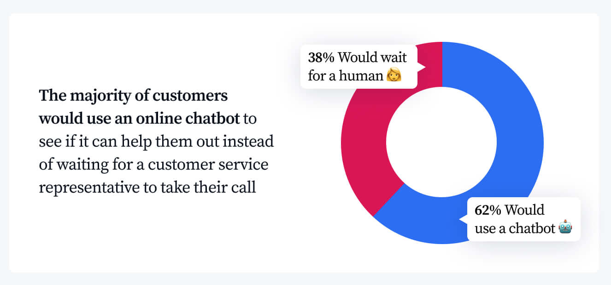
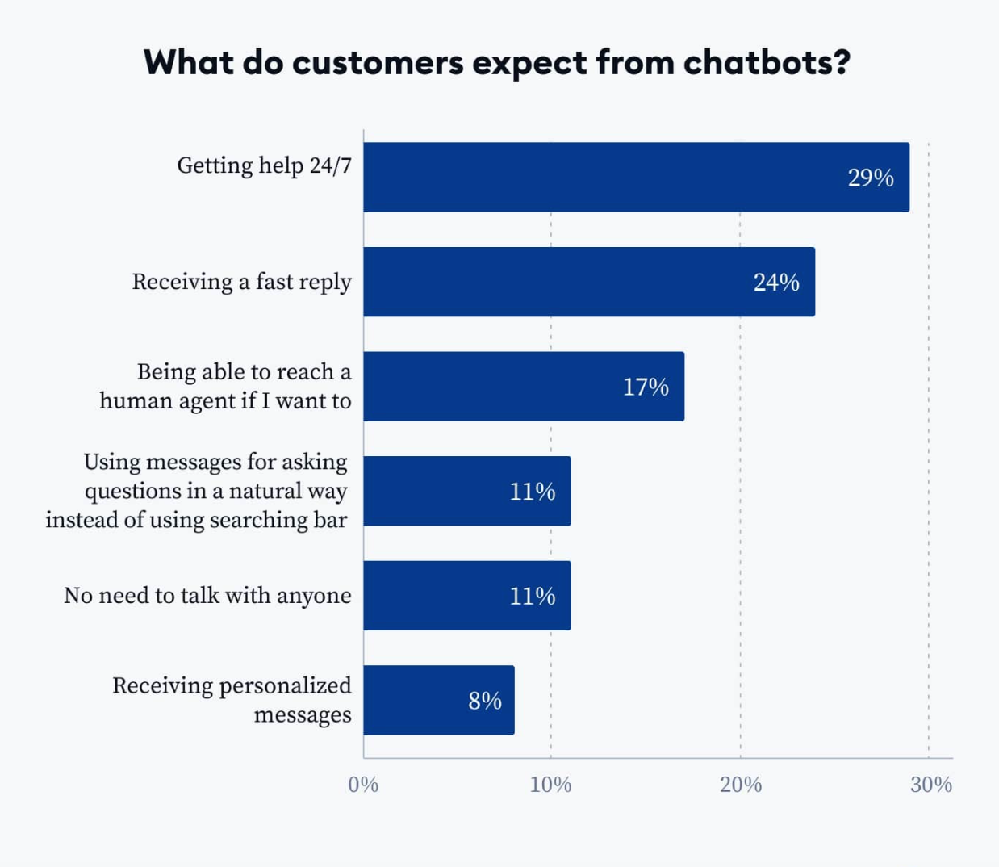

# How Chatbots Improve Customer Service

In today's digital age, customers expect instant and efficient service.  Traditional customer service methods, while still important, can struggle to keep pace with 24/7 demands. This is where chatbots come in. Chatbots are virtual assistants powered by artificial intelligence (AI) that can simulate conversation and automate tasks. They offer a range of benefits that can significantly improve customer service.

## The Power of Chatbots for Streamlined Customer Support

Chatbots offer several key advantages that enhance customer service:

### 24/7 Availability:

Unlike human agents, chatbots never sleep. They can provide immediate assistance to customers any time of day or night, regardless of location. This ensures customers can get the answers they need whenever they need them.

### Reduced Wait Times:

Customers often face long wait times when contacting traditional customer service channels. Chatbots eliminate this frustration by providing instant responses to basic inquiries.

Even 68% customer prefer use chatbot to get help instantly rather than wait for human customer service response

### Efficient Handling of FAQs:

Chatbots can be programmed to answer frequently asked questions (FAQs). This frees up human agents to focus on more complex issues that require human expertise.

in recent time, customer want anything instantly, they want to receiving fast reply and get help faster said [Tidios](https://www.tidio.com/blog/chatbot-statistics/)

## Boosting Customer Satisfaction with Personalized Interactions

Chatbots can go beyond simple tasks to deliver a more personalized customer experience:

### Contextual Awareness:

Advanced chatbots can learn from past interactions and user data to tailor their responses. This allows them to provide more relevant and helpful information to each customer.

### Product Recommendations:

Chatbots can leverage customer data to recommend products and services that align with individual needs and preferences. This can lead to increased customer satisfaction and sales.

Automated Tasks: Chatbots can handle simple tasks such as appointment scheduling, order tracking, and returns. This streamlines the customer journey and reduces the need for human intervention.

## Real-World Examples: How Chatbots Drive Results

Several companies have successfully implemented chatbots to improve customer service:

Sephora: [Sephora's chatbot](https://medium.com/marketing-in-the-age-of-digital/sophora-and-its-beautybots-f5d591fd5435) provides personalized beauty recommendations and makeup tutorials, enhancing the customer experience

Bank of America: Bank of America's chatbot, [Erica](https://promotions.bankofamerica.com/digitalbanking/mobilebanking/erica.), allows customers to check balances, transfer funds, and pay bills, resulting in a significant reduction in call volume 

These are just a few examples of how chatbots are transforming customer service. As chatbot technology continues to evolve, we can expect even greater benefits for businesses and consumers alike.

According to IBM, businesses that leverage chatbots experience a 30% increase in customer satisfaction 
By implementing chatbots strategically, businesses can create a more responsive and efficient customer service experience, leading to higher customer satisfaction and loyalty.