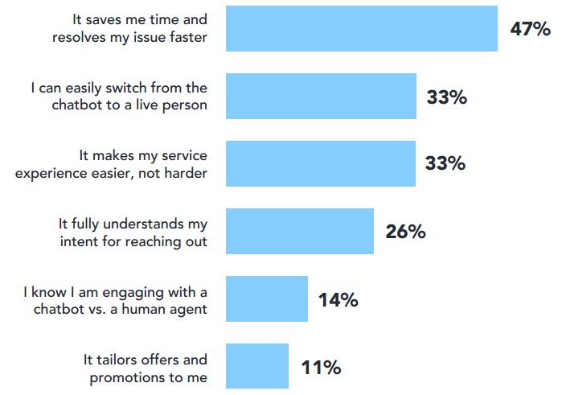
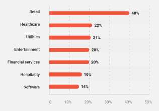
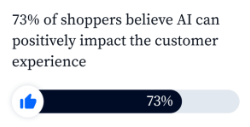
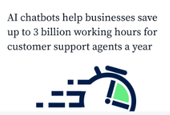
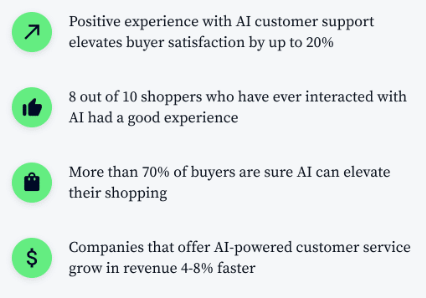

AI chatbots escalate industry operations and enhance customer experience. It can optimize the availability, wait times, and personalization. All the benefits gained from AI chatbot make AI chatbot become a powerful solution for modern needs.

## **The Rise of AI in Customer Service**

AI in customer service rises in industries to improve customer service. According to [Cmswire](https://www.cmswire.com/customer-experience/10-ai-customer-experience-statistics-you-should-know-about/), about 40% of organizations have already created teams and budgets for AI technology.

### Growing Customer Expectations & The Need for Efficiency

AI in customer service provides efficiency for costumer’s needs. It is shown that AI in customer service can fulfill customer expectations and get positive reviews. The biggest benefit that customers expect from interacting with AI is saves time and resolves issues faster, easily connects to human agents, and easier service experience.

Source: Verint

### How Traditional Customer Service Struggles to Keep Up

Traditional customer service is provided by human agents. Their role is to answer questions and resolve customer issues. Even though this method has advantages, there are also some disadvantages. Traditional customer service can be more ineffective in cost because it requires salaries, benefits, and training. It is also not available 24/7 like AI customer service does.

### AI Chatbots: A Powerful Solution for Modern Needs

AI chatbots are a powerful solution for modern needs. It can provide customer service outside the traditional business hours. It can reduce costs. It can handle repetitive tasks and multiple customers.

 

## **Unveiling the Power of AI Chatbots**

AI chatbots are not only useful for business operations but also for customer experience. The advantages are saving time, effectiveness, personalization, and automation.

### 24/7 Availability & Reduced Wait Times

AI chatbots are provided 24/7 and can be accessed anytime and anywhere. The service responds instantly and does not have long wait times. It solves the customer's expectation for faster response.

Source: Outgrow

### Personalized & Consistent Customer Interactions

AI chatbots allow business companies to gain data from customers. The insight data will be used for personalization and to improve interactions with customers.

Source: Zendesk

### Handling Repetitive Inquiries & Initial Support

AI in customer service can handle repetitive tasks, respond to FAQs, and guide customers. The process of an AI chatbot in responding to customers can help streamline the service, save time, and more.

### Automating Tasks & Freeing Up Human Reps for Complex Issues

The automation in AI chatbot, allows human agents to focus on complex issues. Some repetitive and basic stuff can be resolved by an AI chatbot. Meanwhile, human agents are needed to resolve complex and emotional issues.

 

## **Industry Reports: AI Chatbot Success Stories**

AI chatbots are increasingly becoming an important role in industries. Industries adopt AI to power chatbots for customer service.

### Highlighting Case Studies from Various Industries

AI chatbots are used in various industries. The popular industries that applied chatbots used for troubleshooting and customer support, sales and marketing, reviews and feedback, etc. The case studies include several industries like banking, retail and e-commerce, telecommunications, healthcare, and more.

Source: Master of Code

### Quantifiable Results: Improved CSAT & Reduced Costs

About 73% of e-commerce shoppers believe that AI can improve the customer experience. It leads to customer satisfaction that elevates positive experience up to 20%.

Source: Tidio

According to [Tidio](https://www.tidio.com/blog/ai-customer-service-statistics/), 28% of businesses use AI to cut their company’s costs. It reduces costs by streamlining workflows, empowering customer service, and saving human agents working hours.

Source: Tidio

### Customer Testimonials on Enhanced Service Experience

Stats proving positive reviews for using AI chatbot in customer service. In E-commerce industries, for example, AI chatbots lead to buyer satisfaction, elevate buying, and give personalization offers.

Source: TIdio

 

## **The Future of AI in Customer Service (Looking Beyond Chatbots)**

Customers get assistance 24/7 by using AI chatbots. As it lowers the response times that increase customer satisfaction, it lowers the cost per chat. But beyond that, AI in customer service has a lot of skills to know.

### AI-Powered Self-Service Options & Knowledge Bases

AI in customer service provides self-service by assisting customers without human agents on-call or in person. It has a knowledge base for resolving customer problems. It can resolve basic and common issues immediately without wait times.

### Integrating AI with Predictive Analytics & Sentiment Analysis

AI in customer service has a limitation for resolving complex issues and humanity. Therefore, it can integrate with other technologies like predictive analytics and sentiment analysis to gain more data.

### The Human-AI Collaboration: Utilizing AI to Empower Reps

The collaboration between humans and AI in customer service will empower customer satisfaction. The limitation in each part could be complemented and resolved. AI can handle routine and basic issues, while human agents can focus on complex issues.

 

## **Conclusion: AI Chatbots - A Game Changer for Customer Service**

AI chatbots provide an effectiveness for customer service. It has a lot of benefits that can improve customer experience and business operations.

### Recap of Key Benefits and Future Potential

AI chatbots are game changer for customer service. Not only provides 24/7 accessibility, but it also improves customer experience, streamlines workflow, and reduces costs. Even though there are some limitations, the collaboration with human agents and the integration with other technologies will empower and resolve complex issues.

### Embracing AI Technology for a Competitive Advantage

AI technology is a crucial part of business operations. It can help businesses to get insight into data and enhance decision-making or strategies for customers. It also has other advantages that are relevant nowadays.
