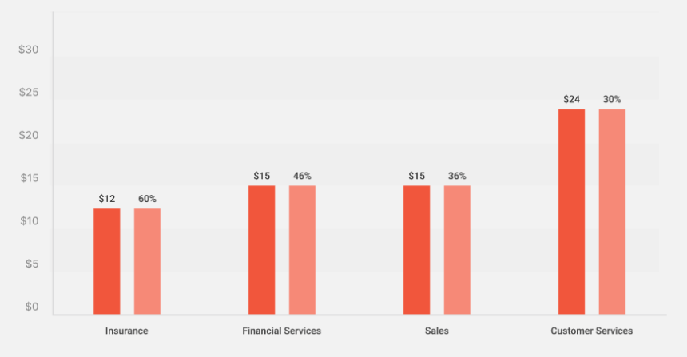

# Supercharge Your Customer Service: Benefits of AI Chatbots for Small Businesses

AI-based customer service helps small businesses to supercharge customer service. Some of the challenges of customer service can be resolved by AI-based customer service.

## Introduction: The Challenge of Customer Service for Small Businesses

Customer service is one of the important things in business. It has some benefits for small businesses. It can retain customers, understand and provide customer needs, upsell products, etc. However, small businesses might face some challenges, like limited resources, high costs, and scalability problems. A potential solution for those problems is to use AI-based customer service.

## How AI Chatbots Can Revolutionize Customer Service for Small Businesses

AI chatbot websites or AI-based customer service provide services that suit small businesses. Here are the benefits that can be gained from using an AI chatbot website.

### 24/7 Availability and Scalability

AI chatbots provide constant customer support 24/7. Regardless of business hours, AI chatbot availability can handle a larger number of queries even though in different time zones. With this benefit, small businesses can compete with other larger companies.

### Improved First Contact Resolution (FCR)

AI chatbots complete basic tasks that help human agents. It can answer basic inquiries efficiently and reduce customer wait times. The customer will gain experience through first-contact resolution. The faster response will impact positive customer satisfaction.

### Personalized Customer Interactions

AI chatbots can collect the personal data of customers. Based on that data, AI chatbots personalize basic interactions. The data will be beneficial for businesses to collect preferences and offer relevant product suggestions to customers.

### Cost-Effectiveness

AI chatbots are also impactful to businesses for reducing costs. The operational cost can be reduced because AI can automate repetitive tasks, available 24/7, and freeing up human agents for more complex interactions. From the [data](https://www.notion.so/1913e58ce4114f2aaa1c6ecccd26e4b5?pvs=21), AI chatbots can potentially to cost savings through automation tasks.

Source: Master of Code

### Data Collection and Insights

AI chatbots can collect valuable customer data during conversations. The technology allows us to analyze data and improve customer service through personalization service. It can offer customized product recommendations and suggest related items. It also can impact business, the data insight can be analyzed to plan marketing strategies.

## The Impact of AI on Customer Service: Beyond Chatbots

There are other ways to enhance the customer support experience. Other applications beyond chatbots like sentiment analysis and predictive analysis can integrated to enhance customer satisfaction. Sentiment analysis provides analysis and evaluates customer feelings from conversations. While predictive analysis provides analysis to anticipate problems and identify patterns. All these technologies can cooperate with AI-based customer service to provide the best customer support.

## Conclusion: AI Chatbots - Your Small Business's Customer Service Partner

The AI chatbot is an important thing to be applied for small businesses. It offers 24/7 service effectively, handles larger queries, enhances customer satisfaction, and cost reductions, and collects data to improve business strategies. Check out other articles about AI chatbots, there are more beneficial things you can learn more about. Or contact our company for further information.