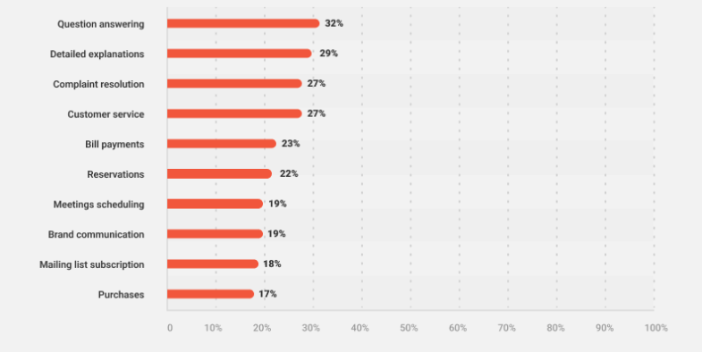
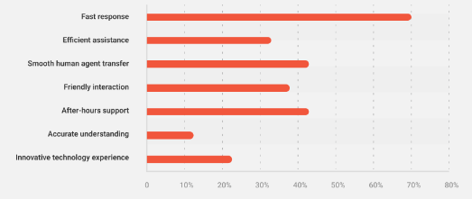

# Benefits of Using AI Chatbots for Customer Support

## **Introduction**

One of the challenges of traditional customer support is not being able to resolve issues immediately. Meanwhile, customers expected to be replied quickly. This problem can be solved by an AI-based chatbot that is applied in customer support. AI chatbots are present to enhance customer support and satisfy the customer experience.

## **What is an AI Chatbot for Customer Support?**

AI chatbot's role in customer service is to respond to customer’s request immediately, without time wait. The AI is integrated with technologies like Natural Language Processing (NLP), Machine Learning (ML), and Conversational AI. The technologies provide AI chatbots to understand, analyze, and respond to human speech or writing. There are some types of AI chatbots, such as rule-based chatbots and machine learning chatbots. The machine learning chatbot allows gain data to learn the customer’s behavior or response. On the other hand, the rule-based chatbot just does basic tasks and cannot learn.

## **Transforming Customer Support: Top Benefits of AI Chatbots**

Chatbots are being used among customers for basic tasks. It can answer questions, explain, give resolutions, give recommendations, and more.

Source: Master of Code

### **24/7 Availability and Improved Efficiency**

AI chatbots offer constant customer support. The chatbot can be accessed 24/7 to handle basic inquiries at any time. Without wait times longer, the chatbot becomes the first contact resolution (FCR) in customer support. The availability and efficiency of AI chatbots will free human agents to focus on complex issues.

Source: Master of Code

### **Enhanced Customer Experience**

AI chatbots personalize interactions based on customer data. It allows collecting customer data to understand more about the customer. AI chatbots also provide self-service options and access to knowledge bases. The data insight will be valuable for faster resolutions and improved customer satisfaction.

### **Reduced Costs and Increased Productivity**

AI chatbots automate repetitive tasks and respond to basic inquiries. It allows to handle a higher volume of inquiries and boosts agent productivity. As a result, it can reduce operational costs and quick return on investment (ROI) of AI chatbots.

### **Valuable Data Collection and Insights**

The AI chatbot's potential to contribute to continuous improvement. It can analyze customer interactions and gather valuable data. This data can be used to improve customer service strategies and identify trends that are suitable for customers.

## **Integrating AI Chatbots: A Seamless Solution**

AI chatbots must be integrated with existing customer support systems. It can be trained and customized to meet specific needs. The integration between AI chatbots and customer support systems will be seamless in the process of customer support. Even though there are some challenges for AI chatbots to understand emotions and humanity. It can be resolved by integrating with human agents.

## **The Future of AI Customer Care**

AI technology for customer service has advanced in some points. It is evolving to be more intelligent and the interactions can be more personalized. The application itself has been derived into many industries. So, it is an optimistic outlook on the future of AI-powered customer support.

Source: Unsplash

## **Conclusion**

There are top benefits of AI chatbots for customer support. It offers efficiency, enhances the experience, reduces data, and personalized interactions. Implementing AI chatbots has a lot of things to learn, so make sure to read more about it. Contact Chatver for AI chatbot solutions.