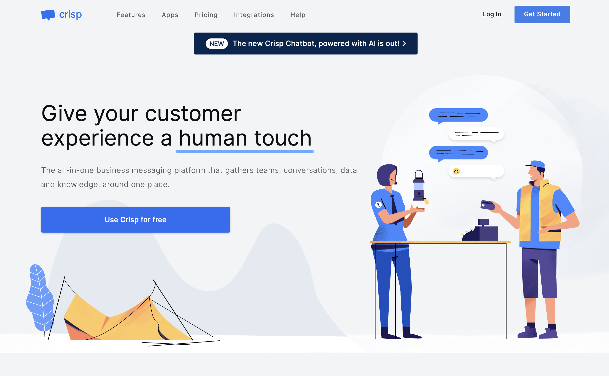
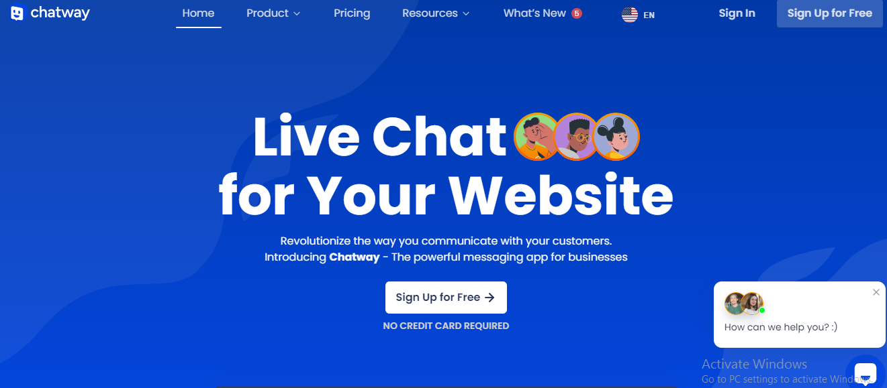
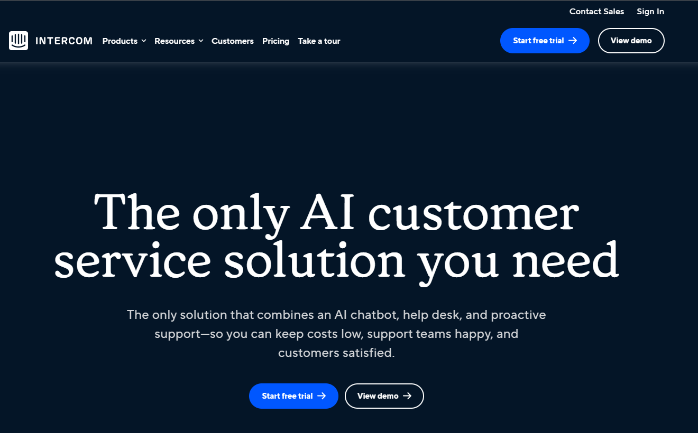
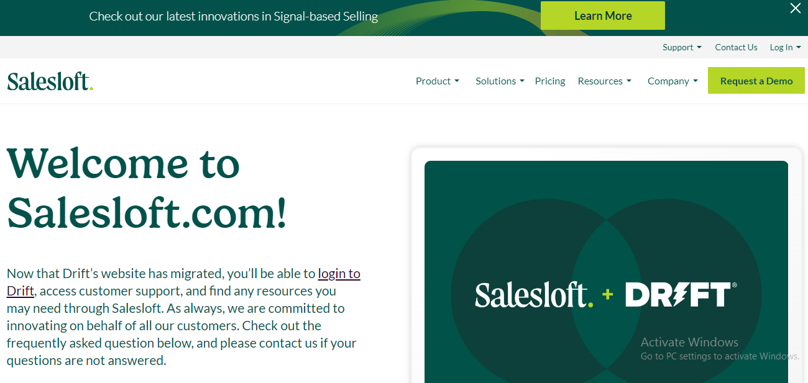
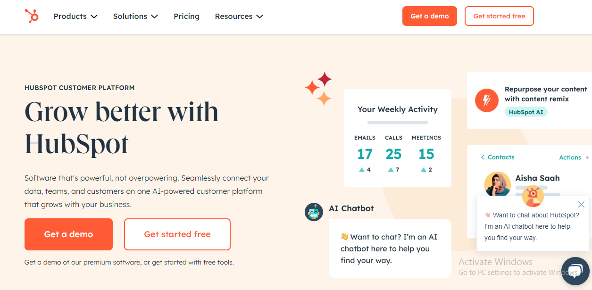
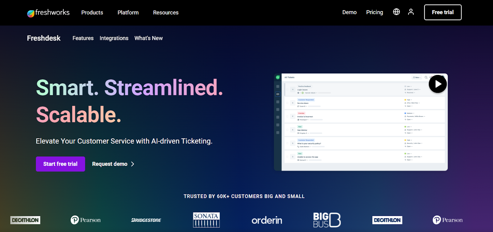
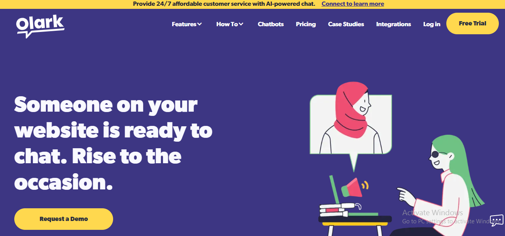
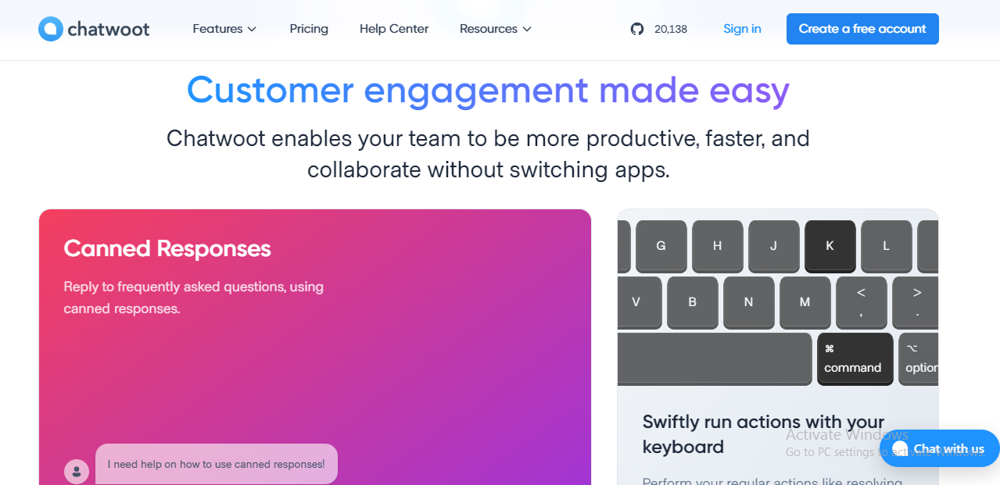
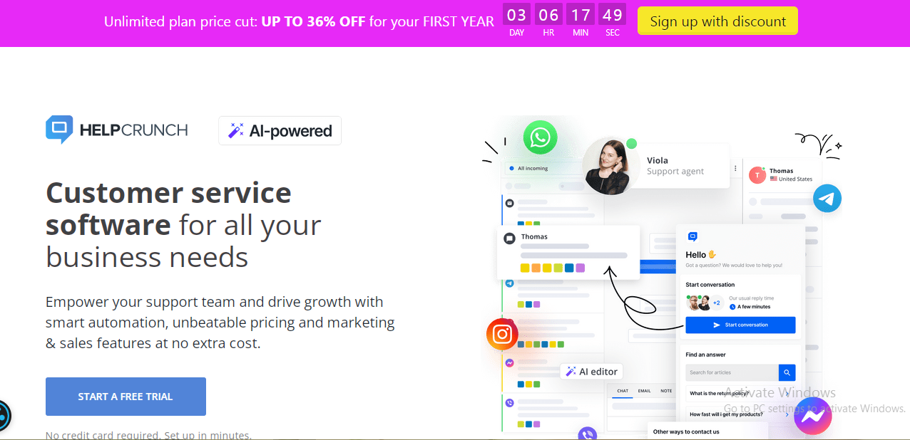
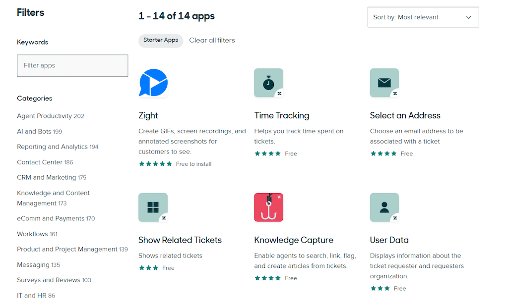

When it comes to the previous mentioned point, a simple google search for live chat brings up Crisp chat which is not just beautifully designed but also provides completely solid support solutions. But if you have already matured from this tool and are searching for Crisp chat alternatives then we still got your back.

So, in this blog post we will dive into the top 10 Crisp chat alternatives with features details, also their pros and cons as well as cost which helps you to select a suitable live chat solution according to your business.

Let’s start!

## **What is Crisp and its features?**

Crisp Chat is a business messaging that allows you to deliver excellent support, sales and marketing. You can track the customer queries with this and understand what your customers need. Thus, it can enable you to rectify your solutions and offer better customer satisfaction.

With Crisp, you can incorporate live chat to your webpage providing instant and personalized support towards all future and existing customers. Or you could even use a no code chatbot builder that helps to qualify better leads, drive more conversions.

**Key Features of Crisp Chat:**

- Team inbox to reply to customers queries
- Mobile access 24/7
- Notifications for when guests messages you
- Triggers based on personalized automation rules
- Canned feedback to save time

## **Crisp Alternatives That Worth to Try**

Even though Crisp is a great bang for the buck, this could be counterproductive to you and your business. Some users online think that the filter system is cumbersome and care about the widget not loading on some occasions.

The only disadvantage of Crisp is its limited features in the low-tier plans. If you need more room to chat on the web and don't want to fork over for a top-tier plan, here are some options that might serve your needs.

### **Chatway**

Another live chat app that is packed with features to assist you in making real time contact is Chatway. Starting off fresh or upgrading from regular live chat communication, Chatway is a great choice to choose.

**Features:** This is a best platform to engage with available on website visitors and solve their query related to products & services. This can help convert them into paying clients. According to the studies, those customers who chat are more likely to convert than ones without live support. Some of specific features offered by Chatway:

- Full customization
- Live chat app
- Unlimited conversations
- Unlimited agent seats
- Analytics
- Notifications
- Multi-platform support (WordPress, Square, Email)
- Segments and tags

**Pricing**

- Free plan: Yes, forever
- Price start from $9/agent/month, free trial 14 days

### **Intercom**

Intercom is one of its kind as it comes along with an automatic omni channel platform. This would be a smart place to start if you have intentions of booming business.

**Features**

- The goal of this platform is to maximize your business efficiencies while minimizing overall cost expenditure by providing you with “actionable tools” for improved third-party marketing.
- Intercom for exquisite use of AI in enhancing your customer support experience.
- But the benefits do not end there. With customer segmentation, self-service & automation tools you can configure so that your business alignment is optimized.
- AI support
- Automation tools
- Advanced messaging and reporting features

**Pricing**

- Free trial: Yes, for 14 days
- Essential – $39 per seat/month
- Advanced – $99 per seat/month
- Expert – $139 per seat/month

### **Drift**

Drift offers support-tight channels to get the brand in front of more targeted accounts and increase sales. For example, you can create playbooks that assist in following up with open opportunities who have come back to your site. Even better, you can utilize *Chat to Call* or *Chat to Zoom* features and meet them by call in order to address their pain points faster. Drift Meetings, this will allow qualified leads to book meetings with you at their own convenience.

**Features**

- Greet your top visitors with a personalized message
- Alert sales reps when their target accounts are present on the website
- Answer Common Questions faster using Saved Replies
- Internal Notes (to the conversation i.e. team members)
- Conversational AI by the tool helps you identify and qualify leads faster
- Conditional routing for multiple teams

**Pricing**

- Here are three categories offered by Drift:
- Premium – $2,500 per month, billed annually
- Advanced – Contact the company
- Enterprise – Contact the company

### **Hubspot Live Chat**

Another Crisp alternative, you can add live chat to your website within minutes by using Hubspot to do real-time customer support and close more deals. By connecting chatters to the right agents, you can solve queries better and faster. Customize Chat WidgetOn this page, you will be able to customize your chat widget so that it matches your brand. You can also automate administrative tasks by using an interactive chatbot.

HubSpot Conversations lets users see all of their customer messages and conversations in one inbox, no matter where they came from, like Facebook Messenger, forms on a website, or team email alias or chat.

**Features**

- Segment your onboarding experience and build relevant welcome messages
- Save and Organize Customer Conversations into conversation inbox
- Convert Repetitive Sales Emails in Templates
- Automatically get new contact records and log sales activity which helps you drive better customer experience and close more deals.
- Keep track of when a lead opens an email, clicks the link in an email or downloads attacks

**Pricing**

- Free plan: Yes
- Prices start at $15/month/seat. For businesses and enterprises start at $800/month

### **Freshdesk**

Another cloud-based communications, Freshdesk enables customer support agents to get into touch with clients as well that need assistance on their computer. Includes a knowledge base, forum and support ticket system. It is free to use and offers a 21-day trial for premium features.

As a customer, you can also obtain a day pass to temporarily expand your user base, in case an unforeseen customer outreach spike impacts the performance of your firmas app accommodation.

**Features**

**Ease of use:** It is a very user-friendly and easy to set up solution for modern help desk tools that are quick to learn on when you sign up (mostly) through the free trial. You can Sign Up and instantly Get Started!

**Hardware:** Freshdesk is offered purely from a software standpoint, so there are no hardware requirements. What makes it even better is that you can do this with your existing phone and desktop equipment. This is where Freshdesk has the upper hand for small businesses searching for cost-effective customer support solutions.

**Software:** Being cloud-based, Freshdesk works the same way as it sounds — you just need to log in on their webpage and utilize its functions online. There is also a mobile app which can be downloaded from the App and Google Play stores.

**Security:** First and foremost Freshworks takes the utmost care to protect your data by hosting its service on Amazon Web Service (AWS) servers, providing best-in-class update and security that comes standard for other cloud vendors.

**Pricing**

- Free plan: Yes
- Price start at $15-$79 per agent

### **Olark**

Olark is a live chat client, and you can configure an automated greeting/legal to answer the most common questions asked by visitors. The chatbot builder will build out the bot for you based on your responses to a few questions.

Olark: A cost-effective live chat widget that is ideal for businesses with a team of customer service experts. You also have access to add-ons and/or a custom plan, which provide more features but with possible extra charges — including the chatbot.

**Features**

- Unlimited chat history
- Customizable chatbox
- Comprehensive data security
- Advanced reporting
- Advanced privacy features
- Real-time reporting

Some addition advanced features:

- A easy to use vendor management system that can be paid via invoice or purchase order (most common payment types in today's day and age)
- Olark integrations — website, CRM and helpdesk and etc
- Scheduled Help: all support requests replied on same business day
- Dedicated Account Manager: Video or phone assistance from Olark support members

**Pricing**

- Free trial: Yes, for 14 days
- Price start at $29 per month

### **Chatwoot**

Chatwoot is an open-source customer communication platform. Their core customer support features include a shared inbox, live chat and integrations for connecting with dozens of channels an internet business might find useful.

To be perfectly honest, their shared inbox feels somewhat stripped down and against the grain. It seems in essence that their chat feature is one of the more fleshed out components of what ClickUp has to offer. You do have full access to their codebase since they are an open-source company. Therefore, the more technical expertise you have available to you, therefore more customizable options.

**Features**

Website live chat: simple and elegant live chat for your website

- Team collaboration: collaborate and manage conversation using a shared inbox
- Chatbots: easily integrate with chatbot platforms like Rasa or Dialog Flow
- Automations: avoid repetitive tasks by automating your workflows and run your business on auto-pilot
- Integrations: super charge your workflow with integrations

**Pricing**

- Free plan: Yes
- Paid plans starting at $19/agent per month

### **HelpCrunch**

HelpCrunch is a customer communication platform that offers free live chat, pop-up messaging as well as help desk +5 add-ons (Messages, Emails).

It also has features such as internal notes and saved responses to quickly answer common customer support inquiries. Live chat is where HelpCrunch really kills the game. As a result, you can donate the chat widget on your website or even in-app (that feature may require some external configuration).

**Features**

- Live chat: talk to the customer in real-time
- Shared inbox: unite all communications channels under one roof
- Chatbot: qualify leads and deliver instant viewers 24/7
- Pop Ups: create stylish pop ups that bring more leads
- Integrations: integrate HelpCrunch with your favorite tools
- Knowledge base: create help articles for customer self-service
- Email marketing: send email campaigns to customers

**Pricing**

- Free trial: Yes
- Price start at $12/agent per month

### **Zendesk**

Zendesk is a household name in support. They are a serious player in the space and offer various features that include shared inbox, live chat, knowledge base capabilities (they refer to it as message but this could be seen from both aspects) and proactive messaging.

There are also phone support and even chatbot/AI-powered automated responses, but those more advanced features only come with their higher-cost plans. Zendesk—is a great tool if you need all those features. If you do not, then there is likely a cheaper and easier to implement alternative.

**Features**

- Messaging and live chat
- AI and automation
- Data privacy and protection
- Help center
- Agent workspace
- Voice
- Workforce engagements

**Pricing**

- Free trial: Yes
- Price start at $49/agent

