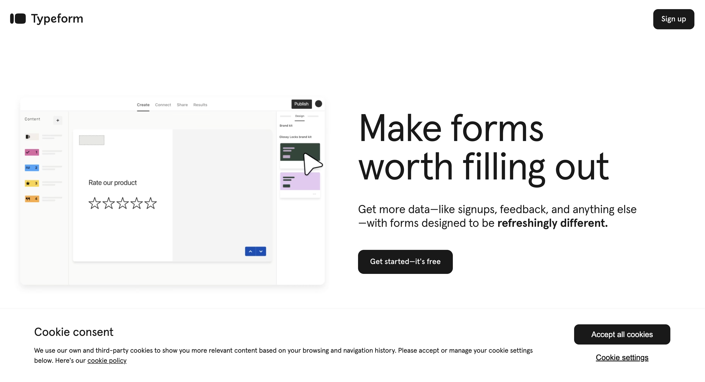
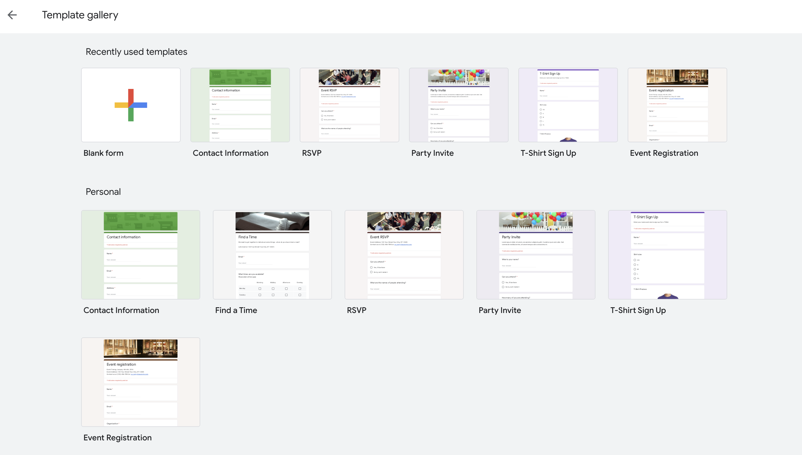
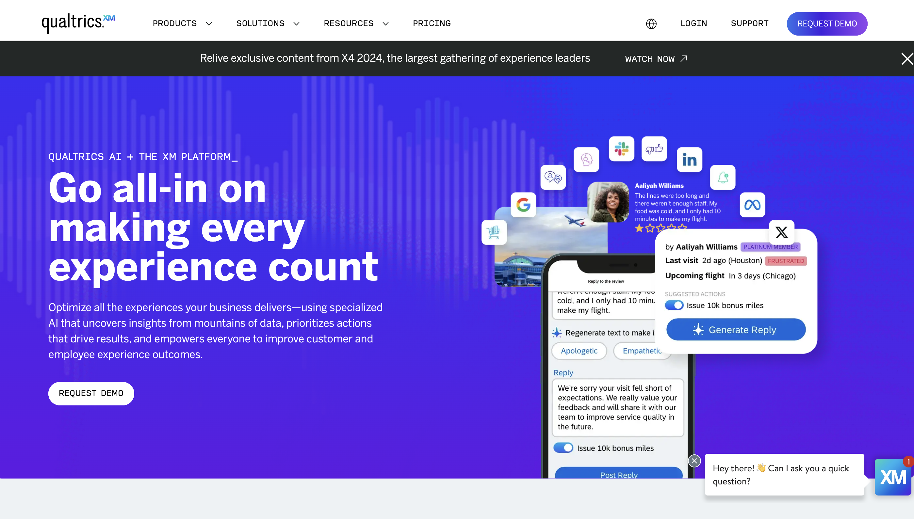
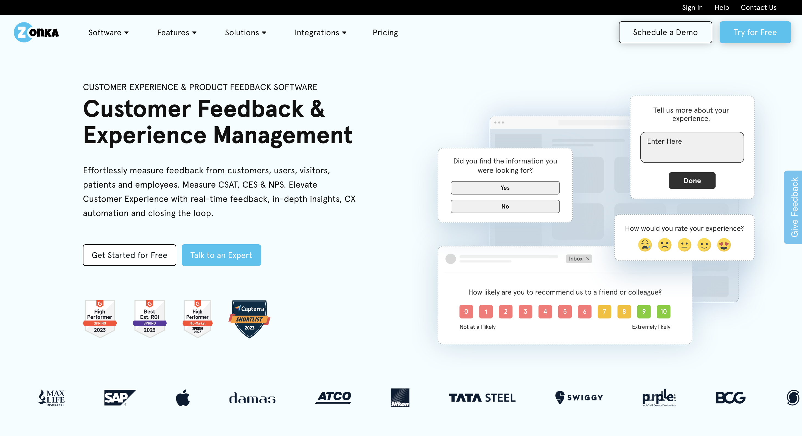
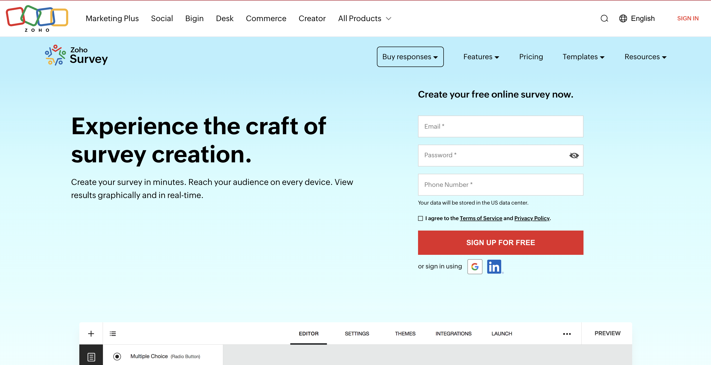
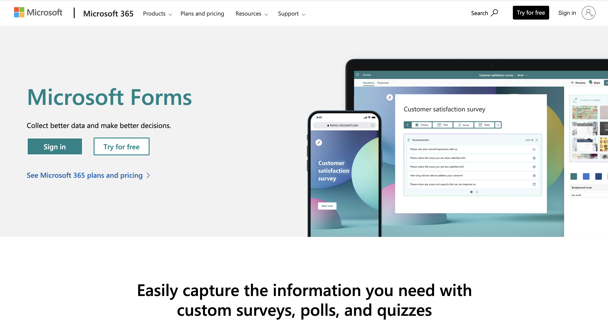
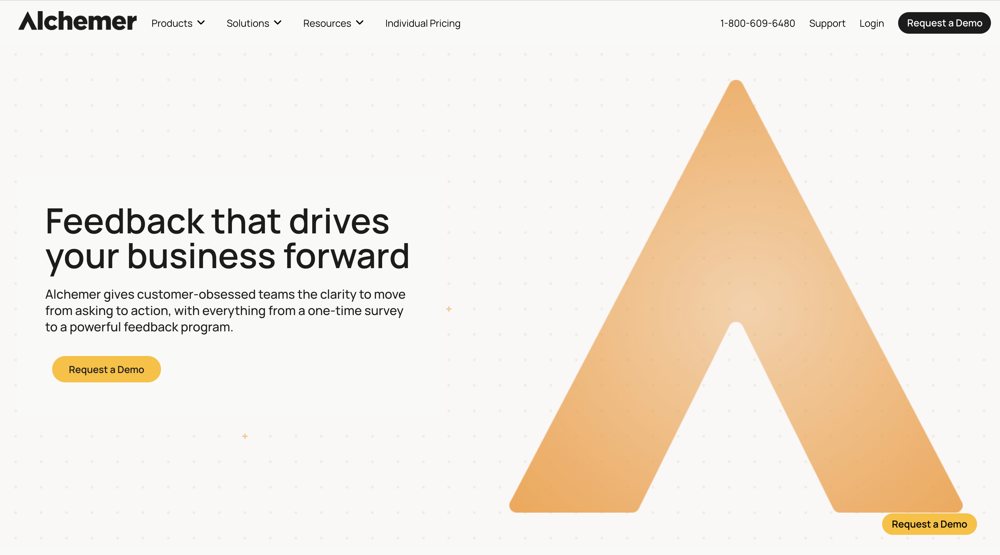
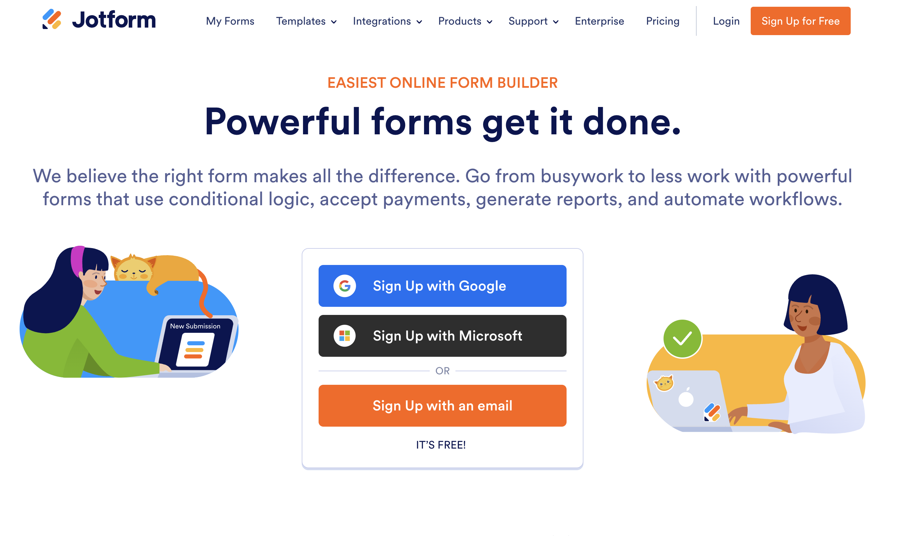

# 9 Best Survey and Feedback Tools 2024 With **Reviews, Pricing**

The landscape of survey and feedback tools is evolving rapidly, with numerous options available to meet diverse needs. Organizations increasingly recognize the importance of gathering insights from customers and employees to drive decision-making and improve services. **Navigating this array of tools effectively can lead to enhanced engagement and more meaningful data collection.**

In 2024, the focus on user-friendly features, integration capabilities, and analytics is more critical than ever. Selecting the right tool not only streamlines the feedback process but also influences the quality of responses received. This article aims to highlight the most effective survey and feedback tools that stand out in today’s market.

## 1) SurveyMonkey

SurveyMonkey is a widely recognized online survey tool known for its user-friendly interface and extensive features. It offers versatile options for creating, distributing, and analyzing surveys, making it suitable for businesses of all sizes.

**Core Features:**

- **Intuitive Design:** SurveyMonkey provides an easy-to-use questionnaire builder that simplifies survey creation.
- **Advanced Logic:** Users can implement branching logic and skip logic to tailor surveys to respondents’ answers.
- **Integration Capabilities:** The platform supports over 200 integrations with applications like Salesforce and Mailchimp.

**Pricing Plan:**

- **Free Plan:** Basic features with limited questions and responses.
- **Standard Plan:** Starting at $32 per month, offering more features like advanced analytics.
- **Team Plan:** Starts at $99 per month per user, designed for collaboration and enhanced functionality.

## 2) Typeform

- **Overview**
    
    Typeform is an interactive online survey and form builder. It is designed to create engaging surveys that improve response rates. Users appreciate its clean interface and ease of use.
    
- **Core Features**
    
    Typeform offers a range of features including customizable templates, logic jumps, and analytics. Users can create surveys that feel conversational, which enhances participant engagement. The platform also supports multimedia elements to make surveys more appealing.
    
- **Pricing Plan**
    
    Typeform has a freemium model with various paid plans. The basic plan starts at $25 per user per month, providing additional features and increased response limits. Users can also access a 7-day trial to explore the full capabilities before committing.
    

## 3) Google Forms

Google Forms is a versatile tool that simplifies the creation of surveys and feedback forms. It offers a user-friendly interface that is accessible to anyone.

**Core Features:**

- **Ease of Use**: Users can create forms quickly with a drag-and-drop editor.
- **Customization Options**: It allows for a range of question types and customizable themes to suit different needs.
- **Collaboration**: Multiple users can collaborate in real-time, making it ideal for team projects.

**Pricing Plan:**

- **Free**: Google Forms is completely free to use with no premium version, providing all the necessary features without any cost.

This makes Google Forms a go-to choice for anyone looking to collect data efficiently.

## 4) Qualtrics

Qualtrics is a leading survey and feedback tool, suitable for various organizations. It provides comprehensive features to gather deep insights and drive decision-making.

**Core Features:**

- Easy-to-use interface: The platform allows users to create surveys quickly with a drag-and-drop builder.
- Advanced analytics: Qualtrics offers robust analytics tools that help analyze customer feedback in real time.
- Customizable templates: Users can choose from a wide range of templates tailored to different survey needs.

**Pricing Plans:**

Qualtrics utilizes a subscription-based pricing model.

- Free trial: A limited version is available for trial purposes to evaluate its features.
- Paid plans: Pricing is customized based on user requirements and the scale of deployment.

For more details about Qualtrics and its offerings, visit their [official site](https://www.qualtrics.com/experience-management/research/best-survey-tools/).

## 5) Zonka Feedback

Zonka Feedback is a versatile tool designed for collecting customer feedback through surveys. It offers a wide range of features suitable for various industries.

**Core Features:**

- **Customizable Surveys**: Users can tailor surveys to fit their branding and specific needs.
- **Multiple Distribution Channels**: Zonka allows distribution via email, SMS, and web links, increasing reach and participation.
- **Real-Time Analytics**: It provides instant feedback analysis, including metrics like Net Promoter Score (NPS), Customer Effort Score (CES), and Customer Satisfaction Score (CSAT).

**Pricing Plans:**

- **Free Trial**: Users can start with a 14-day free trial to explore the features.
- **Basic Plan**: Offers essential functions at a competitive monthly rate.
- **Advanced Plans**: Includes additional features and integrations for growing businesses, with pricing available upon inquiry.

## 6) Zoho Survey

Zoho Survey offers a robust platform for creating and distributing surveys. It caters to various needs, from customer feedback to employee engagement.

**Core Features:**

- **User-Friendly Interface:** The software allows users to build surveys effortlessly.
- **Customization Options:** Users can personalize surveys with themes and logos to match their branding.
- **Integration Capabilities:** Zoho Survey integrates seamlessly with other Zoho applications and third-party tools.
- **Advanced Analytics:** It provides detailed analytics to track responses and gather insights.

**Pricing Plans:**

- **Free Plan:** Ideal for basic use with limited features.
- **Standard Plan:** Priced affordably, it offers enhanced customization and reporting options.
- **Professional Plan:** Geared towards businesses needing advanced features, including integrations and team collaboration.

## 7) Microsoft Forms

**Overview:**

Microsoft Forms is a versatile tool designed for creating surveys, quizzes, and polls. It integrates seamlessly with Microsoft 365, making it convenient for users already within the Microsoft ecosystem.

**Core Features:**

- User-friendly interface for form creation.
- Supports various question types, including multiple choice, text, and rating scales.
- Real-time collaboration with team members is possible for instant feedback.
- Responses can be easily analyzed with built-in analytics and exported to Excel for further examination.
- Offers customizable themes to align with branding or personal preference.

**Pricing Plan:**

- Microsoft Forms is included for free with Microsoft 365 subscriptions.
- There is a free version available for individual users.
- Additional features are accessible through various Microsoft 365 plans, which typically start at a monthly fee per user.

Microsoft Forms is a solid choice for users seeking a simple yet effective tool for gathering feedback and managing data.

## 8) Alchemer

Alchemer is a robust survey and feedback tool known for its high customizability and versatility. It caters to a variety of use cases, making it a popular choice among businesses.

**Core Features:**

- **Customization**: Users can create tailored surveys with various question types and designs.
- **Integration**: It seamlessly connects feedback data to other business systems for more accessible insights.
- **Workflow Automation**: Alchemer offers powerful automation options to streamline survey processes.

**Pricing Plans:**

- Alchemer’s pricing starts at $55 per user per month when billed monthly.
- Annual billing offers a reduced rate starting at $315 per user per year.

Alchemer is especially beneficial for larger organizations, as it provides detailed reporting and analytics features. It is frequently used for internal surveys to gauge employee feedback.

## 9) JotForm

JotForm is a versatile online form builder popular among businesses and educators. It offers a user-friendly interface, making it easy to create surveys and feedback forms.

**Core Features:**

- **Drag-and-Drop Builder:** Allows users to easily add various question types without coding.
- **Pre-built Templates:** Offers a wide range of templates for different needs, such as customer feedback and event registration.
- **Integrations:** Compatible with numerous apps, including Google Drive and PayPal, to streamline workflows.

**Pricing Plan:**

- **Free Plan:** Basic features with limited submissions.
- **Starter Plan ($34/month):** Increases submission limits and removes JotForm branding.
- **Professional Plan ($99/month):** Offers advanced features like conditional logic and customizable reports.

## Key Features to Look for in Survey and Feedback Tools

When choosing survey and feedback tools, specific features can significantly enhance the overall effectiveness of data collection and user experience. Understanding these features can help streamline the process and ensure valuable insights are gathered efficiently.

### User Interface and Experience

The user interface (UI) and overall user experience (UX) are critical for both survey creators and respondents. A clean, intuitive design encourages higher response rates and simplifies the survey creation process. Key aspects of a good UI include:

- **Ease of Navigation**: Tools should allow users to quickly find features without confusion.
- **Customizable Templates**: Users benefit from pre-made templates that can be easily modified to fit their needs.
- **Mobile Responsiveness**: Surveys must perform well on various devices, including smartphones and tablets, as many responses occur on mobile.

Additionally, the UX should facilitate quick feedback collection, with simple options to analyze results effectively. Consider tools that offer drag-and-drop interfaces and real-time editing.

### Integration Capabilities

Integration capabilities are essential for seamless data management and workflow enhancement. Tools that can connect with existing software simplify data analysis and tracking. Key integration features to look for include:

- **CRM Integration**: This allows for automated feedback collection after customer interactions, enhancing relationship management.
- **API Access**: A robust API can facilitate custom integrations with other apps or platforms.
- **Third-Party Tools**: Compatibility with popular applications, such as Google Analytics, ensures users can consolidate their data easily.

Effective integration can also enable automating feedback loops, ensuring timely responses and engagement from users throughout various channels.

## Best Practices for Using Survey Tools Effectively

To maximize the effectiveness of survey tools, attention should be given to the design of questions and the analysis of results. Thoughtful planning at each stage can significantly enhance the quality of feedback and insights gathered.

### Designing Effective Questions

Creating questions that yield actionable responses is crucial. It is important to keep questions clear and concise. Here are essential tips:

- **Avoid Jargon**: Use simple language to ensure all respondents understand the questions.
- **Be Specific**: Clearly define the subject of each question to avoid ambiguity.
- **Limit Length**: Aim for 10-15 questions; longer surveys can lead to fatigue.

Utilizing a mix of question types, such as multiple choice, rating scales, and open-ended questions, can enhance engagement. Open-ended questions allow for deeper insights, while closed questions provide quantifiable data. Following these guidelines can lead to more reliable information.

### Analyzing Survey Results

Analyzing results is as crucial as designing questions. A systematic approach helps in drawing meaningful conclusions.

- **Segment Data**: Break down responses by demographics or specific criteria to identify trends.
- **Look for Patterns**: Utilize data visualization tools to uncover patterns easily. Graphs and charts can illustrate key findings effectively.
- **Prioritize Feedback**: Identify which responses require immediate attention. Focus on actionable insights that align with organizational goals.

Interpreting data correctly allows for informed decision-making. Continuous monitoring and adapting strategies based on feedback can drive improvement over time.