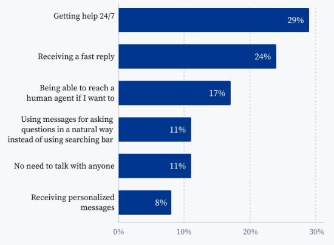

# Overcoming the Hurdles: How AI Chatbot Customer Service Can Revolutionize 24/7 Support

Customers nowadays expect customer service to respond fast and offer 24/7 availability. 
According to [Influx](https://influx.com/blog/24-7-follow-the-sun-support-stats), businesses need to be available 24/7 to meet modern expectations. But, to provide 24/7 customer support, businesses need to hire more teams and add business hours. It leads to more time and cost. AI chatbot customer service present to be a game-changer in overcoming these challenges.

## **The Roadblocks to 24/7 Customer Support**

There are some challenges to providing 24/7 customer support:

### **Resource Constraints**

The biggest roadblock to 24/7 customer support is the limited staff. To provide availability outside business hours, business companies need to hire more staff and add time shifts. The process will take time and increase training costs. After the hiring process, there will be an availability analysis to extend customer support.

### **Maintaining Consistency**

Customer service must ensure the quality of service is meeting the standard. Maintaining consistency of service quality might be hard, especially when there are different time zones. Businesses must adjust the service hours and staff to ensure they can receive all customer requests from different regions and time zones. But, it is also difficult to replicate human expertise outside of core working hours. It needs good management to optimize 24/7 support.

### **Missed Opportunities**

The inability of customer service to respond immediately will raise the risk of losing potential customers. [Surveys](https://www.tidio.com/blog/chatbot-statistics/) show that customers expect to receive quick responses at any time. This limited support availability also will obstruct capitalization on global markets. Businesses can’t provide customer’s needs or responses, which leads to decreasing number of customers.

## **AI Chatbot Customer Service: A Powerful Ally**

The AI in chatbot customer service has become a powerful technology. It supports 24/7 availability and others benefit that help customers and business companies. It resolves the challenges of providing 24/7 customer support.

### **24/7 Availability**

AI-powered chatbots for customer service can handle inquiries and basic support tasks around the clock. To fulfill customer’s expectations, AI chatbots can be available 24/7. It is improved customer satisfaction with immediate and consistent service. As shown in the picture below, the biggest customer expectations in using chatbots are getting help 24/7 and receiving fast replies.

Source: Tidio

### **Efficient Handling of Simple Inquiries**

Chatbots can answer frequently asked questions (FAQs) and provide basic troubleshooting steps. It has a knowledge base to respond to some keywords or other triggers. The automatic program will free up human agents to handle more complex customer issues. Human agents can focus on growing the strategic plan for the business.

### **Personalized Interactions**

Advanced AI chatbots can offer personalized greetings and responses based on user data. The technologies in AI chatbots use machine learning to analyze customer data and preferences. Through the data, the AI chatbot will adjust the responses and recommendations to the individual customer. It enhances the customer experience with a more human-like touch. It offered the customer to feel valued and more engaged with the need.

### **Data Collection and Analytics**

Chatbots can gather valuable customer data for improved service and product development. The data can be gathered from customer feedback and reviews. The data can be used to guide business development. It understands customer needs and identifies areas for improvement.

## **Addressing Concerns and Optimizing Your AI Chatbot Strategy**

Using AI customer service can be a strategy to optimize business operations. The collaboration between human agents and AI chatbot will streamline the workflow of services.

### **Overcoming Limitations**

Chatbots are not replacements for human interaction in some situations. Humans still need to resolve complex situations, then AI chatbots resolve basic and repetitive tasks. The integration of the AI chatbot allows seamless handoff to human agents to resolve escalated cases. The AI chatbot will forward to a real human agent for complex situations.

### **Training and Continuous Improvement**

The important thing to ensure accurate responses is to train the chatbot with relevant data. Detailed data will help AI customers to answer questions and guide customers. It must continuously be monitored and refined chatbot performance for optimal efficiency. The continuous evaluation can meet quality standards that improve customer satisfaction.

## **Conclusion: Embracing the Future of Customer Service with AI Chatbots**

The strength of AI chatbot customer service is to provide 24/7 support. Unlike traditional methods that need more staff and time to wait, AI chatbots are available 24/7, reducing costs and faster response. AI chatbots can revolutionize customer service and contribute to business growth. It provides efficiency, personalization, and data analytics to plan business strategies.