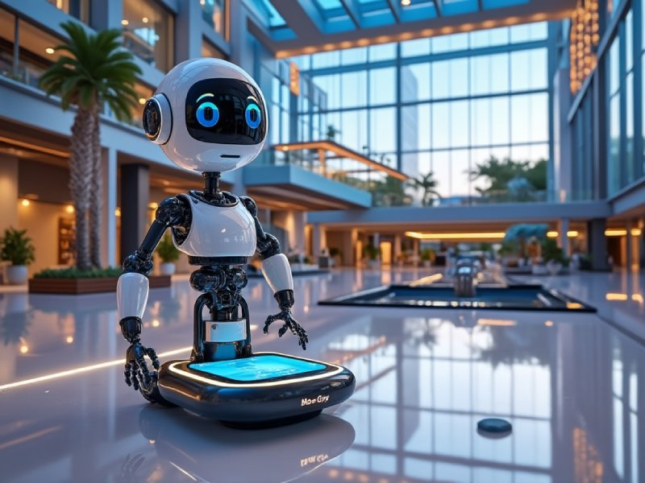
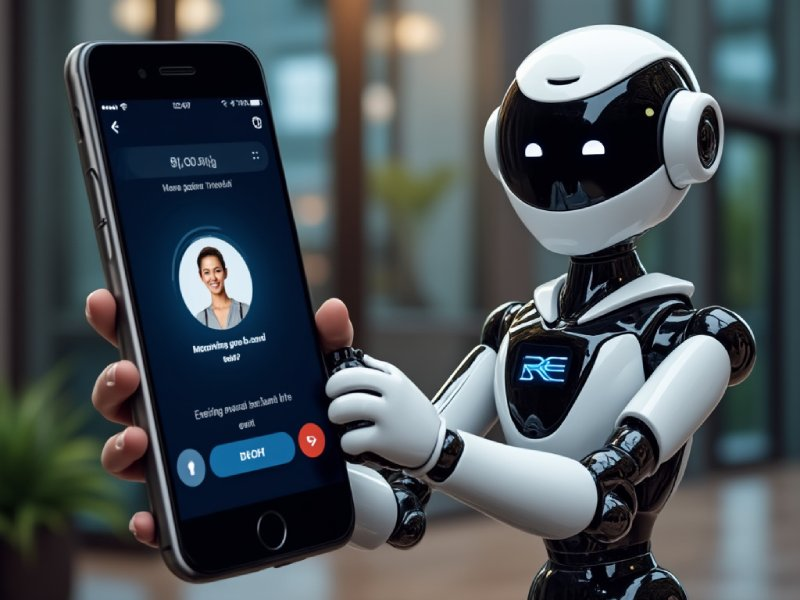
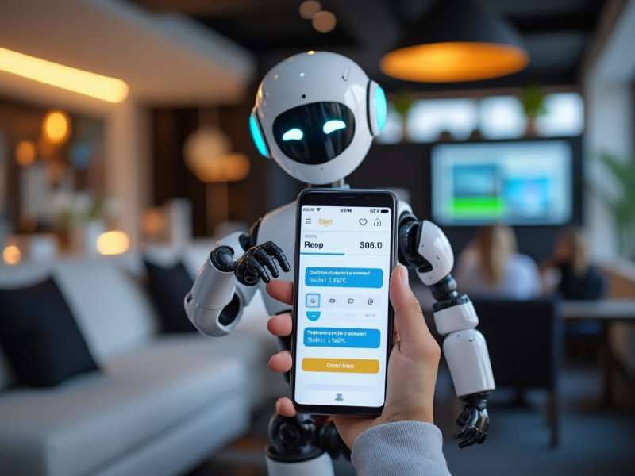
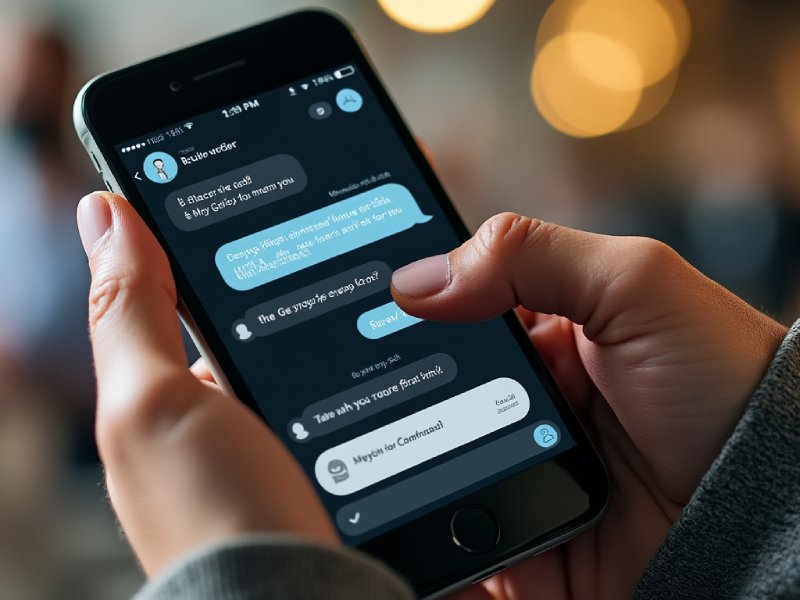
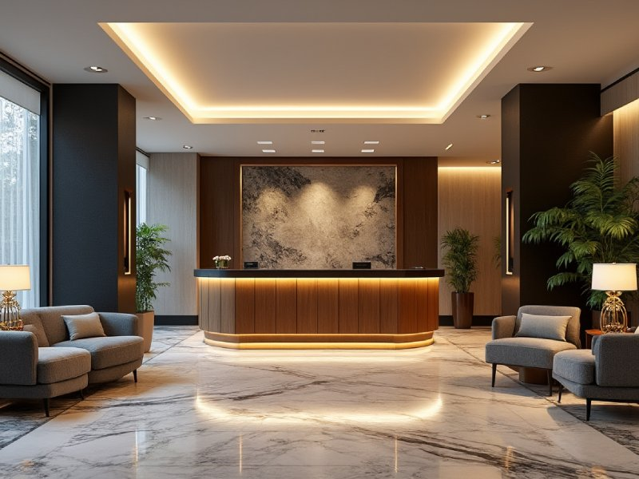

The hospitality industry continues to evolve by embracing innovative technologies. A chatbot for hotels is an increasingly vital tool, streamlining communication between guests and hotel staff. **These chatbots can significantly enhance guest experiences by providing instant support, automating reservations, and answering common inquiries around the clock.**

By implementing a chatbot, we can improve operational efficiency and increase direct bookings. Hotels utilizing this technology often see notable benefits, such as reduced response times and elevated customer satisfaction. The ability to offer personalized interactions at any time ensures that guests feel valued and heard.

As we explore the various aspects of hotel chatbots, it becomes clear that their impact on the industry is profound. From simplifying the booking process to enhancing customer engagement, chatbots are reshaping how we connect with our guests and manage our operations effectively.

 

## Evolution of Chatbots in the Hospitality Industry

The journey of chatbots in the hospitality sector began with basic automation. Initially, these digital assistants were designed for simple tasks, such as answering frequently asked questions and providing essential hotel information.

As technology advanced, chatbots became more sophisticated. They started to support booking processes and handle guest inquiries more effectively. This evolution improved guest experience significantly.

Today, chatbots utilize artificial intelligence to engage in human-like conversations. They provide round-the-clock support, managing everything from reservations to guest feedback. This functionality helps lighten the workload of human staff while enhancing service efficiency.

Key benefits of modern chatbots in hospitality include:

- **24/7 Availability**: Guests can access support at any time.
- **Personalized Interactions**: Chatbots can tailor responses based on guest data.
- **Operational Efficiency**: They assist staff in managing routine tasks.

The past few years have seen an increase in chatbot adoption due to the growing demand for quick and efficient service. As we explore this technology, we recognize that while chatbots offer numerous advantages, careful implementation is crucial.

We are still in the early stages of realizing the full potential of chatbots. They serve as valuable tools to enhance customer satisfaction and streamline operations in our industry. For a deeper understanding, we can refer to resources discussing the use of [chatbots in hospitality](https://www.researchgate.net/publication/375799211_Chatbots_in_hospitality_and_tourism_a_bibliometric_synthesis_of_evidence).

 

## Benefits of Implementing Chatbots for Hotels

**[Chatbot](https://deskbox.co/)** offer numerous advantages for hotels by enhancing guest interaction and improving operational efficiency. From superior customer service to personalized experiences, chatbots play an essential role in modern hospitality. Here, we will explore the significant benefits that implementing chatbots brings to the hotel industry.

### 1) Enhanced Customer Service

We recognize that exceptional customer service is at the heart of the hospitality industry. Chatbots can provide 24/7 support, addressing guest inquiries instantly without the need for human intervention.

Guests can receive answers about room availability, amenities, and services at any hour. This immediate assistance helps us resolve issues quickly, enhancing guest satisfaction.

Additionally, chatbots can handle multiple requests simultaneously, reducing wait times. This efficient service ensures that our guests feel valued and attended to, even during peak hours.

### 2) Streamlined Booking Process

The implementation of chatbots can significantly streamline the booking process. With their capacity to guide potential guests through inquiries, chatbots can assist with selecting options, comparing prices, and finalizing reservations.

By integrating our booking systems with chatbot capabilities, we can provide a seamless experience from inquiry to confirmation.

Guests can receive instant notifications and updates about their bookings. This efficiency not only facilitates direct bookings but can also lead to increased revenue through expedited sales.

### 3) Cost Efficiency and Reducing Workload

Integrating chatbots can lead to notable cost savings. By automating routine inquiries and tasks, we can ease the workload on our front desk staff.

Chatbots can handle frequently asked questions, manage check-ins and check-outs, and address common service requests. This allows our employees to focus on complex tasks that require a personal touch.

The decrease in labor costs and the reduction in staff required for front desk operations can help boost our profitability while maintaining service quality.

### 4) Gathering Customer Insights

We can leverage chatbots to collect valuable customer insights. By analyzing interactions, we gain a deeper understanding of guest preferences, frequently asked questions, and common concerns.

This data helps us identify trends and areas for improvement in our services.

Furthermore, with more targeted marketing strategies based on collected insights, we can tailor promotions and services to meet the needs of our guests. Such data-driven decisions enhance our ability to attract and retain customers.

### 5) Personalized Guest Experiences

Personalization is a key component of hospitality. Chatbots can curate tailored recommendations based on guests’ preferences and past interactions.

By utilizing customer data, we can suggest activities, services, or dining options that align with individual interests.

This level of customization enhances the guest experience, making it more memorable and enjoyable.

Moreover, chatbots can remember previous stays, allowing for a more personal touch during future visits. This connection fosters loyalty and encourages repeat bookings from satisfied guests.

 

## Key Features of Hotel Chatbots

Hotel chatbots come equipped with several essential features that enhance guest experience and streamline operations. These capabilities are crucial for providing efficient customer service and adapting to the dynamic needs of the hospitality industry.

### 1) Natural Language Processing

Natural Language Processing (NLP) is a vital component of hotel chatbots. It enables these bots to understand and interpret human language in a more conversational manner.

This means that guests can interact with the chatbot using natural phrases, rather than select from predefined options.

The ability to grasp context, sentiment, and intent allows us to deliver more personalized responses. A robust NLP system also decreases frustration and ensures that the communication feels more human-like, enhancing guest engagement.

### 2) Integration Capabilities

Integration capabilities allow hotel chatbots to connect seamlessly with various systems, such as property management systems (PMS), booking engines, and customer relationship management (CRM) tools.

These integrations ensure that chatbots have access to real-time data, which is necessary for providing accurate information regarding room availability, pricing, and amenities.

By tying in different operational systems, we can automate repetitive tasks, streamline workflows, and present a more cohesive experience for guests. This holistic approach also aids staff in managing inquiries more efficiently.

### 3) Multilingual Support

Multilingual support is an essential feature for hotels catering to an international clientele.

Chatbots equipped with this capability can communicate in multiple languages, breaking down barriers and making it easier for us to assist guests from different regions.

This feature ensures that non-native speakers feel welcomed and understood, which can greatly enhance their overall satisfaction. By offering communication in a guest's preferred language, we promote inclusivity and improve the likelihood of repeat bookings.

### 4) 24/7 Availability

The availability of hotel chatbots 24/7 is one of their most significant advantages.

Unlike human staff, chatbots can provide immediate assistance at any time of day or night. This feature is particularly beneficial for guest inquiries that may arise outside of regular business hours.

Guests appreciate quick responses, whether they are asking about a late check-in or inquiring about local attractions. By being always available, we improve guest experience and satisfaction, leading to increased loyalty and repeat business.

### 5) Scalability

Scalability is a crucial feature that allows hotel chatbots to grow alongside our business.

As our hotel expands and our customer base increases, chatbots can handle a larger volume of inquiries without compromising quality.

This capacity for growth enables us to maintain efficiency during peak times, such as holidays or special events, when guest inquiries typically surge. With scalable solutions, we can ensure that every guest receives timely and helpful support, regardless of how busy we may become.

 

## Design and Development Strategies

In designing and developing a chatbot for hotels, we must prioritize user requirements and choose the appropriate platform. Crafting effective conversational flows is essential for providing a seamless experience, while ensuring security and privacy protects both guests and the hotel.

### A. Understanding User Requirements

To create a successful hotel chatbot, we start by identifying the specific needs and expectations of our users. This involves engaging with various stakeholders, including guests, front desk staff, and management, to gather insights on common queries and desired functionalities.

Effective requirements analysis can involve user surveys and interviews to pinpoint essential features such as booking assistance, FAQs, or service requests. We categorize these needs into must-have and nice-to-have features, helping us focus our development efforts efficiently.

Additionally, utilizing analytics from existing communication channels can provide data on frequently asked questions. By understanding these pain points, we can tailor the chatbot's functionality to meet user expectations effectively.

### B. Selecting the Right Chatbot Platform

Choosing the right platform is critical for the chatbot's success. We assess various options based on factors such as ease of integration with existing systems, scalability, and available features. Popular platforms include Dialogflow, Microsoft Bot Framework, and IBM Watson.

We consider the platform's capabilities in natural language processing (NLP) and machine learning. These features enhance the chatbot's ability to understand and respond to varied user inputs accurately.

Integration with third-party services like payment gateways and booking systems is another crucial factor. Ensuring that the chosen platform supports these integrations simplifies the development process and enhances user experience.

### C. Crafting Conversational Flows

A well-designed conversational flow is key to user satisfaction. We start by mapping out typical interactions based on user research. Each interaction should be clear, concise, and lead users towards their intended outcomes.

Using tools like flowcharts helps visualize the conversation pathways. We should prioritize common queries, such as booking inquiries and customer support, and ensure our chatbot can seamlessly transition between various topics.

Incorporating fallback responses is also essential for when the chatbot cannot understand a user's input. These responses should guide users to alternative solutions or human assistance, maintaining service quality throughout the interaction.

### D. Ensuring Security and Privacy

The implementation of robust security and privacy measures is non-negotiable. We must comply with data protection regulations such as GDPR or CCPA, necessitating that we inform users about data collection, processing, and storage practices.

Employing encryption protocols for data transmission protects sensitive information such as payment details and personal data. We also implement secure authentication methods to verify user identity when necessary.

Regular audits and updates to the chatbot's security infrastructure are crucial to mitigate potential vulnerabilities. By proactively ensuring the chatbot's security, we foster trust among users and uphold the hotel's reputation.

 

## Chatbot Implementation Process

Implementing a chatbot in the hotel industry requires a structured approach. We must address several critical phases, from initial planning to ongoing maintenance, ensuring functionality and user satisfaction.

### 1) Planning and Goal Setting

During this phase, we focus on defining specific objectives. We should identify the primary purposes of the chatbot, such as handling reservations, answering FAQs, or providing customer support.

Setting measurable goals is crucial. For instance, we might aim for a 30% reduction in booking inquiries handled by staff. Engaging stakeholders, including the marketing team and front desk staff, helps us understand their needs and how the chatbot can assist.

Additionally, we need to analyze our target audience. Recognizing user preferences and potential pain points allows us to tailor the chatbot's functionality effectively.

### 2) Building, Testing, and Training

Next, we move to the development phase. We collaborate with chatbot developers or use existing platforms to build the bot according to the established requirements.

Testing is vital to ensure the chatbot functions as intended. We should conduct usability tests involving staff and select customers to gather feedback on interactions.

Training the chatbot involves feeding it with data relevant to our hotel, including FAQs, booking procedures, and local recommendations. This process helps the chatbot understand various user intents, ensuring it provides accurate and helpful responses.

### 3) Deployment and Integration

Once ready, we proceed with deploying the chatbot on our website, app, or other platforms. It's essential to integrate it seamlessly with our existing systems, such as our property management system and CRM tools.

Monitoring user interactions during the initial rollout helps us adjust the chatbot’s functionalities. We might need to tweak responses based on user queries or refine its knowledge base continuously.

Communication about the chatbot's launch is critical. Informing guests about this new feature encourages them to engage. Promoting the chatbot via email newsletters or social media can also drive traffic.

### 4) Monitoring and Maintenance

Post-launch, we must regularly monitor the chatbot's performance. Analyzing metrics like user engagement, response accuracy, and completion rates helps us understand its effectiveness.

We should gather user feedback consistently. This input can guide us in making necessary updates or enhancements. Regularly revisiting training materials ensures the chatbot evolves with changing customer expectations.

Maintenance includes frequent software updates to fix bugs and improve security. We need to ensure our chatbot remains responsive and relevant, adapting to new trends within the hospitality industry.

 

## Best Practices in User Interaction

In designing effective chatbot interactions for hotels, we focus on creating a seamless user experience that engages guests and gathers valuable feedback. This ensures that the technology not only enhances satisfaction but also drives operational efficiency.

### User-Friendly Design

A user-friendly design is critical for ensuring guests can navigate the chatbot effortlessly. We must prioritize intuitive interfaces, utilizing clear language and simple commands.

- **Visual Elements:** Incorporating visuals such as icons and buttons can help guide users through interactions.
- **Accessibility:** Our chatbot should be designed for all users, including those with disabilities. This can involve voice commands or options for larger text.
- **Response Time:** Rapid response times contribute to a positive experience. We aim to maintain communication speeds that meet guests' expectations.

By keeping our design straightforward, we can minimize confusion and maximize engagement.

### Proactive Customer Engagement

Proactive engagement can significantly enhance the guest experience. We can program chatbots to initiate conversations based on certain triggers, such as user inactivity or specific inquiries.

- **Personalized Messages:** By utilizing guest data, we can craft personalized greetings that resonate with individual preferences.
- **Timely Reminders:** Sending timely reminders about bookings, check-in times, and special promotions can make guests feel valued and informed.
- **Interactive Features:** Incorporating features like quick surveys or FAQs encourages guests to interact and improves their overall experience.

By adopting proactive strategies, we foster a connection that makes guests more likely to engage with our services.

### Feedback Mechanisms

Establishing effective feedback mechanisms is essential for continuous improvement. Gathering guest opinions helps us refine our chatbot functionality and guest service strategies.

- **Quick Surveys:** We can include short surveys immediately after interactions to gauge satisfaction levels.
- **Rating Systems:** Implementing a simple rating system allows guests to provide insights on their experience quickly.
- **Response Follow-Up:** Following up on feedback can enhance the relationship with guests, demonstrating that their opinions matter.

These mechanisms not only enhance our service but also encourage repeat interactions, reinforcing loyalty.

## Case Studies

We find several compelling case studies that highlight the impact of chatbots in the hotel industry.

**Dubai Hotels** adopted AI technology to enhance customer satisfaction. Their case studies demonstrate that using AI chatbots improves not only guest experience but also operational processes. These implementations have positioned these hotels at the forefront of technological advancements. Learn more about their journey **[here](https://medium.com/hotel-tech/case-studies-successful-ai-implementations-in-hotels-2ae759eb7403)**.

A major hotel chain showcased significant improvements in customer service through chatbot deployment. By automating common guest inquiries, they significantly reduced costs and enhanced guest satisfaction. Human agents could then focus on more complex issues. Further insights are available in the detailed case study **[here](https://www.capellasolutions.com/blog/improving-customer-service-with-ai-chatbots-a-case-study-from-the-hospitality-industry)**.

These case studies illustrate the versatility and effectiveness of chatbots, providing valuable lessons for hotels considering similar implementations.

Build chatbot for your hotel **[here](https://deskbox.co/)**