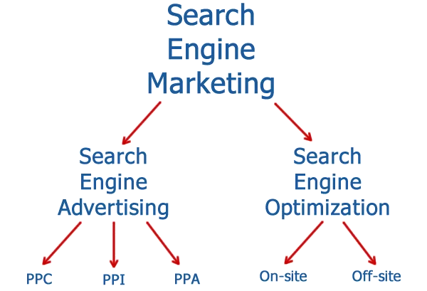

 
# Artificial Intelligence (AI) and Chatbot Integration with Digital Marketing Channels

Let's go back to the day when the idea of ​​AI was just presented in science-fiction movies, for examples, The Matrix, Robocop, Wall-E, and Her. But today, AI has become an important part of everyday life. We are certainly familiar with the existence of Siri on the iPhone, or Alexa from Amazon. As technology develops rapidly, AI is becoming the main choice for various types of industries, including sales and marketing.

We can all clearly see how ***chatbots integrate with digital marketing channels***, how chatbots work to replace the role of humans in connecting companies and customers. As a result, chatbot assistance can increase business opportunities, and can even be known abroad. Chatbots also expand market reach, so that a company can have customers who come from various circles and regions.

## How are chatbots used in digital marketing?

With plenty of implications in the marketing field, chatbots definitely count as the most exciting one. But, what exactly is this chatbot? ***How are chatbots used in digital marketing*** and have a very important role in the sales process? Here we discuss every important part that connects AI and chatbots, to increase excellence in a company.

If the question arises, 'Can you assimilate chatbots into your [digital marketing](https://deskbox.co/blog/what-is-chatbot-marketing) strategy?' The answer is 'Yes, we can'. As we can see, chatbots have become a game in the world of digital marketing. Every company is competing to develop chatbots to suit their needs, make chatbots increasingly sophisticated, and create chatbots that are very likely to lighten the burden on workers. Chatbots can be used for the following purposes:

### Gathering important customer information

Every company certainly wants to be the best and known by many people, right? However, to be at this peak point, a company must first know what they have to do. AI or chatbot assistance, will have a very significant impact, but how the chatbot is used wisely is much more important.

When entering the world of marketing with the help of AI, collecting information about customers is the first step that must be taken. This data can be collected through meaningful conversations. The data consists of contact information, email, information about whether you are a customer or not, age, shopping habits, and product preferences.

The data collection system can be done by providing polls, quizzes, and fun games. As we know, customers do not provide their personal data easily, considering the many scam crimes that occur through online activities. So, building customer trust in the company is a task for every entrepreneur who uses the chatbot.

### Scheduling

The saying 'chatbot knows what's best for you' is true. This can be implemented in scheduling or arranging appointment schedules with customers. Piling up office work sometimes makes workers forget what they have to do tomorrow, or forget certain important dates.

Well, in this case, the chatbot can provide assistance in the form of scheduling sessions. Activities such as sales calls, customer service calls, or onboarding sessions are no longer scary. The chatbot is like an alarm, ready to remind you of every schedule that must be carried out. No more drama!

### Answering FAQs

As a human being who feels bored, doing work repeatedly will feel very tiring. This is what customer service felt before the discovery of chatbot technology. They have to answer the same question asked by hundreds of different people. Nowadays, chatbots can help solve FAQ problems that stress workers.

Answering FAQs with the help of this chatbot can be said to be a win-win solution, both for customers and workers. Customers will get the answers they are looking for quickly and easily, while workers no longer have to provide answers to the same questions hundreds of times.

What needs to be noted is that every company develops chatbots to become more sophisticated. Sophisticated here means, the chatbot can answer naturally, like human language, not rigid machine language and templates.

### Greetings to the customers who first land on your website

When we talk about offline business, companies or shops must have staff who greet and welcome customers. Customers will have different experiences when they surf the online world. Jobs that have been programmed and carried out by smart machines sometimes mean that customers no longer receive greetings.

So, to recreate that personal experience, chatbots can quickly send greetings to every new customer who visits the website or online media for the first time.

## How to integrate AI into digital marketing?

In a very dynamic digital business landscape, AI is said to be a keyword and basis that helps a brand interact with its audience. This is because AI is able to analyze data at scale, perform repetitive tasks, increase efficiency, and personalize customer experiences.

Chatbots and AI cannot be separated, both are transforming to create a sophisticated, fast ecosystem and simplify processes. The use of AI is also not limited to giant companies that have been developing for a long time, but can also be used by microbusinesses (even those that are starting a business).

The use of AI and chatbots allows every business field to compete fairly. Let's learn more deeply about ***how to integrate AI into digital marketing,*** starting from analytical tools to platforms supported by AI to get optimal content. Let's read till the end!

### Use AI for personalizing experience

In marketing, data personalization is important. Knowing the personal side of customers will help a business connect with them for a long time. AI-based chatbots make it possible to adapt to individual interests, preference, and customer behavior. Here are several ways you can utilize AI as a form of personalizing the customer experience:

- AI-driven content recommendations

Several entertainment products, such as Netflix, Spotify, and Amazon, are prime examples of implementing AI-based content recommendations. The AI ​​system will analyze the types of films watched or music listened to by customers, and then later, the AI ​​system will provide several recommendations for similar content that they might like.

The AI ​​tools that can be used are Adobe Experience Manager. This tool helps to increase user engagement and increase the chances of conversion according to customer interests.

- Email marketing

Until now, email marketing has been a powerful strategy for marketing products or services. These messages can be product promotions, breaking news, special offers, or relevant content. One platform that may sound familiar is Mailchimp, which integrates AI to send emails to customers. Mailchamp can determine the best sending time, and personalize email subject lines.

Mailchimp as the supporter of email marketing [source: [https://www.singlegrain.com/](https://www.singlegrain.com/)]

### Content creation and curation are AI-based

In the era of massive internet and all online information, content is king. Every company competes to create content that is interesting, unique, and not discussed by other companies.

Content that dares to be different is what can attract many customers. However, creating interesting content is a challenge in itself, considering that there is too much information that can be obtained from various social media. But, don't be confused, here's how AI systems can help the process of creating and curating content for more interesting results.

- AI writing assistant

One of the many ways ***how to integrate AI into digital marketing*** is writing with AI*.* Writing now can be a very enjoyable activity. This is because AI can check data, grammar, and sources. So, with the help of AI engines, companies can produce interesting reports, articles, and stories. There are many AI-based writing assistants that are familiar and widely used, such as ChatGPT, Jasper AI, and ContentShake AI.

As a side note, to get original, human-written content, ask AI to create a first draft or brainstorm content ideas. For the rest, companies can develop ideas and perfect content by reading various references. So, the content obtained is not solely the result of AI, but rather a collaboration between AI and the human mind.

- SEO optimized content creation

Which company doesn't want their content to be on the first page of search engines? For digital visibility, this is very crucial. AI can be a tool that can analyze the latest search trends, suggest keywords, and even predict content that will explode on the market.

There are several AI tools that can be used to optimize content, for example, MarketMuse. This platform provides tips so that content sells in the market, provides recommendations for the right keywords, and opens up the possibility for content to get a high rating.

- Visual content creation

Apart from writing, AI can also play a role in creating content such as videos and images. AI-driven graphic design tools make it possible to generate images, videos, and even infographics needed by companies or websites. Some customers may be too lazy to read written content; they prefer images and graphics.

To support the digital marketing process, companies can explore AI-based tools, such as Canva's Magic Write or Lumen5. This platform can produce images, graphics, and even videos that suit your wishes and needs.

### Customer decision making and data analysis

The data is a valuable thing for the company. For a company, data can be used for analysis and decision-making in data-driven marketing. Here are some examples of the transformative impact of AI on these sections.

- AI-based customer segmentation

In the buying and selling process, customers can fall into several segments, depending on certain characteristics or behaviors. AI in this case can divide micro segments based on these preferences, resulting in various customer data points. Incoming customer data will be analyzed one by one and collected into certain segments.

How Salesforce Marketing Cloud works on data segmentation [source: [https://www.singlegrain.com/](https://www.singlegrain.com/)]

One of the AI ​​tools that can be used for grouping this data is Salesforce Marketing Cloud. This data segmentation is of great value to companies because they can analyze and highlight personalized marketing messages.

### Chatbots and customer service

Let's discuss the main topics that have the most role in digital marketing, namely chatbots and customer service. Chatbots are a vital tool, because they can increase sales in a short period of time. All problems related to responding to customers, answering FAQs, and providing product recommendations, can all be resolved in a matter of seconds.

This virtual agent uses machine language that is structured in such a way that it looks like human language. It's not surprising that the existence of AI-based chatbots can make customer service work easier. Working to serve customers is no longer as scary as many people imagine.

- Chatbot as shopping assistant

Just as chatbots are taking over the role of customer service, they can also take on the role of shopping assistants. This shopping assistant works by offering the latest products, offering discounts and promotions, and even providing product recommendations based on previous purchases. So, customers who make purchases online will have an experience like shopping at an offline store.

The way to optimize this chatbot is to design the chatbot to ask relevant questions. The question could be what the customer’s needs and preferences are. Then, use that information to suggest products or services that meet their criteria.

### Enhance SEO (search engine optimization) and SEM (search engine marketing)

As the field of digital marketing becomes increasingly competitive, two factors that should not go unnoticed are SEO and SEM. These two factors can increase traffic. Advanced AI technology offers a very innovative way, so that when companies release content in the form of advertisements, the advertisements can reach the audience at the right time.

How AI can make a significant impact [source: [https://www.singlegrain.com/](https://www.singlegrain.com/)]

So, to improve SEO and SEM, the first step you have to take is looking for the right keywords. Keywords can help a website be easily found by the audience, even on the first page of searches.

## Conclusion

As a result, let’s embrace AI in digital marketing. The integration of AI, chatbots, and digital marketing is proof of technological progress and human innovation in advancing business. AI helps in many ways, from creating and curating various types of content, replacing customer service with chatbots, acting as an assistant, and even maximizing SEO and SEM for marketing progress. AI can also be called the future of digital marketing. The increasingly rapid development of AI makes the world of digital markets increasingly busy and in demand. So, are you one of those interested in using AI assistance to market your products?