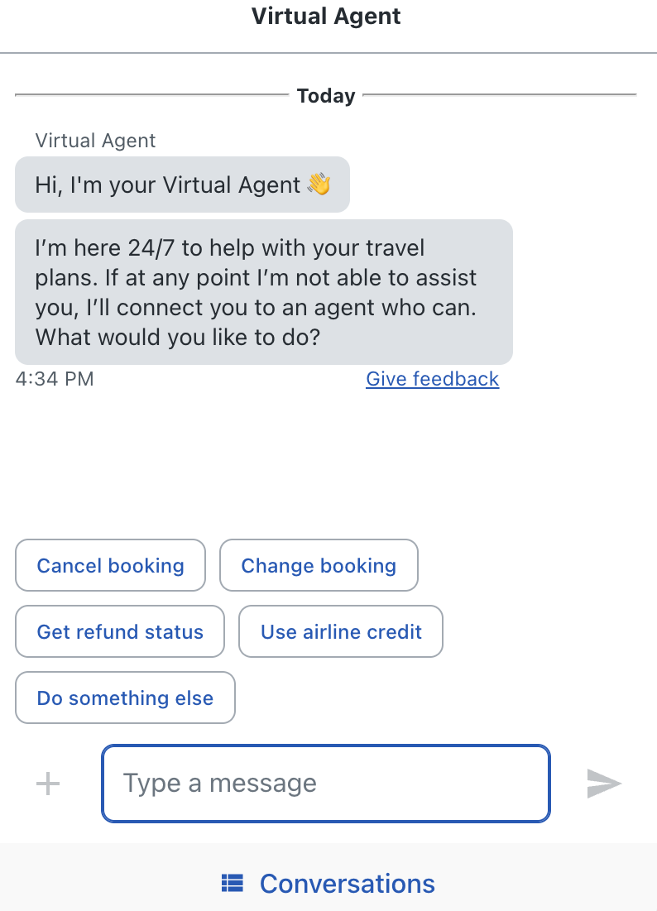

# How Chatbot Become The Trends and Innovations in Marketing in The Future

In the future, some jobs may be replaced by sophisticated and modern machines, for example, artificial intelligence, which works similarly to humans. This AI breakthrough helps in various business fields, one of which is marketing. In marketing products to customers, AI applies smart machines that can carry out programmed two-way conversations. The language used is similar to everyday conversation between sellers and customers. Seeing this situation, will chatbots be ***the trends and innovations in marketing*** in the future?

The chatbot market is also experiencing very rapid development. Research notes that as of 2024, chatbots have a value of USD 7.01 billion, and it is estimated that it will reach USD 20.81 billion in 2029. This large number indicates a high compound annual growth rate (CAGR) of 24.32%.

Chatbot innovation is certainly a determinant of marketing success in several large companies. They rely heavily on chatbot speed in serving and answering customer questions. Chatbots are also a solution for efficient working hours and an opportunity to provide an interesting transaction experience.

## **What is the market trend for chatbots?**

The chatbot market trend is entering an era where almost all companies, both well-known and start-up companies, are trying to implement chatbots. This is considered because the chatbot provides much needed assistance. Chatbots that are ready 24/7 provide opportunities for every business to serve customers optimally, with minimal costs and human resources. The following are examples of chatbot usage that varies among users in various countries:

- According to Juniper Research, worldwide retail of chatbots increases from $12 billion in 2023 to $72 billion by 2028 (based on a survey in June 2023).
- Google records that 49% of adults in the United States used AI chatbots for customer service in the past 12 months.
- In North America, 50% of digital marketing agencies used ChatGPT, according to WordStream survey data in September 2023.
- 9% of adults in the United States use chatbots for their business needs, according to research from Vonage.

Chatbot in the 1st position to enhance digital marketing, based on marketers survey [source: [https://www.emarketer.com/](https://www.emarketer.com/)]

## **How are chatbots used in marketing?**

It is no longer strange to know [***how are chatbots used in marketing***](https://deskbox.co/blog/what-is-chatbot-marketing)? This is because AI systems have been widely used in various industries, including health, education, retail and online shops, and even travel agents. Chatbots that provide many conveniences in an instant have become a popular trend and will continue to be used and developed. Here are some of the benefits of using chatbots for marketing!

### **Fast response to customers**

The first reason why many businesses use chatbot assistance is because it gives a very quick response to customers. In instant transactions, long loading times are what customers hate the most.

Super-fast service allows customers to save a lot of time by carrying out various transactions at the same time. Chatbots always provide fast responses because they are programmed that way. The answers provided have also been integrated based on searches on search engines. This chatbot method of responding to messages quickly will improve engagement, brand image, and customer trust.

### **Speed ​​up the payment process**

Welcome to the cashless era! In an era where everyone is competing to pay contactlessly, without cash. Payments can be made via chatbot, saving time and energy. Customers no longer need to queue to pay for their purchases. Paypal, for example, is one of the AI ​​systems that offers money transfer and payment services. This is very effective, isn't it?

This payment system is very convenient and easy when compared to conventional systems. Google Pay, Apple Pay, and Samsung Pay are examples, besides Paypal, that facilitate faster and easier payments.

### **Increase engagement with customers**

Through chatbots, conversations with customers from various countries cannot be limited. On large platforms such as Messenger and WhatsApp, the number of users can reach billions. This large number is what makes it possible to increase interaction between viewers.

This type of online ordering is also always updated regularly, so there are always the latest features being launched. As done by WhatsApp, interaction with customers can be built through the channels contained in the 'Update' feature. In this channel, users can join according to the channels they are interested in.

### **Suitable in any business**

Chatbots are designed to be implemented in various types of businesses of various scales, be they large companies or those that are just starting out. Chatbots can also direct customers to certain segments.

For example, when customers ask about stock and prices, they are likely to place an order. The chatbot will simplify the ordering process by providing several product recommendations that suit the customer's interests. So, don't be afraid to try implementing the use of chatbots for your business. This will really help the product marketing process.

## **What are examples of chatbots in marketing?**

The use of chatbots is most commonly found in B2B or B2C business environments, because this field requires interaction with customers. Some businesses use chatbots to boost their sales system, or simply so that their company is known and has a name among the wider community. Then, ***what are examples of chatbots in marketing?*** The following are examples of companies that utilize chatbots:

### **Sun Hola Holidays**

Do you like vacationing or traveling to faraway places? Have you ever heard of the name Hola Sun Holidays? This company is one of many travel agents who specialize in providing holiday packages to Cuba. Hola Sun uses chatbots via Messenger, to ensure that their customers always reply to messages and interact wherever they are. With the convenience of chatbots, holidays feel more fun and less boring.

### **1-800-Flowers Gwyn**

Come on, flower lovers, come here! 1-800-Flowers is a chatbot that allows customers to order flowers via Messenger. This chatbot also gives customers a chance to speak with support. So, for those who are confused about ordering flowers for certain occasions, graduation events, or flowers for loved ones, this chatbot is the solution. Ordering flowers can be relaxing, so no more worries.

1-800-Flowers Gwyn chatbot [source: [https://digiday.com/](https://digiday.com/)]

### **Whole Foods Market**

One chatbot that can be used to search for various kinds of food recipes and for grocery store chains. Recipe searches can be based on type of dish, type of cuisine, food for a diet, and so on. What's even more incredible is that all the cooking recipes determined in this chatbot have gone through a testing process by the Whole Foods team. So you can be sure that the recipe is rigged with the nutritional amount and vitamin composition that our body needs.

The recipes and cooking recommendations provided by Whole Foods are based on the responses given by users when they first log in to the chatbot page. Because customers choose their own recipes, using the Whole Foods chatbot can certainly avoid undesirable types of dishes, for example, those that cause allergies, or those that contain certain ingredients.

### **Wall Street Journal's Chatbot**

One example of a ***chatbot for marketing*** is the Wall Street Journal. This chatbot uses a personalization system based on customer data, so it will match customer interests. Customers who enter this journal page will get satisfaction because it meets their expectations. Some of Andalah's features on Wall Street include providing the latest news updates and collecting consumer insights. The advantage gained from using chatbots is effective marketing activities through analyzing interactions with customers.

### **Mountain Dew chatbots**

One of the United States beverage companies also markets products with the help of chatbots. The process of connecting with customers is built through brand advocacy and engagement. Through a campaign entitled 'rig up', this beverage product was first introduced to customers. Furthermore, this product is promoted by Twitch through live stream activities. 

Mountain Dew finally gained success by receiving the Short Award. This extraordinary marketing process has helped it achieve a high level of engagement and become one of the most well-known brands among millennials and Gen-Z.

### **KAI Mastercard**

In 2019, Mastercard launched KAI as a product aimed at helping customers manage and plan their finances. Chatbots then play an important role here, providing financial advice because it has been personalized, and adapts to customer needs. These chatbots personalize customer data based on their spending patterns and financial goals. Other features that can be offered are balance inquiry services and card activation. Regarding benefits, the following are the benefits that customers get:

- Improving customer financial literacy
- Increasing customer loyalty and engagement
- Managing brand reputation

## **Why are chatbots the future of marketing?**

Everything related to technology will be a milestone in the future of business, especially for those involved in marketing and product marketing. This is the answer to ‘***why are chatbots the future of marketing?’*** Because chatbots are one of the breakthroughs in the field of technology that will continue to develop from time to time.

In 2024, it will be recorded that 50% of the transactions carried out by chatbots will be carried out by machines, without any human intervention. This shows that AI is increasingly advanced and effective. In the following years, technology that is much more sophisticated and helpful to humans will probably be born.

There is also a new breakthrough, the separate chatbot trend, where chatbots can be used on a retailer's smartphone or mobile app. Chatbots are not only accessed via browsers or messaging platforms. As of this year, approximately 80% of online shopping by global consumers is done via chatbots. See, how can chatbots not be the future of marketing?

### **Optimizing your resources**

One important factor in improving marketing is getting direction and attention as early as possible. By using chatbots as a way to achieve goals, a company saves money and energy. Workers no longer need to work 24/7 hours or in shifts because machines have been replaced that are available at all times. Chatbots can be a long-term business investment, and can be used as a backup, as long as they carry out regular maintenance.

How chatbots responds 24/7 to customer [source: [https://media.sproutsocial.com/](https://media.sproutsocial.com/)]

### **Increase engagement**

Just imagine, how many potential customers could become customers of a company if the service system was satisfactory. The chatbot feature can be an entry point for someone to become a regular customer. When entering the website, customers are no longer confused about finding the product they want. The chatbot will serve them by answering various kinds of questions. 

That way, when customers are satisfied with the answers given, they will move on to choose the products provided. The quality of various chatbot features certainly also influences customers to stay longer on the website. In the end, they can also recommend the business to people around them.

### **Data analysis**

One of the reasons why chatbots can be categorized as marketing supporters in the future is their speed in analyzing data. Every piece of customer data that enters the website will become a valuable treasure. Because this data provides insight into customer tastes and demands. 

Knowing customer tastes means knowing how to improve the overall marketing plan. As a result, the company will supply products that are sought after by many customers. This puts those who use chatbots one step ahead of those who market products by word of mouth.

### **Future-proof a business**

A business can be said to be growing if it continues to be willing to adapt and experiment with the latest technology. That way, business people know which technology, platforms, and marketing methods are most appropriate to use. 

Using the latest technological assistance, such as chatbots, will make you one step ahead of your competitors. Every customer certainly wants help and guidance in finding the product they want. Employing staff 24 hours a day is certainly no longer effective. Therefore, an AI machine called a chatbot will take over this role.

### **Expand to global markets**

In the business world, companies that can go international and be known globally have won the lottery many times. Expanding your business internationally is no longer difficult, with the help of chatbots, for example. The marketing process, which was previously difficult, can now become easy and enjoyable. 

A business that has grown rapidly also allows business owners to have wider channels. This can be a good signal, so that the business will live long and be increasingly known by many people. So, the question is, what kind of sophisticated chatbot technology can make a company widely known globally?

## **Conclusion**

In conclusion, regardless of what type of business you are pursuing, chatbots are a marketing strategy that will help a lot. This chatbot is becoming a trend that is being used by almost all e-commerce companies, in order to increase revenue and profits. If a company wants to build brand awareness, maintain customer loyalty, and generate promising sustainable business, then chatbots are the best choice. 

According to all the research that has been done, chatbots tend to provide many benefits and advantages. By using chatbots, companies have helped customers experience new experiences in their shopping activities.
