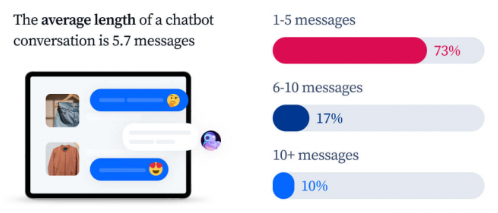
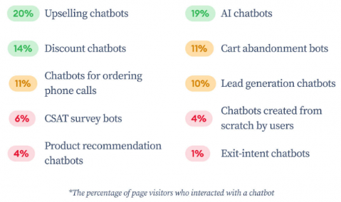

# Benefits of Automation in Customer Support

## **The Changing Landscape of Customer Support**

The changing landscape of customer support mainly happened because of the benefits that customers need to get. Customers expectation for fast, efficient, and personalized service, but traditional methods can’t offer that. The traditional customer support methods need more time for wait times and limited time (business hours). Technology development has resolved the problem by implementing AI in customer support.

Source: Unsplash

## **Introducing AI for Customer Support**

Artificial Intelligence is a technology that allows computers to learn and make decisions without human intervention. The technology can used for customer support. The use of AI in customer support has different types, such as chatbots, virtual assistants, etc. All the types helped customer and business operations to be more efficient.

### **How AI Can Help Customer Support**

AI helps customer support through availability, efficiency, and personalization.

- **24/7 Availability**
    
    AI chatbots can handle inquiries anytime, anywhere, outside business hours. The service can be accessed through 24/7 and freeing up human agents.
    
- **Improved Efficiency**
    
    AI can automate repetitive tasks like answering FAQs and routing inquiries. The efficiency of AI allows human agents to focus on complex issues, and basic issues will be resolved by the AI.
    
- **Enhanced Personalization**
    
    AI can personalize interactions based on customer data. It offers a more relevant experience that has been adjusted to customer preferences.
    
- **Faster Resolution Times**
    
    AI can quickly answer common questions leading to faster issue resolution. An average conversation with AI-based customer service includes only [5.7 messages](https://www.tidio.com/blog/ai-customer-service-statistics/).
    
    
    
    Source: Tidio
    

## **The Benefits of AI Automation for Businesses**

AI automation is a solution for businesses to improve customer services without increasing costs and human agents. It helps business to engage customers effectively.

Source: Tidio

- **Increased Customer Satisfaction**
    
    AI in customer service enhances customer experience and leads to customer satisfaction. The AI provides faster and more efficient than the traditional method.
    
- **Reduced Operational Costs**
    
    AI can automate repetitive tasks that lead to decreasing the cost of managing a customer support team. It also streamlines workflows in service and assists to saving costs.
    
- **Improved Agent Productivity**
    
    The AI works 24/7 and freeing human agents outside business hours. It will give agents time to focus on higher-value tasks and complex customer interactions.
    
- **Valuable Customer Insights**
    
    AI can gather and analyze customer data. It provides valuable insights to improve the customer service. The other way, the customer will get a personalized experience based on their preferences.
    

Source: Unsplash

## **Leveraging AI for a Winning Customer Support Strategy**

AI automation has a lot of benefits for business. By identifying and analyzing AI, the business company might find a better strategy for customer support improvement.

- **Identifying the Right Use Cases**
    
    First, identify areas in customer support that can benefit most from AI automation. By identifying the area, it can help find a solution that could be more effective.
    
- **Integrating AI Seamlessly**
    
    AI helps business operations to be more efficient. It integrates AI with existing systems and workflows for a smooth transition.
    
- **Prioritizing the Human Touch**
    
    Future customer support needs collaboration between AI and human agents. The limitation of AI can be solved by the human. Human elements in customer support are important for resolving complex issues and emotional situations.
    
- **Measuring Success**
    
    The business company can evaluate customer support performance by tracking key metrics of AI. The impact data that is collected includes customer satisfaction, resolution time, etc.
    

## **Conclusion: The Future of Customer Support is Now with AI**

AI automation is a solution for businesses to improve customer support. The use of AI in customer support has advantages in enhancing customer experience and personalization, reducing costs, improve efficiency. The use of AI also helps businesses to create customer support strategies. It will find effective and efficient solutions, and also evaluate the customer support performance. Learn more about AI-powered customer support solutions in other articles.