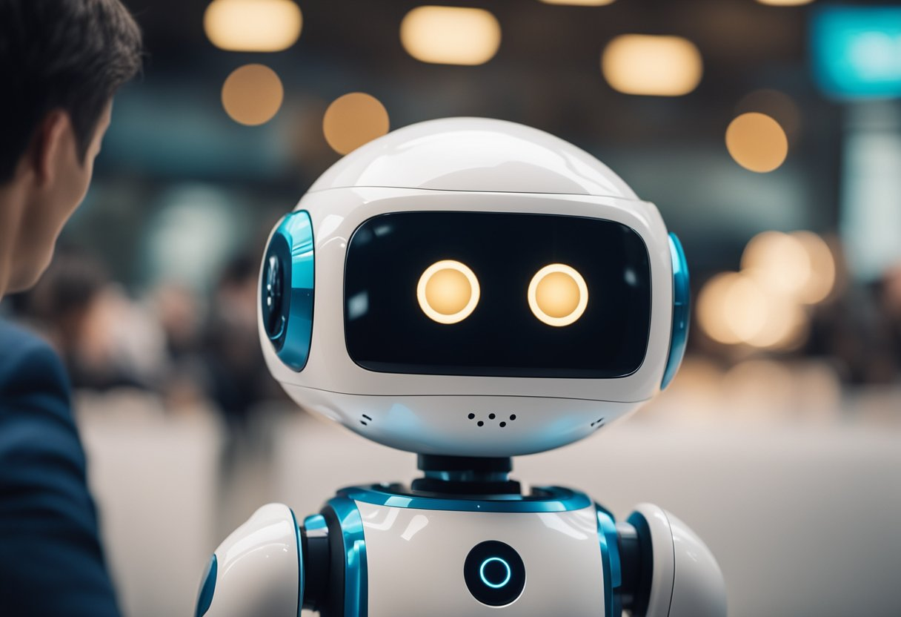

The rise of [AI chatbots](https://deskbox.co/blog/what-is-chatbot-for-customer-support) represents a significant shift in how businesses interact with customers. **These intelligent systems enhance customer experience by providing instant responses to inquiries, reducing wait times, and ensuring consistent service quality.** As organizations increasingly adopt this technology, the ability to manage customer expectations and streamline service processes is becoming essential for maintaining competitive advantage.

As businesses navigate this new landscape, the integration of AI into customer service must be strategic and well thought out to truly benefit the end user. The ongoing evolution of chatbot technology holds the promise of not only enhancing customer satisfaction but also driving efficiency within service teams.

### Key Takeaways

- AI chatbots deliver quick responses, improving overall customer satisfaction.
- Successful integration requires balancing automation with human interaction.
- Ongoing evaluation is essential to maximize the effectiveness of AI in customer service.

## AI Chatbot Impact on Customer Service

AI chatbots significantly enhance customer service by providing support around the clock, personalizing interactions, and improving efficiency. These capabilities lead to better customer engagement and satisfaction, ultimately benefiting the business.

### 24/7 Support and Instantaneous Response

AI chatbots offer continuous availability, ensuring customers can receive assistance any time of day or night. This round-the-clock support is crucial for businesses operating across different time zones and for industries where urgent responses are required.

With instant messaging capabilities, chatbots respond to queries immediately, eliminating frustrating waiting times. This prompt engagement improves the customer experience and cultivates a sense of reliability.

According to a study, customer retention increases significantly when businesses provide timely support. Implementing AI chatbots allows companies to maintain satisfaction while accommodating diverse customer needs and preferences.

### Personalization at Scale

AI chatbots excel at personalizing customer interactions by leveraging data analytics and customer profiles. Their ability to analyze past interactions and preferences enables them to tailor responses, making each engagement feel unique.

Customers appreciate tailored recommendations, which can enhance the shopping experience and lead to increased sales. By employing AI-driven suggestions, companies can cater to individual tastes without human agents being overwhelmed by requests.

This level of personalization is difficult to achieve manually, especially for businesses with large customer bases. Chatbots streamline this process while maintaining a personal touch that resonates with customers.

### Reduction in Waiting Time and Queues

Long wait times frustrate customers and can drive them to competitors. AI chatbots reduce these delays by managing multiple customer interactions simultaneously.

By addressing simple queries instantly, chatbots free up human agents to tackle more complex issues. This division of labor improves the efficiency of customer service teams and reduces backlog.

In practice, companies that implement chatbots often report a significant decrease in customer wait times. This enhancement helps create a smoother and more enjoyable experience for customers seeking assistance.

### Handling Capacity and Multitasking Efficiency

The ability of AI chatbots to handle numerous inquiries at once is a game changer for customer service. Unlike human agents, who can only manage one conversation at a time, chatbots can engage with thousands of customers simultaneously.

This multitasking efficiency ensures that no customer feels neglected, even during peak business hours. Organizations can maintain service quality at scale without sacrificing response times.

Moreover, AI chatbots continuously learn and improve from interactions, further enhancing their ability to manage queries effectively. This ongoing development makes them increasingly valuable for businesses looking to expand their customer support capabilities.

### Consistency in Customer Service

AI chatbots deliver consistent responses, which helps establish trust and reliability among customers. Unlike human agents who may vary in their interactions, chatbots maintain a uniform tone and quality in communication.

This consistency is vital for brand image and customer confidence. When customers receive reliable support, they are more likely to return for future interactions.

Furthermore, chatbots can easily be updated to reflect changes in company policies or products. This ensures that all customers receive the most accurate and timely information, enhancing the overall service experience.

[Deskbox](https://deskbox.co/) is the solution for those of you who want to improve customer support services in your business.

## FAQ

1. **What are the benefits of using a Deskbox chatbot for your customer ?**
    - **24/7 Availability:** Chatbots can provide support at any time, even outside of regular business hours.
    - **Instant Responses:** Deskbox chatbot offer immediate answers to customer inquiries, reducing wait times.
    - **Cost Efficiency:** Automating routine queries reduces the need for human agents, saving on operational costs.
    - **Scalability:** Chatbots from Deskbox can handle multiple conversations simultaneously, making it easier to manage high volumes of customer queries.
    - **Consistency:** They provide consistent responses, ensuring customers receive accurate information.
2. **What types of questions can a Deskbox chatbot handle?**
    
    Deskbox chatbots can handle a variety of questions, including:
    
    - Basic information requests (e.g., "What are your business hours?")
    - Product or service inquiries (e.g., "Can you tell me about your pricing plans?")
    - Technical support for common issues
    - Frequently Asked Questions (FAQs)
    - Guiding customers through troubleshooting steps
    - Guiding customer how to use your products
3. **Can a Deskbox chatbot escalate issues to a human agent?**
    
    Yes, chatbot can escalate the conversation to a human agent if it necesarry. This ensures that customers receive the help they need with collaboration between chatbot and humant agent. Currently we integrate with Intercom to escalated to human agent if you use Intercom as your live chat
    
4. **Can a chatbot be customized for my business?**
    
    Absolutely! Deskbox enable you to build chatbots tailored to fit your business’s specific needs, including color, logo, etc.
    
5. **How do I measure the effectiveness of a customer support chatbot?**
    
    Effectiveness can be measured using various metrics, such as:
    
    - **Response Time:** How quickly the chatbot responds to customer queries.
    - **Resolution Rate:** The percentage of queries resolved by the chatbot without needing human intervention.
    - **Customer Satisfaction:** Feedback from customers regarding their experience with the chatbot.
    - **Engagement Rate:** The number of interactions or conversations the chatbot handles.
    - **Escalation Rate:** The frequency at which the chatbot hands off to a human agent.
6. **Can a chatbot integrate with my existing platform ?**
    
    Yes, currently we are integrated with Intercom as Chatbot. So you can integrate Deskbox chatbot with Intercom to handle repetitive question and escalate to your human agent on intercom when customer want to connect with your agent

<a 
  href="https://deskbox.co"
  style={{
    display: 'inline-block',
    backgroundColor: '#5423E7',
    color: '#fff',
    padding: '0 50px',
    textAlign: 'center',
    textDecoration: 'none',
    borderRadius: '10px',
    fontFamily: 'Inter, sans-serif',
    fontWeight: 'bold',
    fontSize: '14px',
  }}
>
  Create Your Chatbot
</a>
