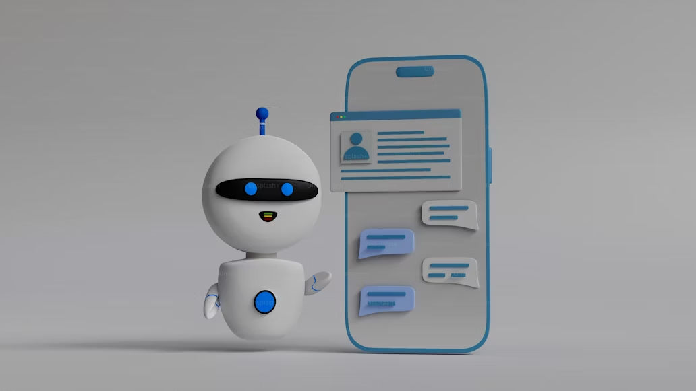
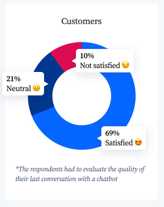
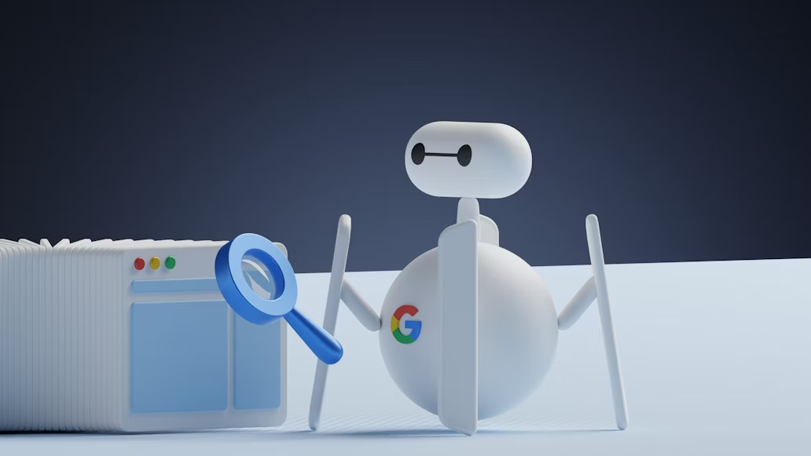

# How AI is Changing Customer Service

## **Introduction**

Artificial Intelligence has been known for the simulation of human intelligence. It is capable of learning, adapting, making decisions, and solving problems. However, AI has been implemented in today’s customer service. Some research shows that AI-based customer service is growing rapidly and become essential to the business landscape. The AI in customer service changes the experience effectively.

## **Examples of AI in Customer Service**

AI has been derived for many sectors of customer service. The wide application purpose is to help service more effectively.

### **AI Chatbots**

AI Chatbots are capable to answer customer questions and resolve basic issues. The technology allows customers to use it effectively and quickly get a response. It is also 24/7 available, so the customer can access any time. The application has applied in different industries, such as retail, banking, travel, and more.

### **Virtual Assistants**

Virtual assistant is a technology that handles customer inquiries through voice commands. The ability of virtual assistants allows customers to have guidance and automation quickly. The popular example of virtual assistant customer service is Amazon Alexa and Google Assistant. They can use human voice, so the conversation feels natural.

### **Sentiment Analysis**

The AI in sentiment analysis can analyze customer conversations. It is capable of understanding customer emotions and satisfaction levels. AI helps businesses to understand more about their customer. Some areas that can be analyzed are service, product, and interactions. It provides feedback on services that improve customer experience.

### **Predictive Maintenance**

Predictive maintenance customer service is a technology that anticipates customer issues. It uses AI, machine learning, and data analysis to identify some potential defects before the failure occurs. The AI can be used for various sectors, like scheduling service appointments based on product usage data. It will give a notice and earlier warning about the parts that need to be inspected.

## **How Can AI Help Customer Service**

The automatization of AI-based customer service improved customer experience and business operations. It includes efficiency, satisfaction, availability, and more.

### **Increased Efficiency and Scalability**

AI automates repetitive tasks. It can resolve basic problems and some routine-consuming time tasks. With that, human agents have time to focus on complex and critical issues. Besides efficiency, AI-based customer service also allows business companies to handle larger volumes of customers. Without compromising service quality, AI-based customer service manages multiple customers and ensures immediate answers.

### **Improved Customer Satisfaction**

AI chatbots in customer service provide 24/7 availability. AI chatbots also reduce customer wait times with faster automatic responses. The faster response and the availability, significantly boost customer satisfaction and loyalty.

The AI chatbot leads to higher satisfaction due to the relevance and preference of the customer. AI chatbots enhance customer interaction because of the personalization of AI-powered. It analyzes customer data based on demographics, behavior, and preferences.

Source: Tidio

### **24/7 Availability and Global Reach**

AI chatbots offer continuous support, even outside regular business hours. The accessibility of AI will reduce wait times and improve customer experience. The experience was also improved by the multi-language that AI chatbots offered. It overcomes language barriers and caters to customers worldwide.

### **Data-Driven Insights**

The AI collects and analyzes customer data to understand customer’s needs. It identifies the preferences of customers to improve future interactions and offer personalized trends. The process leads to higher customer satisfaction by enhancing customer engagement. These insight data help businesses refine their customer service strategies for better outcomes. 

## **Can AI Replace Customer Service Reps?**

With all the benefits AI customer service has offered, it still has limitations. The AI in customer service is unable to handle complex situations and read complex emotions. It might answer in sensitive ways that might impact to customer experience and feel. This inability requires human agents for empathy and judgment. So, AI is best seen as a tool to augment human capabilities, not replace them entirely.

By working together, the future of customer service can be a collaboration between AI and human agents. It will offer a more efficient and personalized experience for customers.

## **Conclusion**

AI has a transformative impact on customer service. It grows rapidly to support customer experience and business operations. Implementing AI-powered solutions, helped the efficiency, satisfaction, availability, and personalization of customers. All benefits will also help refine the strategies for better customer service outcomes. AI also has limitations, but it is resolved by collaborating with humans to complement each other. Yet, it still has the benefit of strategies to enhance customer service. Explore more about AI-based customer service articles in other sections.