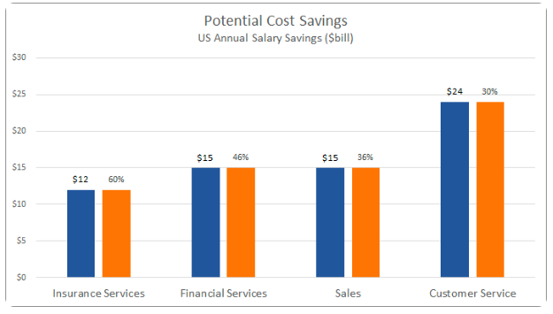
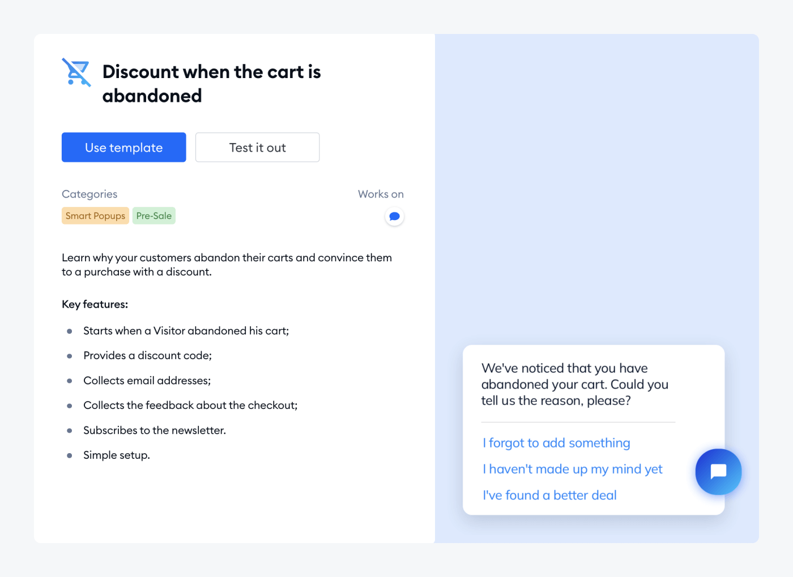

# Implementation of A Chatbot Strategy in Marketing to Enhance A Business Sales

Talking about the implementation of chatbots in boosting digital marketing, there will be a lot that can be discussed. Chatbot simulations that work like humans allow these machines to answer a hundred or even a thousand questions without stopping. Sales and marketing using chatbots is a good, fast, and cheap step. 

As in previous discussions, ***chatbots for marketing*** bring many benefits to a company. Let's just say, chatbots replace the position of customer service, which is required to serve customers all day long. Instead, chatbots can be active 24/7, providing maximum convenience for customers. So, the next question, ***how can chatbots be used in marketing?*** Check out the following review!

## **How Can Chatbots Be Used in Marketing?**

In the ever-growing digital era, the use of artificial intelligence is commonplace in business. The existence of chatbots can be said to be the most popular current trend. This chatbot is used through a messaging interface, where customers talk to a machine as if they were talking to a human. The massive use of chatbots has made it a 'buzzword in the industry'. This embedding is not without reason, here's how chatbots play an *[important role](https://deskbox.co/blog/what-is-chatbot-marketing)* in digital marketing!

### **Save Time and Cost Effectively**

Chatbots are an investment for the future that can be continuously used in the world of marketing. Have you ever wondered ***how can chatbots change marketing and sales?*** Well, with a technology system that is active non-stop 24/7, the chatbot displays real-time responses from customers. The existence of chatbots is very profitable, because it reduces the funds and time used to serve customer wishes one by one. As a result, chatbots will save money. It's as easy as that.

How chatbot save cost effectively [source: [https://www.giosg.com/blog/chatbots-and-marketing](https://www.giosg.com/blog/chatbots-and-marketing)]

The results of a study show that in 2023, chatbots have delivered up to $11 billion in cost savings. This number is a calculation from various sectors, such as the health industry, retail, and banking. When compared to hiring a staff as a customer service, it will cost a lot of money. Because, they need training, insurance packages, transportation fees, and even supporting infrastructure.

### **Enhance the Quality of Customer Service**

Perhaps, the most valuable change a chatbot has made to a business or company is the quality of customer service. Customer service is a tiring job, because you have to answer endless user questions and complaints. The simple reason why chatbots are a solution is: to solve customer problems, including:

- There is no 24 hour customer service line available
- Long response time to questions or complaints from customers
- The call center is always busy and cannot be contacted
- Improper attitude or conflict with the agent

### **Personalizing Scalability**

Scalability and increasing workload within a company can be threats. Increasing customer activity can complicate the situation. So a company might hire new people, or lay off staff who it feels are less competent in their field. These changes will put pressure on human resources departments.

Implementing chatbots will really help the process of increasing scalability, of course with lower costs and an easier process. For the record, the following things must be considered when increasing scalability with the help of chatbots

- Continue adding some features that are needed by customers, because that is what will make them stick around and continue to subscribe
- Introducing the chatbot and its specific department. Remember, the narrower the scope of questions asked to the chatbot, the more effective the interaction with customers will be, and the more accurate the information provided
- Personalize interactions with users. Make sure the bot doesn't just answer FAQs according to a template. Personalizing chatbot interactions will make customers feel like their needs are being met by a company.

### **Nurture Leads**

Chatbots play an important role in generating high-quality business leads. Conversations with chatbots are very easy, especially if we look in depth at people's habits of preferring to send text messages rather than making or receiving calls from customer service. In generating and nurturing leads, companies can build and organize chatbots like this:

- Offer promotions and discounts for first-time visitors
- Engage customers through quizzes or product recommendations
- Offers subscriptions and provides useful information
- Make an appointment with a live agent

### **Collecting Customers’s Data**

Why is collecting customer data considered important in starting a business? The answer is that, with this data, companies can understand consumer desires, behaviors and concerns about a product. Information related to this data is very meaningful in developing demand strategies and generating prospects for a business. The following are universal types of data that can be collected with the help of chatbots:

- Customer personas
- Customer desires
- Customer concerns about certain products
- Language preferences and choices
- Demographics

So, how do companies use this to get important data related to customers? You can use the following steps:

- Bots can collect names, emails, contact information, and other personal info;
- Ask a customer about specific questions related products and services;
- Organize quizzes and distribute polls

As a note, don't rush into asking questions. Questions can be asked when the customer is comfortable enough surfing the website, Messenger, or any application owned by a company or business. In an era where personal information is prone to being stolen, customers certainly will not provide their personal information quickly. Being patient in communicating and continuing to build customer trust are the keys. Make sure that the chatbot provides the best service, goods, and services to customers.

### **Chatbots As A Reminder**

Have you ever heard the term 'abandon cart'? Yep, this term is popular among online business owners. Abandon cart means that buyers only put the items they want into the shopping cart, then forget about them. In 2020-2021, the percentage of abandoned carts on e-commerce platforms reached 85.6%. In this condition, businesses use chatbots as a reminder or alarm.

Image: Abandoned cart [source: [https://www.tidio.com/blog/chatbot-for-business/](https://www.tidio.com/blog/chatbot-for-business/)]

Chatbots alert customers that they have pending purchases that need to be completed immediately. This reminder also notifies you about product availability, as well as discounts that you might get if you buy a particular item. Finally, bots help keep customers from leaving the website.

## **What Is An Example Of A Chatbot in Marketing?**

Talking about chatbots, based on surveys and research, more than 42% of large companies in the world are already using artificial intelligence technology. The use of AI has been proven to be able to improve marketing and sales of products and services offered by certain companies. Below are several ***examples of a chatbot in marketing,*** taken from various well-known brands from all industries. This chatbot example proves how AI plays an important role in efforts to sell products.

### **MobileMonkey, Inc.**

MobileMonkey, or Instachamp, is a chatbot platform for creating chatbots on websites, Instagram, Facebook Messenger, and SMS. How MobileMonkey works with two-way communication and presents interactive content to users. This content can be in the form of polls, quizzes, and other fun questions for the audience. When the audience is convenient, the new chatbot will accommodate interesting information concerning new product launches or ongoing promotions. The following are the benefits produced by MobileMonkey:

- Use interface
- Broadcast your chatbot on websites, Facebook, Instagram, and SMS
- Using Drip Campaigns and Chat Blasters
- Built-in live chat
- Website Widgets (advanced)

### **Kiehl’s Chatbot**

Founded in 1851, Kielh's is included in the list of cosmetic brands that focus on apotherapy skincare, bodycare, and haircare. Known as a well-known brand, Kielh's was once just a roadside pharmacy located on the corner of 13th Street, New York. Kielh's is not only known for its quality products but also for its use of chatbot technology that helps customers get the products they want.

Kielh's chatbot can identify the user's skin type first. After the identification process is complete, the chatbot will direct the user to choose products that are relevant and suitable for their skin type. In choosing various kinds of beauty product recommendations, chatbots help customers save time and find the right product. Chatbots also provide a pleasant experience, so they can engage more customers. Both customers and staff are happy.

## **How Can Chatbots Change Marketing and Sales?**

The use of chatbots in the future seems very promising, so businesses can grow rapidly. Here are some reasons why chatbots can change marketing and sales in a more advanced direction:

### **Improved Natural Language Processing**

More natural use of natural language processing (NPL). Even though they use machine language, chatbots can naturally understand human language more efficiently and accurately. With accurate language, it is ensured that the answers given by the chatbot are also personal, making customers feel involved. For example, Dialogflow, which supports rich conversations and insights with customers.

### **Integrating with voice assistants**

Chatbots through conversation are good, but using voice chatbot is better. That is one of the easiest ways to increase the number of sales. In this era of sophistication, of course, customers choose simpler and faster paths. In this situation, using voice bots such as Siri and Alexa will save time, especially without having to type long texts.

### **Better Analytics**

Compared to manual methods, machine systems are known to be faster and save-time in processing incoming customer data. Chatbots make it possible to track customer activities, starting with interactions, preferences, behavior, and even customer satisfaction with a company's services. Proper analysis will help the company know the points that need improvement. So, the number of sales will increase rapidly.

## **Conclusion**

In interacting with customers, chatbots are an important tool for business marketing. His ability to carry on a conversation 24/7 is unmatched. Rather than causing headaches and difficulties, chatbot assistance will make marketing activities more enjoyable and easier. 

Chatbots help companies understand consumer behavior, realize their desires for a product, and ensure consumers come again and do not switch to other products. In short, there are several important things that must be improved in developing a chatbot. 

For example, by adding various advanced features that consumers need, as well as carrying out regular maintenance. Regular maintenance will help the website avoid errors and be available 24/7.

