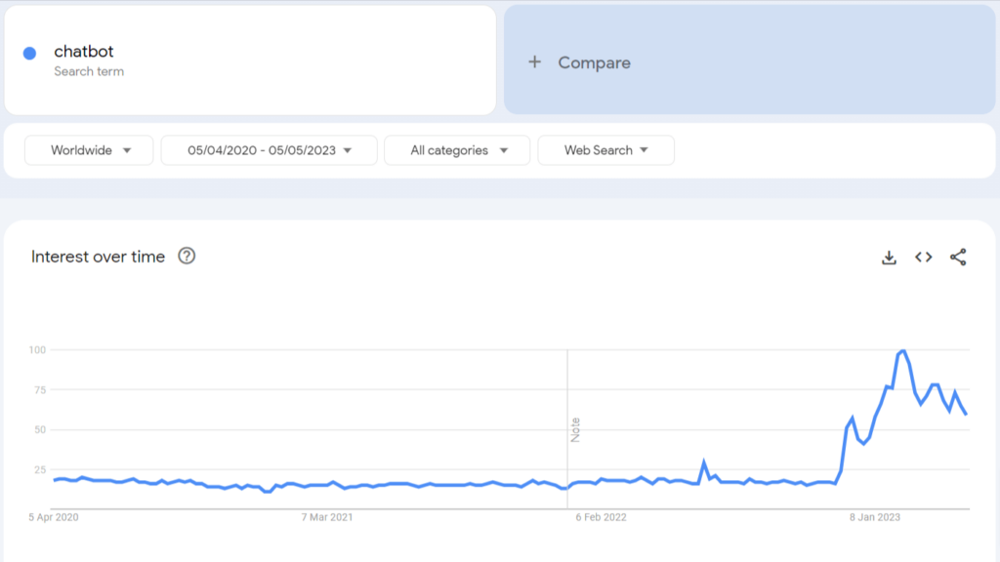
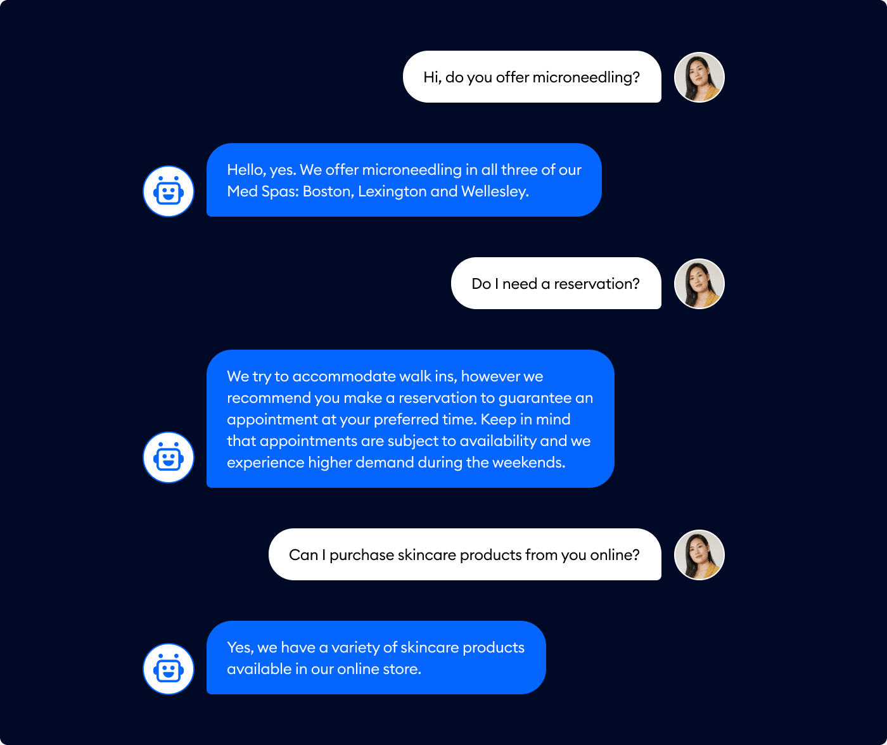

Building a marketing strategy that promises success is both difficult and enjoyable. In today's modern and internet era, marketing is no longer a confusing job. There are many ways to offer various products owned by a company, for example by using chatbots that are based on artificial intelligence (AI). 

Chatbots will connect companies with potential customers quickly. With the right service, chatbots can help a company get prospects and enable them to interact with customers effectively. In this article, let's discuss how to improve marketing with the help of chatbots. This is a bit of an ***introduction to chatbots for marketing.*** Let's get started!

## Overview Chatbot for Marketing

Chatbot itself is a two-way conversation system that uses AI assistance which connect companies and customers. This conversation is programmed like a human, acting as customer service. Conversations can be via websites, chat apps, or messaging channels. The existence of this [***chatbot for marketing***](https://deskbox.co/blog/what-is-chatbot-marketing) can greet new customers, nurture leads, direct customers to customer support, and much more.

When it first appeared, this chatbot was designed for customer support or B2C (business-to-ustomer). However, currently chatbots are also increasingly popular among B2B, or business-to-business marketing and sales teams.

## How to Use Chatbot for Marketing?

Starting from 2020 to 2024, Google Trends worldwide records that "chatbot" has a very significant increase in search volume. It cannot be denied that chatbots have been widely used in various types of businesses. One of the many advantages of using a chatbot is time efficiency.

Google trends worldwide records [Source: [colorwhistle.com](http://colorwhistle.com/)]

A company can improve service to customers without involving staff or working teams. Instead of wasting time and energy answering all of the customer's queries, chatbots can do that job very well. For example, answering frequently asked questions or gathering customer feedback. This will help the company reduce customer service costs, and lower time constraints while the staff and team can focus on optimizing their strategy. So, by the descriptions that have been mentioned, then ***how to use chatbot for marketing?*** Let’s find out!

### Taking Order

Just like humans, the use of chatbots is to receive orders given by customers through the conversation column. For example, answering various questions that are often asked by customers. So, the tech is here. The chatbot will answer incoming questions in a matter of seconds; it will give the same answer for repetitive questions over and over again.

Apart from answering FAQs, another command that can be carried out with the help of a chatbot is providing product recommendations. When a customer needs a certain product, the chatbot will provide a choice of product types to choose from. This certainly makes it very easy for customers to make orders in a short time.

How chatbot answer the FAQs from customers [Source: [Tidio.com](tidio.co)]

### Promoting Products and Services

Promoting products and services can be done very easily with the help of chatbots. Several retail stores have succeeded in gaining popularity because they are known to provide many recommendations for their best products according to customer needs, for example, Sephora. Customers will be greeted by Sephora’s chatbot by giving a short quiz, which will then guide them to get the products that they want.

Sephora also provides information regarding various promotions and discounts, the newest products, the best-selling and most sought-after products, and even the types of products that are suitable for certain skin tones. By using this way –promoting using chatbots— now Sephora has more than 2,700 stores, operated in 35 countries around the world.

### Scheduling Appointment

Make an appointment using a chatbot, why not? Appointments are crucial, so even a minute will be worth it. The development of chatbot technology will really help make effective appointments. Scheduling bot appointments is a new way for someone to make an appointment automatically without interacting with humans.

In making this appointment, the bot will help manage the calendars, ensuring that appointments are scheduled seamlessly and efficiently. Apart from that, the advantage of making an appointment using a chatbot is saving time and reducing lots of errors (that usually happen in manual scheduling). Besides, with 24/7 scheduling service, it will improve customer satisfaction.

### Distributing News and Updates

When customers feel that their satisfaction is fulfilled regarding a product or service provided by a particular company, they will look for the latest news and updates. These updates can be about the newest products, price discounts, promotions, product features that are of concern to customers, and even certain events held by a company. 

So, chatbots can play an important role in news and update distribution activities. So, there is no longer a need for the word-of-mouth marketing process, which takes longer and does not reach all groups. If everything can be done quickly and interestingly, why not?

## What Is The Role Of Chatbots in Digital Marketing and Their Impact on Customer Engagement?

### Chatbot’s Role in Digital Marketing

1. **Elaborating SEO and User Experience (UX)**

Unlike the interaction with humans as customer services in many field (industries), chatbots hold important role in elaborating search engine optimization (SEO) and the user experience or UX. In this analysis, together we’ll discuss how chatbot bringing positive impact to website visibility and gaining user engagement. These two things are important factors that determine the success of digital marketing.

- Boosting SEO

When scaling websites, search engines (like Google) will make prioritize based on user engagement. Metrics, such as bounce rate, time on the site, and page per view are included in critical indicators. In this case, the chatbot functions to increase metrics and make sure the users stay on the website as long as possible. Chatbots can decrease the bounce rates if users enroll in relevant alliance interactions, two way conversations, and content recommendations.

- Improving User Experience

The more positive exposure users get from a website, the more likely they are to rebound and reentrance the website. In this case, chatbots participate in improving the user experience (UX) by providing instant assistance. If users have difficulty using navigation, chatbots will help. 

So, users will not be disappointed and abandon the site. Apart from providing convenience, chatbots also make their journey through the site more enjoyable and smoother, resulting in higher conversion rates.

- Maximizing Content Discovery

One of the challenges of content-heavy sites is being consistent and ensuring the user accesses and finds relevant to them. By using intuitive questions and analyzing data interaction, chatbots will be dynamic search tools, helping users find the content that they are looking for. 

This method will help the company or business increase the visibility of the content. Besides, users will fully access the content to increase opportunities for sharing and engagement.

1. **Chatbots in Some Marketing Industries**

Most of ndustries nowadays using chatbot as a helper. With the help of technology, various industries are exploring and utilizing chatbots to make work easier and increase interaction with customers. That way, marketing results will also increase drastically.

- Chatbot in Healthcare Industries

In the healthcare industry, chatbots are contributing to patient engagement and administrative efficiency. Chatbots are usually used to set appointments, send reminders for the next scheduled visit, remind patients to take medication, and provide basic health information to patients. 

More specifically, the chatbot will answer several FAQs asked by patients about common medical conditions. In this way, it certainly saves time for medical personnel to answer questions from patients and prospective patients. Patients also get satisfaction because of the instant help and information they get.

- Chatbot in Finance Industries

The highlights that will be discussed in the finance chatbot are customer support and financial advice. Customers can get various kinds of advice about financial management through conversations with chatbots. The chatbot will also provide offers in the form of long-term investment advice, financial product information, and even details of transactions that have been carried out. 

What's more interesting, in terms of finance, customer privacy will be safe and maintained, because the finance chatbot itself is programmed with strict regulatory guidelines.

- Chatbot in The Retail and Online Shop Industries

Shopping is the most enjoyable activity. Of course, it would be even happier if this shopping experience were supported by technology that understood our needs. Currently, almost all retailers and online shops use chatbot assistance as a guide for their customers and potential customers.

The chatbot will help choose products, recommend products according to user preferences in previous transactions, and answer questions about orders. For example, the chatbot will recommend some items buy based on the previous search history or shoes selections based on your latest search on fashion. For some reason mentioned, it won't be difficult to get some loyal customers, right?

- Chatbot in The Travel and Hospitality Industries

How often do you get messages from chatbots regarding vacation spot recommendations? In travel and hospitality, chatbots are most often used to ask for local recommendations, booking assistance, and travel notifications. 

Chatbot assistance helps customers who want to book flight tickets, make hotel bookings, recommend must-visits in a country or city, local entertainment, and famous local food. With the help of chatbots, travel will be easier and more enjoyable. The good effect is that the company will get more attention and attract more customers.

- Chatbot in The Education Industry

Nowadays,  the education sector continues to upgrade so that it can utilize modern technology very well. In the education sector, chatbots are used to provide notifications regarding course information, registration, and administrative support. 

Chatbots also navigate course options, manage schedules, and even select the type of course according to student needs. Using this chatbot will reduce the administrative burden and provide easier access according to student needs.

### The Impact of Chatbot on Digital Marketing

In digital marketing, AI has various implications. Chatbots are one of the most popular AI systems and are widely used in various business industries. Through a series of conversations, the chatbot collects customer data and information, starting from contacts, purchase history, preferences, and tastes, as well as various technical issues. Based on surveys, chatbots that provide fast responses have the potential to reduce customer support expenses by as much as 30%.

## The Reason Why Chatbots Are Called as the Future of Marketing?

Have you ever heard the term "AI as the future of current technology"? This expression is discussed by many people, considering the increasingly massive use of AI in various sectors of life, especially in the business sector. The use of AI in chatbot marketing also makes it one of the most helpful future technologies. In this chapter, we will explore several reasons ***why chatbots are the future of marketing.***

### Ready to Help 24/7

In contrast to services provided by humans, chatbots will reply to messages within seconds, they are ready 24/7. This is in line with what customers expect, namely getting a fast answer. Therefore, business hours are no longer a problem, because chatbots can operate without the help of staff or team work.

### Chatbot Helping in Free Up the Human Resources

In an industry, the presence of a chatbot can make a business develop quickly and strategically. How could it not be, chatbots don't know working hours, so they can reply anytime and anywhere.

Chatbots also answer various questions, complaints, and even offers. When using a chatbot, you can do automatic repetition as many times as you want. In this way, human resources in the business industry will focus on developing the business and creating ideas to make it more advanced.

### Giving Helpful Customer Insights

Chatbots also play an important role in conducting market research. What kind of research is meant here? Well, with the help of advanced AI, chatbots will help businesses develop by improving products and services, so that customers have a pleasant transaction experience.

Chatbots also allow companies to collect feedback and conduct surveys, such as examples of why customers delete items they have put in their shopping cart. Companies can also learn a lot from reviews given by customers. The unlimited data collected by chatbots is useful for optimizing sales and promotion of products or services, so that companies will grow rapidly.

### Expand Possibility to Enter the Global Market

Being known and entering the international market is certainly the dream of every businessman. Even though there are many challenges, when you succeed in reaching the international market, your business channels will grow and your company's name will become increasingly known to many people.

Chatbots are a way that can be taken to make this dream come true, because the chatbot market itself comes from various different sectors. To reach the international market, of course, you don't need a lot of staff and workers, just a chatbot and various great strategies. Apart from chatbot assistance, an aspect that is no less important is product quality, as well as the types of products that are in demand across countries and cultures.

## Conclusion

If you want to build a brand, then chatbots are an excellent resource and worth trying. There are many things offered by this based AI system, for example, convenience and fast service, maintaining customer loyalty, results in the form of sustainable business, and cutting marketing costs. The explanations above are enough to answer the question: ***why chatbots are the future of marketing?*** Because it brings many benefits in business fields. 

In the future, chatbots will provide many conveniences for both customers and businesses. In aspects that have an impact on customer engagement, chatbots also help the development of various industries, ranging from health, finance, retail, travel and hospitality, the education industry, and so on.

