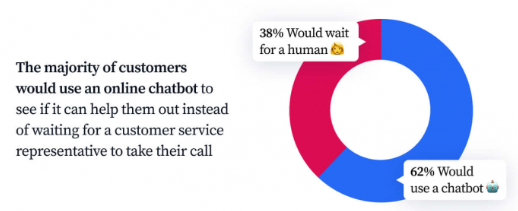

# Overcoming Language Barriers in Customer Service: A Guide to Global Success

Keyword: AI Based Customer Service

Overcoming Language Barriers in Customer Service: A Guide to Global Success with AI-Based Solutions

AI in customer service provides real-time language translation that overcomes language barriers. It is easier for customers who speak different languages to communicate with customer service.

## The Challenge of Language Barriers in Customer Service

The demand for global customer service has increased every year. The market of global customer service in 2023 is [valued at $13.4](https://www.yaguara.co/customer-service-statistics/). However, in globalized customer service, some language barriers can be challenging.

### Misunderstandings and Frustration for Customers

Language barriers can make it difficult for customers to explain or understand their needs. Customer may feel their needs are not resolved or not receive any help.

### Reduced Customer Satisfaction and Retention

Customers may feel poor satisfaction due to the language barrier. It reduces customer satisfaction and retention.

### Difficulty Providing Consistent and High-quality Service

For customer service employees, language barriers can make it difficult to understand the customer's needs. It can lead to inaccurate information and bad services.

## AI-Based Customer Service Solutions: Breaking Down the Language Wall

AI-powered is a solution as a game-changer for overcoming language barriers. AI chat support and smart assistants can translate, offer self-service, and analyze data. The technology allows the AI chatbot to translate immediately and overcome the language barrier.

### Provide Real-time Translation During Live Chat Conversations

AI chatbot in customer service provides real-time translation during conversations. It has a complex system with machine learning to allow translation between languages automatically.

### Offer Multi-lingual Self-service Options with AI Chatbots

AI chatbot provides self-service options to customers in online support. The AI allows customers to understand multiple languages that customers request and respond quickly.

### Analyze Customer Data to Personalize Support Across Languages

AI chatbots can analyze customer data to support personalization. It provides data across languages through machine learning systems. The insight data is used to ensure that customer service is relevant.

## AI Chat Support: Your Multilingual Customer Service Partner

AI chat support has a lot of benefits for customer service. Besides overcoming the language barrier, it also provides 24/7 service, more efficient, and consistent.

### 24/7 Availability: Serve Customers Anytime, Anywhere

Customer expectation in customer service is to get a response immediately at any time. AI chat support provides that with 24/7 availability and can be accessed anywhere at any time. The availability has shown in recent statistics that customers prefer to use a chatbot rather than the traditional method.

Source: Tidio

### Increased Efficiency: Handle High Volumes of Inquiries in Multiple Languages

AI chatbots increase efficiency by handling many conversations simultaneously. It can handle various questions and multiple languages at once.

### Improved Accuracy: Minimize Translation Errors and Misunderstandings

The advanced technology in AI chatbots minimizes translation errors and misunderstandings. Unlike human agents, AI chatbots are more consistent in minimizing errors and misunderstandings of service.

## AI Customer Support Jobs: The Future of Multilingual Support

AI customer support may give the best quality of service. However, AI support can’t replace customer service jobs. The AI chatbot complements human agents in assistants, automated analysis, and doing repetitive tasks. One aspect that AI empowers human agents is multi-language support.

### Focus on Complex Issues While AI Handles Routine Inquiries

The AI chatbot’s presence allows human agents to focus on more complex tasks and be productive in other aspects. AI chatbots will complement human tasks, like assistants, analysis, and solving repetitive tasks.

### Increased Productivity and Efficiency for Agents

The automated system that AI offers significantly improves the process of service more efficiently. This automation reduces the time spent by human agents. So, they can focus on complex tasks and boost productivity.

### Opportunity to Specialize in Specific Languages and Cultural Nuances

The communication in AI chatbots feels natural because of the support to understand multi-languages. The technology engages natural language conversations and can adapt to cultural nuance communication.

## The Impact of AI on Customer Service: Beyond Language Barriers

AI on customer service has a broader impact in some aspects. Some impacts can be made:

### Personalization Beyond Language

Machine learning and natural language processing in AI chatbots allow personalization for customers. It can understand multi-language and adapt to some cultural communication.

### Proactive Issue Resolution

AI on customer service may seek potential issues that will happen. It can be analyzed and resolved before the problem occurs.

### Improved Self-service Options with AI Chatbots

AI chatbots provide self-service options that can be accessed easily. It can be used 24/7 everywhere at any time. The customer service experience also can be enhanced by the personalization of the conversations.

## Conclusion: AI - Your Pathway to Global Customer Service Success

AI chatbots can help overcome the language barrier. It provides smart assistants that can translate, offer self-service, and analyze data. The technology in the AI chatbot also minimizes translation errors and misunderstandings. So, it can lead to achieving global customer service more successfully.  Explore other AI solutions for your business on our page.

# Overcoming Language Barriers in Customer Service: A Guide to Global Success with AI-Based Solutions

AI in customer service provides real-time language translation that overcomes language barriers. It is easier for customers who speak different languages to communicate with customer service.

## The Challenge of Language Barriers in Customer Service

The demand for global customer service has increased every year. The market of global customer service in 2023 is [valued at $13.4](https://www.yaguara.co/customer-service-statistics/). However, in globalized customer service, some language barriers can be challenging.

### Misunderstandings and Frustration for Customers

Language barriers can make it difficult for customers to explain or understand their needs. Customer may feel their needs are not resolved or not receive any help.

### Reduced Customer Satisfaction and Retention

Customers may feel poor satisfaction due to the language barrier. It reduces customer satisfaction and retention.

### Difficulty Providing Consistent and High-quality Service

For customer service employees, language barriers can make it difficult to understand the customer's needs. It can lead to inaccurate information and bad services.

## AI-Based Customer Service Solutions: Breaking Down the Language Wall

AI-powered is a solution as a game-changer for overcoming language barriers. AI chat support and smart assistants can translate, offer self-service, and analyze data. The technology allows the AI chatbot to translate immediately and overcome the language barrier.

### Provide Real-time Translation During Live Chat Conversations

AI chatbot in customer service provides real-time translation during conversations. It has a complex system with machine learning to allow translation between languages automatically.

### Offer Multi-lingual Self-service Options with AI Chatbots

AI chatbot provides self-service options to customers in online support. The AI allows customers to understand multiple languages that customers request and respond quickly.

### Analyze Customer Data to Personalize Support Across Languages

AI chatbots can analyze customer data to support personalization. It provides data across languages through machine learning systems. The insight data is used to ensure that customer service is relevant.

## AI Chat Support: Your Multilingual Customer Service Partner

AI chat support has a lot of benefits for customer service. Besides overcoming the language barrier, it also provides 24/7 service, more efficient, and consistent.

### 24/7 Availability: Serve Customers Anytime, Anywhere

Customer expectation in customer service is to get a response immediately at any time. AI chat support provides that with 24/7 availability and can be accessed anywhere at any time. The availability has shown in recent statistics that customers prefer to use a chatbot rather than the traditional method.

Source: Tidio

### Increased Efficiency: Handle High Volumes of Inquiries in Multiple Languages

AI chatbots increase efficiency by handling many conversations simultaneously. It can handle various questions and multiple languages at once.

### Improved Accuracy: Minimize Translation Errors and Misunderstandings

The advanced technology in AI chatbots minimizes translation errors and misunderstandings. Unlike human agents, AI chatbots are more consistent in minimizing errors and misunderstandings of service.

## AI Customer Support Jobs: The Future of Multilingual Support

AI customer support may give the best quality of service. However, AI support can’t replace customer service jobs. The AI chatbot complements human agents in assistants, automated analysis, and doing repetitive tasks. One aspect that AI empowers human agents is multi-language support.

### Focus on Complex Issues While AI Handles Routine Inquiries

The AI chatbot’s presence allows human agents to focus on more complex tasks and be productive in other aspects. AI chatbots will complement human tasks, like assistants, analysis, and solving repetitive tasks.

### Increased Productivity and Efficiency for Agents

The automated system that AI offers significantly improves the process of service more efficiently. This automation reduces the time spent by human agents. So, they can focus on complex tasks and boost productivity.

### Opportunity to Specialize in Specific Languages and Cultural Nuances

The communication in AI chatbots feels natural because of the support to understand multi-languages. The technology engages natural language conversations and can adapt to cultural nuance communication.

## The Impact of AI on Customer Service: Beyond Language Barriers

AI on customer service has a broader impact in some aspects. Some impacts can be made:

### Personalization Beyond Language

Machine learning and natural language processing in AI chatbots allow personalization for customers. It can understand multi-language and adapt to some cultural communication.

### Proactive Issue Resolution

AI on customer service may seek potential issues that will happen. It can be analyzed and resolved before the problem occurs.

### Improved Self-service Options with AI Chatbots

AI chatbots provide self-service options that can be accessed easily. It can be used 24/7 everywhere at any time. The customer service experience also can be enhanced by the personalization of the conversations.

## Conclusion: AI - Your Pathway to Global Customer Service Success

AI chatbots can help overcome the language barrier. It provides smart assistants that can translate, offer self-service, and analyze data. The technology in the AI chatbot also minimizes translation errors and misunderstandings. So, it can lead to achieving global customer service more successfully.  Explore other AI solutions for your business on our page.