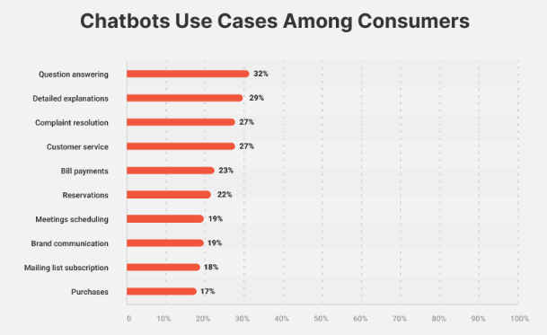
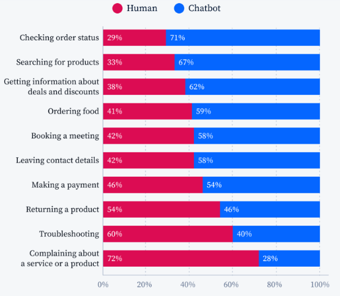

# Revolutionizing Customer Service: AI Chatbot vs Live Chat

What is the difference between AI chatbot and live chat customer service? How do these two work? Are they can integrate into one another?

## **Introduction**

Excellent customer service become important in today’s competitive market. It has a lot of benefits that retain customers and help business operations. Nowadays, there is a growing trend of using AI in customer service. It offers service that can help live customer service. But, how AI customer works? What kind of customer service should we choose, AI chatbot or live chat? Which one reigns supreme?

## AI Based Customer Service: Transforming the Game

The AI chatbot is powered by AI to provide customer service. It is offering services that might be hard for human agents. AI chatbots can provide 24/7 services and more cost reduction than the traditional method. It is beneficial for customers and business companies. Some of the advantages are:

### Increased Efficiency and Reduced Costs

The automation that AI-based customer service offers is increasing efficiency. It can streamline the operation and reduce operational costs.

Source: Master of Code

### 24/7 Availability and Improved Response Times

AI chatbot provides 24/7 customer service. This availability is supported by the immediate response. Without wait times, customers can respond faster than regular customer service.

### Personalized Customer Interactions & Enhanced Satisfaction

AI-based customer service can personalize customer interactions. Giving what customer needs personally, can enhance overall customer experience. The AI also can suggest more relevant products to customers by analyzing the customer data.

### Scalability to Handle Fluctuating Customer Volume

AI chatbots can handle larger customers because of the technology. It helps small businesses to compete with larger other company by handling more customers at the same time.

### Valuable Data Collection and Analytics for Improved Service

AI chatbots collect data and analyze them for better service. Business companies can use the data to plan recent and relevant strategies for customers. While customers can experience better service.

## AI Chatbot Website: The Powerhouse of AI Customer Service

AI chatbot websites are mainly used for completing basic tasks. Its role in customer service streamlines the interaction between customers and AI customer service immediately. There are some functionalities of an AI chatbot on a website, such as:

Source: Master of Code

### Handling Frequently Asked Questions (FAQs)

AI chatbot website handles question answering. The chatbot is designed to answer common questions that customer asks frequently. Without facing live, the AI chatbot allows customers to find the answer quickly.

### Guiding Users Through Self-Service Solutions

AI chatbot websites provide self-service for customers. The process of guiding service is automated. It simulates how humans converse naturally and interactively.

### Collecting Customer Information and Routing to Live Agents

AI chatbot websites collect customer information using routing and intelligence. It can help streamline service by handoffs to agents based on data collected before. The agent is adjusted based on skill, availability, and issue priority.

### Providing Basic Troubleshooting and Product/Service Information

AI chatbot website provide basic troubleshooting and service information. The customer can quickly find information through chatbot conversation. Some problems can be fixed by the automation solution that the chatbot offers.

### Learning and Evolving from User Interactions

AI chatbot websites can learn and evolve from user interactions. This ability is supported by machine learning (ML) and AI technology. By that, AI chatbot websites can understand more complex requests and learn more about the customers.

## Live Chat: The Human Touch in Customer Service

AI chatbots already have a lot of benefits to provide, but live chat is still important to be used. Live chat offers human communication that adds sympathy to it. Live chat is a better option to interact with complex inquiries and build trust. Some of the benefits are listed below:

### Handling Complex Customer Inquiries Requiring Personalized Attention

Live chat can handle complex customer requests that require personalization attention. AI chatbots may not give the best solution to solve complex issues. So, human agents are present to resolve this problem.

### Building Rapport and Trust with a Human Touch

It is crucial to provide a human touch to build rapport and trust. Unlike automation solutions, humans will connect to the customer personally.

### Providing Emotional Support and Empathy to Customers

Human agents in live chat offer more empathy than AI chatbots. By showing empathy, humans can provide emotional support to comprehensively resolve customers' needs.

### Real-time Problem-Solving and Personalized Solutions

Live chat provides real-time problem-solving and personalized solutions. It can help customer to solve their problem right away. It also enables personalization based on communication and conversations with the customer.

### Flexibility in Addressing Unexpected Customer Issues

Unlike AI chatbots, live chat has flexibility in addressing unexpected customer issues. Live chat can handle complex issues or some specific questions.

## AI Chatbot vs. Live Chat: Finding the Perfect Balance

Before deciding what to use between AI chatbot and live chat we must understand the difference. The comparison table below will explain the pros and cons between AI chatbots and live chat.

|  | AI Chatbot | Live Chat |
| --- | --- | --- |
| Strength | 24/7 Availability; Efficient for FAQs; Data collection | Personalized Interactions; Complex Inquiries; Building Trust |
| Weaknesses | Limited Emotional Intelligence; Repetitive Interactions | Wait Times; Cost of Human Resources |

The solution of customer service can be a mixed approach. By combining AI chatbot and live chat it can solve any issue, from generic customer issues to complex issues, speed up the resolution time, giving personalization and building trust, and more. Each customer service benefits in some areas and by combining it, businesses can operate the system more profitably.

## The Future of Customer Service: A Seamless Blend

AI chatbot and live chat can work together to create a more seamless customer service experience. Each kind will highlight advantages in some areas and complement each other. Choosing the right tools can be a strategy to enhance customer satisfaction. To provide basic tasks it can be done by Ai chatbot. While to provide complex issues it can be guided by human agents in live chat.