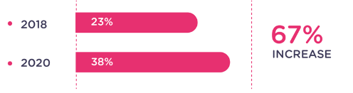
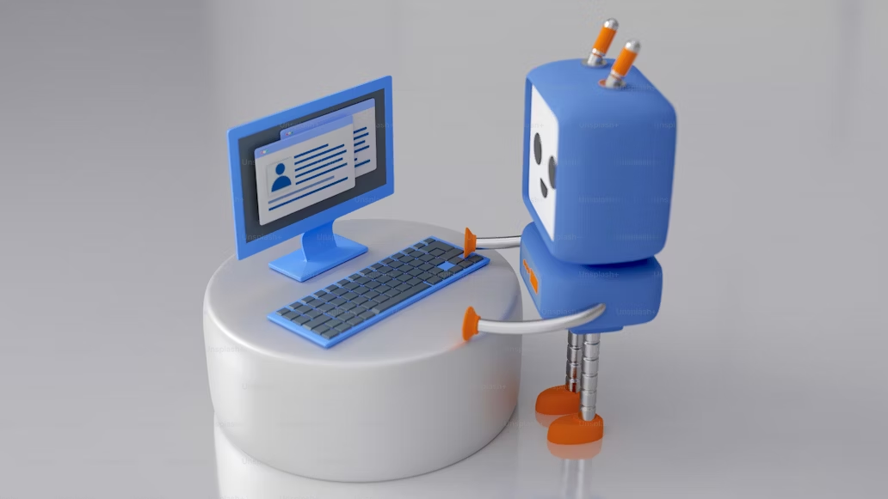
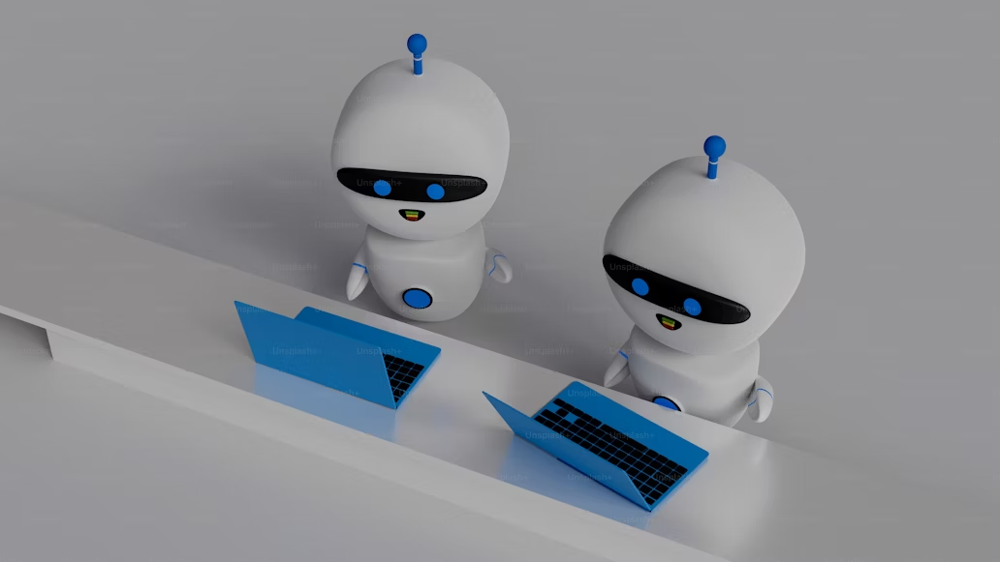

# The Future of Customer Service

# **Customer Service Trends for The Future**

## Introduction

Humans as agents can be supported by AI-based customer service. Not only for the customer, the efficient solutions that AI-based customer service offers will also impact business operations. In that way, the application of useful chatbot websites as an AI-based customer service has grown rapidly.

By using the chatbot, customers define a new interaction and exceptional experiences through AI-based customer service. As a future customer service, it changes the way customers experience a service to be more fast and helpful.

## **The Rise of Chatbots in Customer Service**

The pandemic era was a rapid growth time for self-service technology (like chatbots) adopted. The statistics showed that [chatbot usage](https://landbot.io/blog/chatbot-statistics-compilation) increased 67% between 2018 and 2020, and is predicted to increase more.

Source: Sales Force State of Service 4th Edition by Landbot

### What are Chatbots for Customer Service?

The main function of chatbots is to respond to the customer. The technology allows chatbots to interact with customers automatically.

Chatbots in customer service might use different types. There are rule-based chatbots and AI-based chatbots. The difference between the two chatbots is the ability to learn. 

The AI-based chatbot is powered by artificial intelligence and machine learning technology that allows the chatbot to learn the customer’s behavior or response.

### Benefits of Using Chatbots for Support

Customers might experience waiting for the replies too long. Some customers might just look at simple questions and prefer self-service. And others needed personalized guided service. 

All those problems could be resolved by using the chatbot as an AI-based customer service. With 24/7 availability and efficient response, the chatbot handles repetitive and basic troubleshooting, reduces workload and cost, and offers personalized interactions.

### Applications of Chatbots for Service Desk

The applications of chatbots improve customer service and customer experience in wide areas. Some jobs that can be done are:

- Provide first-line support for common issues.
- Answer frequently asked questions (FAQs).
- Schedule appointments and manage service requests.
- Collect customer feedback and sentiment analysis.
- Route complex issues to human agents.

## **The Future of Customer Service with Chatbots**

Chatbots have become one of future interactions. All the technologies integrated into chatbots have developed the way humans interact with computers. The collaboration of humans and chatbots enhances the customer service experience.

### Advancements in Chatbot Technology

The early chatbots can respond to simple questions, but they can’t understand complex language. By involving artificial intelligence, chatbots become smarter and capable of handling complex conversations.

Chatbots are used to detect keywords and analyze them to respond to the customer. With a lack of technology, chatbots often confuse understanding human language. Natural Language Processing (NLP) is present to understand human language better. The understanding process allows the chatbot to analyze human emotions and personalize the interactions.

### Chatbots and the Omnichannel Experience

Chatbots have been integrated into communication channels, like websites, messaging apps, and social media. It can help business operations through all the communication channels. The services that chatbots offer are answering questions and guiding customers. The accessibility process was seamless and efficient because customers could experience 24/7 service.

### The Human-AI Collaboration

Human agents and AI have their strengths. Human agents show more empathy, humanity, and sensitivity to the issue. While AI is quick in response, offers multi-languages, cost-effective. However, human agents can collaborate with AI to empower the services.

The collaboration of humans and AI in customer service shows more effective results. Chatbot as an AI-based customer service can do basic tasks with the automation program. Human agents can focus on complex issues and provide personalized support.

## Preparing for the Future with Chatbot Customer Service AI

Chatbots could become an essential channel for customer service. Before implementing this technology, some preparation needs to be completed.

### Considerations for Implementing Chatbots

The use of chatbots in business operations become an essential part. But, there are some considerations in implementing chatbots:

- Define your customer service goals and identify areas where chatbots can add value.
- Choose a chatbot platform that aligns with your needs and budget.
- Train your chatbot with relevant data and ensure its accuracy.
- Integrate the chatbot with your existing customer service systems.

### Measuring the Success of Chatbot Customer Service

The most common way to measure the chatbot success is to track key metrics like customer satisfaction, resolution rates, and agent productivity. Also, continuously analyze chatbot performance and make improvements as needed.

## **Conclusion**

Chatbots in customer service have grown significantly. That happens because advantages that chatbots have offered. As a key trend for future customer service, chatbots could collaborate with human agents to enhance the customer experience. 

However, some preparations were needed to complete and succeed the customer service. The success of chatbots includes efficiency, personalized experiences, and shapes the future of customer service.

Learn more about your chatbot solution or explore how it can benefit your business.