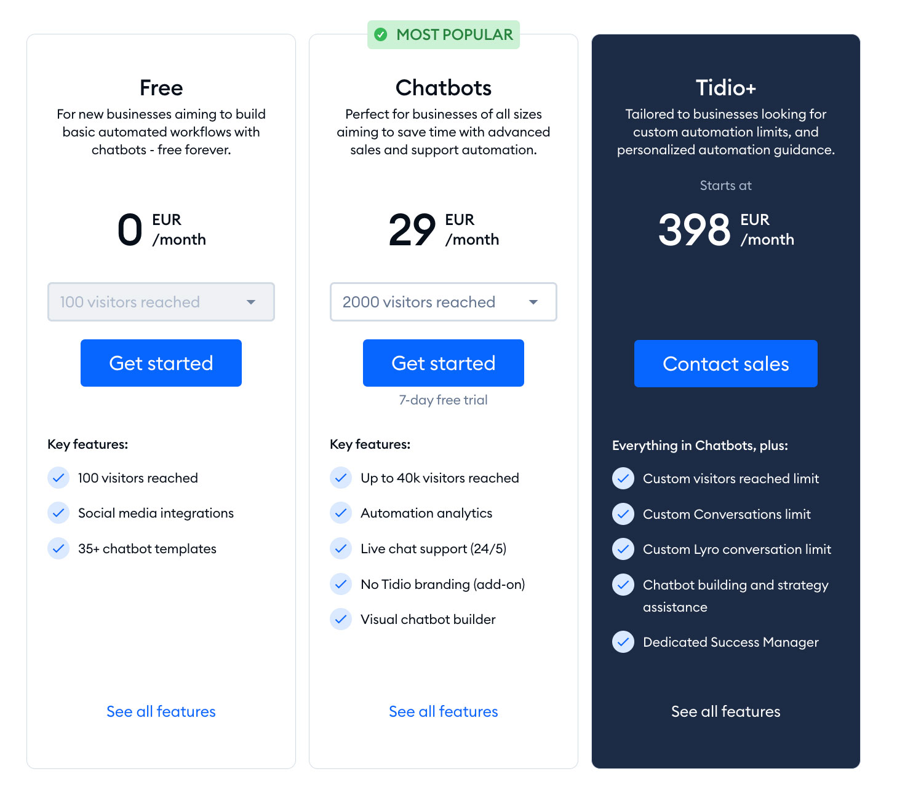

If you are looking for a chatbot on your website or in your app then ChatBot may be what comes to your mind. ChatBot is an AI-based chatbot software that helps you automate and scale up a lot of tasks on your website with the help of its Help Desk, Live Chat and other impressive tools.

However, more effective tools come at the cost of using them in large amounts. Further, ChatBot is limited by subscription to apply its premium features like buttons and many chats at the same time as well having a different paid gateway for live chat access which comes off really expensive.

It was neither the first on the market nor is it the best chatbot you can find now. Especially when you look at the prices of their individual parts. If all you need is a simple conversational chatbot, one of the alternatives to ChatBot.

Let’s take a look at the ChatBot service and features itself.

## **When might you replace ChatBot with another alternative?**

The people communicate with computer programs, as if they were communicating via instant messaging service. They can also offer automated tasks or information. In place, you can use chatbots with messaging platforms or as website live chats. For example, visitors to your online store can ask questions about products using a chat icon 24/7 and receive automatic responses from your ecommerce сhatbot.

ChatBot  can assist you in improving this situation and keep customers satisfied. On the whole, there is a complete ecosystem of SaaS products for customer service by this company (ChatBot, LiveChat and HelpDesk) to name a few.

But, they are all paid tools. You have to use multiple modules — all of which require separate subscriptions. You would have to pay nearly $150 a month in order to access features beyond just button actions. And that only gets you a small number of conversations as well. Then there is the live chat which needs a LiveChat subscription and if you want to provide it as an AI virtual assistant solution mixed with human agents, then that requires buying a separate feature.

Many of the competitors to ChatBot allow you unlimited chatbots and conversations for a fraction of that price. They also throw in a complimentary free live chat. There is no need to spend such a huge amount on chatbots, look for viable options in the market like DeskBox before actually considering it. Here are the 10 best ChatBot alternatives for you in case this is not fulfilling your requirements.

## **1. Deskbox**

[Deskbox](https://deskbox.co/) is a cost-effective alternative to ChatBot. It takes a unique approach compared to other customer support platforms by integrating with existing live chat platforms rather than competing with them directly. Currently, Deskbox integrates with Intercom, offering users an alternative to Intercom's FIN chatbot.

### **Customization**

Deskbox offers customization options, allowing users to tailor their chat widget's appearance to align with their brand identity.

### Advanced Training

Unlike some chatbots, Deskbox doesn't rely on pre-made templates for its knowledge base. Instead, it allows you to create a custom knowledge base directly from your website. You can easily train your chatbot by uploading PDF documents, entering your website URL, or using your help center documentation. This enables the chatbot to answer questions based on your specific online knowledge base.

### **Integration**

Deskbox enables you to work with your existing customer support platforms, such as Intercom.

While some AI-powered chatbots come with high costs, Deskbox allows you to integrate AI-powered chatbots with your existing platform, like Intercom, at a lower cost.

With simple integration, Deskbox's AI-First Chatbot helps you handle common questions and pass complex issues to agents working on Intercom. (Currently, we've integrated with Intercom only, but we plan to integrate with other live chat platforms like Zendesk Live Chat, Crisp, etc. in the future.)

## **2. Zendesk**

Zendesk AI lets you install a messaging and live chat system on your site or from within any of the social channels. It greatly assists you to provide an end to and highly rich conversational experiences by providing your customers with real-time, fast AI-automated responses while available all the time so that no customer has to wait for their query or problem to be resolved.

In the case of a Zendesk AI, on the other hand it does not have to generate responses but return suggestions based on their business policy. It takes seconds, generating personalized messages and giving the agents context of them all.

### **What makes Zendesk standout?**

- Customization: There are plenty of opportunities to customize the tool — even down to your workflows within a ticketing system (here is one example).
- AI: Zendesk leverages a standard proprietary AI trained on the vast global experience to have more meaningful conversations with your customers.
- Customer service: Zendesk has a complete suite of analyses that facilitate interaction between customers and businesses.
- Collaboration: Provides a customer relationship management (CRM) platform that helps startups organize consumer information and collaborate with customers as well as employees.
- Free trial: Yes
- Pricing: Zendesk allows basic plans starting at $19 per month. The other premium plans start from $55- $115/agent/month.

## **3. Crisp chatbot**

Crisp chatbot provides AI features that are pretty useful for sharing applicable FAQ articles automatically. A powerful feature which helps your customers even when you are offline. In this article, there will be an explanation step by step process to develop an AI-assisted FAQ chatbot using which you can get the best help content.

Crisp always uses strong administrative, technical and logical security measures to keep your personal data safe from improper access or changes by third parties.

### **What makes Crisp standout?**

- Easily translate chatbot into multiple languages
- Live chat + Typeform and Zapier integration
- Whole lot of documentations & tutorials (even videos) on using their platform (supports via live chat and email)
- Native website widget AI
- Capabilities: basic for automatic greetings and answering simple questions
- Pricing: Paid plans from $25/month

## **4. Freshchat**

Freshchat (from Freshworks) is a conversation-first messaging software which primarily helps businesses engage more meaningfully with their customers across major channels like chat, email, voice calls & social network handles including WhatsApp business. Freshchat also has out-of-the-box support for native AI-powered chatbots, where it comes with a no-code builder which businesses can use to create contextually aware and personalized self-service solutions at scale.

### **What makes Freshchat standout?**

- Built-in AI: Intents, self service, copilot
- Publish chatbot on website, WhatsApp, Instagram, Facebook, SMS, Google, Line
- Advanced Analytics: many reports and add custom reports
- Free trial: Yes
- Pricing: starting at $19- $49 (pro) per agent/per month

## **5. Chatfuel**

Chatfuel is the top bot platform for creating bots on Messenger and Instagram. It features a flow-builder that lets you create bots in just five minutes, and it resolves integration barriers with Meta-channels.

### **What makes Chatfuel standout?**

- A generic analytics dashboard by Chatfuel with general stats like the total number of users
- Easy-to-use flow builder
- Unlimited custom field to store user data
- Publish a chatbot on Facebook, Instagram & WhatsApp
- Free trial: Yes
- Pricing: paid plan already starting at $20/month

## **6. Chatbase**

Chatbase is one of the newest entries into the AI chatbot space that lets you build a bot trained on your own data, like from your website or business documents. A chatbot training platform that is very user-friendly, especially for small businesses or others who are new to AI.

### **What makes Chatbase standout?**

- Provides high-level insights in terms of the number of chats that happened during any given time
- Chatbase tutorials including how to create chatbot, and complete list of features provided by its platform
- Chatbot can be set up in less than 10 minutes
- Built-in AI: Knowledge base
- Easily revise answers with chat logs
- Free trial: Yes
- Pricing: paid plans starting at $19/month

## **7. Tidio**

Tidio is super user friendly, and you can get a chatbot up in minutes. Also, you can transfer them over to your live chat agents and reply automatically via the built-in AI which is called Lyro. You can also send messages to website visitors proactively with Tidio. The most beneficial chatbot for a moderate online venture happening via live-chat and AI, try Tidio.

### **What makes Tidio standout?**

- Built-in live chat
- Built-in AI features (Lyro)
- Provides a direct integration with e-commerce, like Shopify
- Free trial: Yes
- Pricing: starting at €29/month

