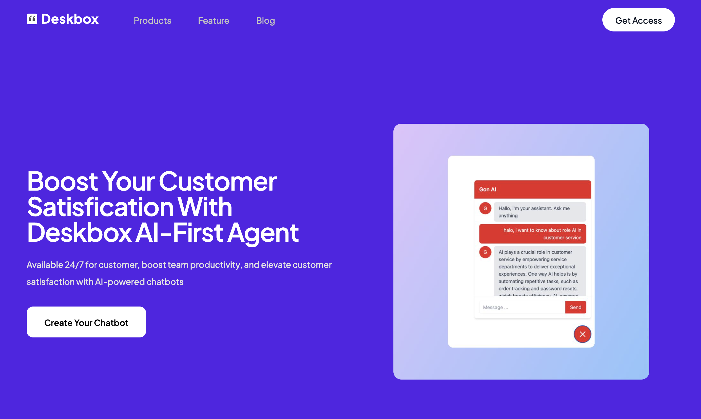

Looking for the best Intercom alternatives for customer support? Here are 10 tools to build outstanding customer support for your business

## 1) Deskbox

[Deskbox](https://deskbox.co/) is a cost-effective alternative to Intercom for the hotel industry. Deskbox have a different approach compared to other customer support platforms

### **A. Customization**

Deskbox brings customization to enable the user to customize their chat widget appearance so that aligns with the brand identity

### **B. Advanced Training**

Deskbox does not use templates as a knowledge base. Deskbox enables you to create a knowledge base from your website directly. You can upload your pdf document, input the website URL or your help centre documentation to train your chatbot so they can answer the question based on the online knowledge base you have

### **C. Integration with Booking Engine**

Deskbox is designed for the hospitality vertical industry. It can integrate with the booking engine. Currently, Deskbox can integrate with Staah to create a seamless experience for users to make a hotel reservation via chatbot conversation.

 

## **2) Help Scout**

**Pricing**: Basic plan starts at $22/user/month. More advanced features are available on higher-tier price plans.

**What makes Help Scout standout:**

They help platform that is easy to use, offers excellent customer support and offers a beacon help widget that integrates with their knowledge base to improve self-service customer support
 

## 3) Zendesk

**Pricing:** The Suite Team plan starts at $55/user/month, while more features on the Suite Enterprise plan

**What makes Zendesk stand**:

Zendesk provides a platform to streamline the customer support process into manageable tasks. Zendesk also provide a marketplace to customize integration with third-party tool

 

## 4) Tidio

**Pricing:** Offering free tier pricing with limited features. The premium tier starts from $29/month. Advanced features are available on higher-price tiers.

**What makes Tidio stand out**: Recently launched AI Chatbot integrated with live chat to automatically answer common questions from customers. They also provide a website scrapper to scrap your website to be a knowledgebase

 

## 5) Crisp

**Pricing:** Available basic free tier. The paid tier starts from $25/user per month with advanced features available on higher-tier

**What makes Crisp stand out:** Crisp brings simplicity to users. They have a unique co-browsing feature that enables agents to co-browse with your customers without any plugin

 

## 6) LiveChat

**Pricing**: Paid plan starts from $20/agent per month. LiveChat also offers enterprise solutions with custom prices in this tier.

**What Makes LiveChat Standout:** LiveChat is integrated with multichannel messaging such as Facebook Messenger, Instagram, SMS, WhatsApp, etc to enable you to reach your users on their various channels.

 

## 7) ClickDesk

**Pricing:** ClickDesk is available with a Free tier. Premium tier starts from $14.99/month. While advantages features are available on a higher tier.

**What Makes ClickDesk Standout**: ClickDesk offers video chat that is suitable for your needs that want to more human touch and personalize your customer support

 

## 8) ZohoDesk

**Pricing:** Start from $12/user per month. Free trial available

**What Makes ZohoDesk Standout**: Integrated with the Zoho environment so will allow you to streamline flow to enhance your customer support

 

## 9) FreskDesk

**Pricing:** Starting price at $15/agent per month. They also offer enterprise tier with $79/agent per month

**What Makes FreskDesk Standout**: FreskDesk offer simplicity to support your customers across various platforms. They have a Sandbox feature, to enable you to create a secure test environment without impacting agent and customer

 

## 10) Front

**Pricing:** Front starting price at $19/agent per month. More features available on higher-tier

**What Makes Front Standout:** Front offers a collaboration tool to enhance productivity and coordination with your team. They also have workflow automation to help teams stay efficient by organizing messages based on tag, route, etc