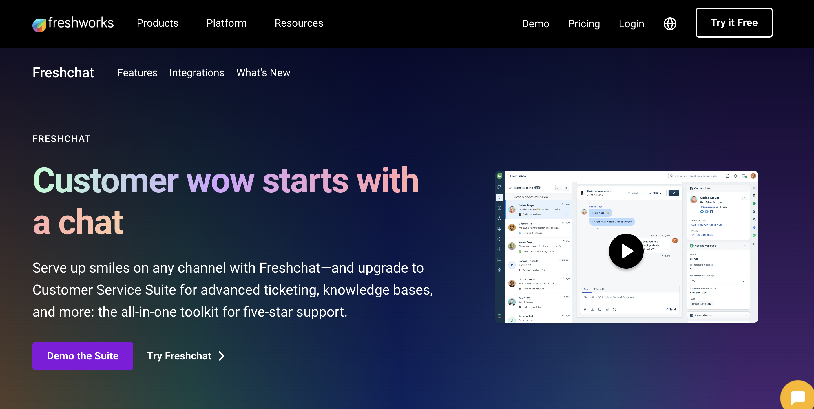
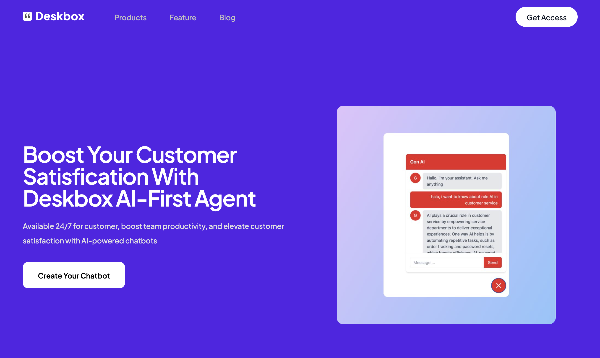
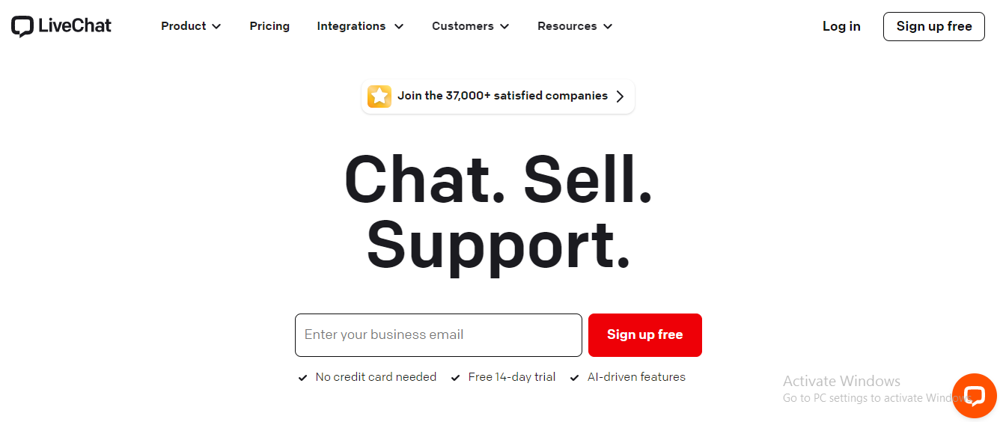
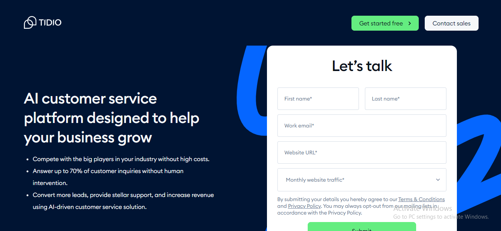
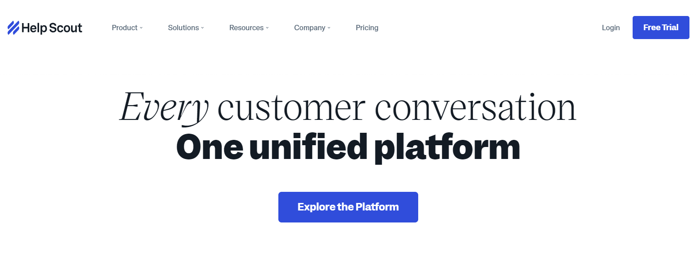
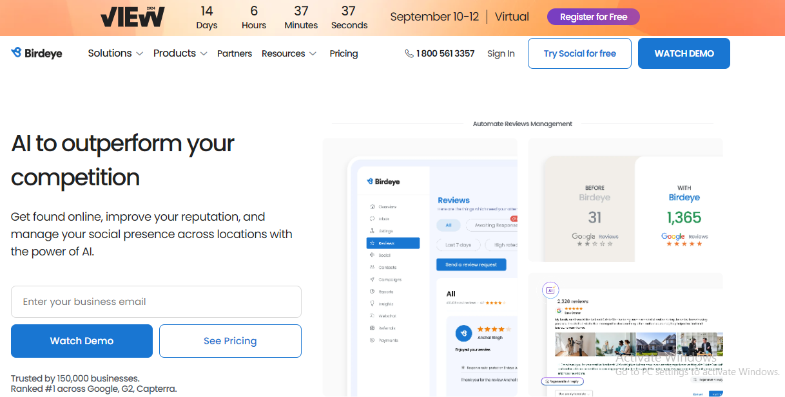
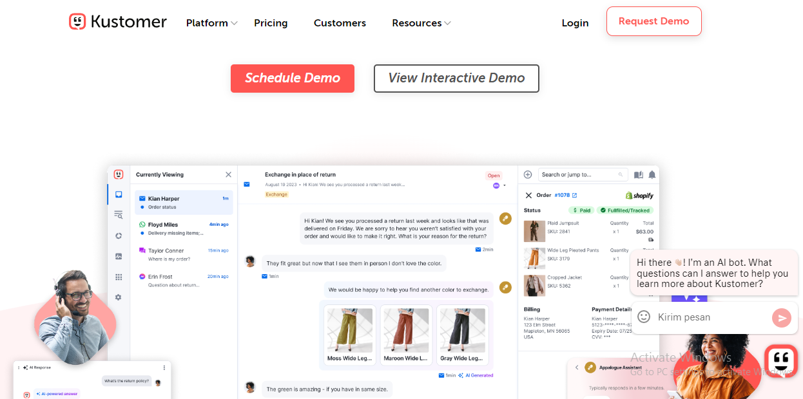
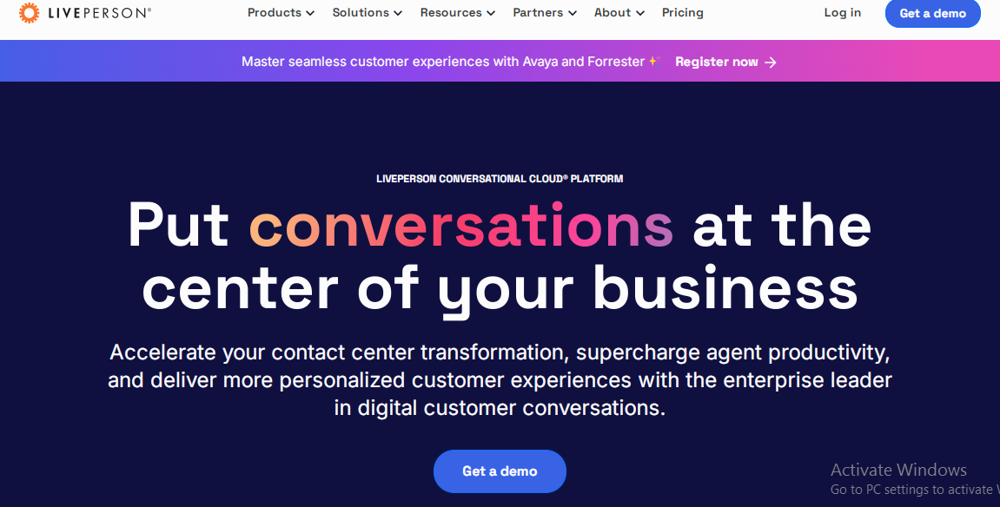
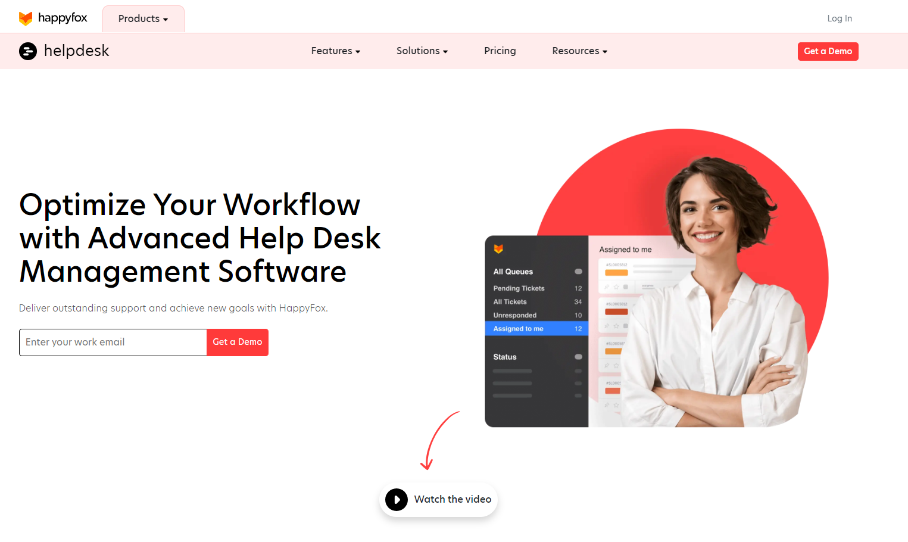
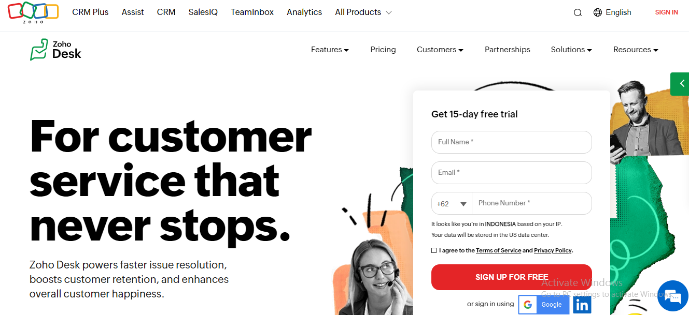

# Top 9 Freschat Alternative

Focus Alternative: Freshchat
type: listicle

# Top 9 FreshChat Alternative That Worth to Try

It is a task to find top Freshchat Alternatives for your business, as we have a highly saturated market. Here, we have jotted down the option that you can explore as best Freshchat alternatives offer all that it takes in a live chat support.

However, before we elaborate on the list of alternatives, one question still has to be answered – Why would you search for an alternative in place of freshchat? In fact, this question warrants its own section. Ok, let's start over.

## **What Is Freshchat?**

Freshchat is an effortless conversation engagement software that also plays a role in live chat support by Freshworks, helping businesses enhance the quality of customer service they provide. A simple machine learning-powered automated chat technology for businesses to engage with customers and provide live help. It features chat rooms and stores a record of the chats to monitor customer discussions on its protected server.

## **Why do you look for a Freshchat alternative?**

It is against this backdrop that we need to talk about the purpose of why you should even be searching for Freshchat competitors and alternatives, before going any further. So, here are a couple of reasons why the majority prefer going for Freshchat alternatives while you should too.

**Limited Integration Options:** It is also not the best alternative if you are looking for a tool that will easily fit into your CRM and business ecosystem. It supports only FreshDesk, no third-party integration.

**Issues in Automation:** Not as much automation is seamless compared to Freshchat rivals and the range of integrations are shallow. Sometimes It is too complicated to use its functionality and has very few features in it.

**Unpredictable Minor Bugs:** There are some little bugs in the tool. For instance, not offering a wide range of GIFs, timing and accuracy issues around responses, messages with typos in the message templates or lack proper response punctuation marks. And, it also allows you to block & delete messaging.

## **9 FreshChat Alternatives at 2024**

### **1. DeskBox**

[Deskbox](https://deskbox.co/) offers an affordable alternative to ChatBot by taking a different approach to customer support. Instead of competing with existing live chat platforms, Deskbox works alongside them, currently integrating with Intercom as an alternative to Intercom's FIN chatbot.

### **Customization**

With Deskbox, you can customize the look of your chat widget to match your brand’s identity, giving it a unique and personal touch.

### **Advanced Training**

Deskbox stands out by allowing you to build a custom knowledge base from scratch, rather than relying on pre-made templates. You can train your chatbot using PDFs, your website URL, or help center documents, so it can provide answers tailored to your specific content.

### **Integration**

Deskbox seamlessly integrates with existing customer support tools like Intercom, making it a cost-effective way to add AI capabilities to your current system. While other AI chatbots can be pricey, Deskbox offers a more affordable solution, managing routine inquiries while letting your human agents handle more complex issues.

Currently, Deskbox integrates only with Intercom, but there are plans to expand to other platforms like Zendesk Live Chat and Crisp in the future.

### 

### **2. LiveChat**

One of the popular applications is LiveChat. It is a perfect tool to replace Freshchat as it has many features, including eye-catcher toggle which encourages customers to come talk with you, chat assignments and targeted texts.

On the customization side, you can control your agent profiles and adjust how the chat widget looks. They do provide integration with other messaging apps to make it easy for the teams.

**LiveChat advanced features**

- Has location message sneak-peek option to show your agents who types in real-time.
- Design using configurable branding live editor
- The filters in the archives aid in sorting out chats from previous times.
- It comes with 200 integrations to power up your workflow using tools such as Hubspot, Calendly and Salesforce.
- Includes client reports to help you track risky clients

**Pricing**

- Free trial: Yes
- Third party integrations allowed: Yes
- Starter: $16/month
- Team: $33/month
- Business: $50/month
- Choose it for: Agent reports, file sharing, pre-chat surveys
- Suited for: Small to large businesses

### **3. Tidio**

Tidio is presented as a Freshchat alternative because it has rich features. This is an excellent customer communication software with responses within seconds and real-time writing. These features are so integrated that it drastically reduces the response time, now agents can handle more tickets.

Support agents can view the customer journey of each user and understand what exactly has led to that ticket, in order for them to provide a more personalized solution.

**Tidio advanced feature**

- Abandon cart bots to decrease cart abandonment
- Includes a mobile app so you can assist customers on the go
- Personalizing is possible through unique chat widgets
- Canned responses to reduce response time on chat
- Peeks into what customers are writing, instantly
- Reliable mobile apps

**Pricing**

- Free trial: Free
- Third party integrations allowed: Yes
- Chatbots: $39/month
- Communicator: $19/month
- Choose it for: Visitor live preview and shared team inboxes
- Suited for: Small to large businesses

### **4. HelpScout**

It is only slightly smaller, but Help Scout goes after a whole different market — customer support (CS). It is backed by low proof points but real customer lists, just the CS footprint alone goes up to 12k businesses reaching out. For those that like the feel of Gmail, the software also offers multi-channel support via a shared inbox.

But, with all of its features, Help Scout does not have native voice or text solutions, limited social channels (Facebook & Twitter) and less than 100 integrations. The interface is bewildering, similar to Gmail in many aspects and reports are not entirely reliable.

**Help Scout advanced feature**

- Shared inbox
- Reporting and analytics
- Integrations
- Live chat and in-app messaging
- Knowledge base

**Pricing**

- Free trial: Yes, 15 days
- Standard: $20 per user/month
- Plus: $40 per user/month
- Pro: $65 per user/month
- Plans are billed annually

### **5. Birdeye**

Birdeye is a software platform for reputation and customer experience. More than 60,000 businesses trust Birdeye to be found online and get chosen by customers with a great consistent reputation- in real-time.

While Birdeye is not a pure play e-commerce platform, it offers sales tracking and other features that are aimed at any online store. Birdeye is also a live chat with standard ticketing and automatic messaging capabilities as well.

**Birdeye advanced feature**

**Appointments** -Solution for local businesses in confidence to schedule booking, reminders and recall alert that makes the business smarts 24X7 available have person & reduce no shows.

**Payments** –Birdeye payments allows small to mid-sized businesses to get paid significantly faster with modern and convenient payment methods. For customers, this allows them to pay wherever they are — whether it be at home or in the office via text (roadmap) and online.

**Birdeye Listings** -Product for helping local businesses list and rank higher on search. It enables businesses to bring in leads by establishing an engaging, present and accurate presence on 100s of online directories and converting the lead with messaging.

**Pricing**

- Free trial: Yes
- Standard star from $299/month
- Professional plan start from $399/month
- Premium by custom pricing

### **6. Kustomer**

Kustomer provides a CRM platform for handling high support request volumes and gathering all customer data under one roof. It is designed for businesses that are in a rapid growth phase and need assistance managing the steady stream of support enquiries.

This one uses AI across their platform to automate repetitive tasks, answer basic questions, increase CSAT and improve your service asset management. The system allows you to build massive consumer profiles that have their previous interactions, order history, shipping information and even the browsing activity. It will help your client service team to make faster resolution of the support tickets.

**Kustomer advanced feature**

- View an organized timeline of all customer data across internal and third-party systems to have more effective, efficient discussions.
- Unlock the continuous and contextual conversation with agents always-in-the-know using Kustomer Timeline to break through traditional multi communication silos that fragment service experiences.
- Saving you time and effort by reducing the manual work involved with common support tasks, automating functions within the platform itself, getting agents what they need.
- Intelligent queueing and routing is a rules-based, omnichannel solution that moves beyond basic first-in, first-out or channel based routing for large volume customer service organizations containing multiple groups of agents.

**Pricing**

- Free trial: Yes
- Plan starts from $89/month/user
- Suitable for small businesses-large enterprises

### **7. LivePerson**

The process of digital conversation at the enterprise level goes through LivePerson. Leveraged by the world's largest brands, our award-winning digital customer conversation platform orchestrates conversations across webchat, messaging and social channels using AI & automation to supercharge contact center agents' productivity — delivered on-premise or in-the-cloud.

This platform is for large consumer-oriented enterprises in highly regulated industries. The conversational cloud platform processes over a billion interactions per month and is easy to use, while hundreds of thousands of digital reserves in Burberry, Chipotle and Virgin Media's leading brands have used millions interacting with consumers responsibly.

LivePerson renders a billion conversational interactions every month, ensures them with advanced security measures and we have unique information to help you harness the power of generative AI methodologies for large language models(LLM) while providing improved business results.

**LivePerson advanced feature**

- Proactive Messages: includes features like pre-approved WhatsApp templates and outbound messages
- Voice and Video Calls: includes features like voice and video call invitations from the Agent Workspace
- Source Attribution: includes features like the Consumer Info widget that allows agents to tell which ad or post a consumer clicked through
- IVR and VoiceBot deflection: includes features like deflecting voice to messaging to increase efficiency and CSAT.

**Pricing**

- Free trial: Yes
- Starting from $40/month
- Pricing model: monthly, quote-based

### **8. Happyfox**

Happyfox is a SaaS help desk software, used by IT to bring the old and nonperforming ticket systems at bay for good. A compliance seeking employee can have a common user experience portal that they interact with to report all issues regarding their IT customer. As an internal help desk, the software is great; serving as a customer portal across various industries.

**HappyFox advanced feature**

- Activity Tracking
- Alerts/Notifications
- Customer Complaint Tracking
- Document Storage
- Email Templates
- Social Media Monitoring
- Workflow Configuration
- Text Editing
- Reporting/Analytics

**Pricing**

- Free trial: Yes, 14 days
- Plan starts at $9/agent/month
- HappyFox also offers product demo

### **9. Zoho Desk**

Zoho desk is a customer support tool which focuses on small and medium businesses. Embed the help desk to your website, watch all requests automatically turned into tickets and handle them from here. Secondly, you can automatically assign the tickets by groups or according to regions with the help of Workflow.

The agent will then have to respond to the ticket, or allocate it to another team member. So, this makes a good FreshChat alternative for being an only support tool if your business is website-based and you have a separate customer service team.

**Zoho advanced feature**

- Zia is the name of Zoho's AI tool, which provides more than predictive analysis
- Mobile access to contacts, leads, notes and deals quickly via the Zoho CRM mobile app
- It offers a simple interface with which you can learn quickly, so quite convenient
- 30 days for the Zoho CRM's monthly service full refund
- Ticket management duties
- Push notifications on subscription-based basis
- Gmail and Help desk CRM integration
- Automatic ticket assignment

**Pricing**

- Free version available
- Free trial: Yes, 15 days
- Zoho Desk Express: $9/month/user
- Standard: $18/month/user
- Professional: $30/month/user
- Enterprise: $45/month/user
