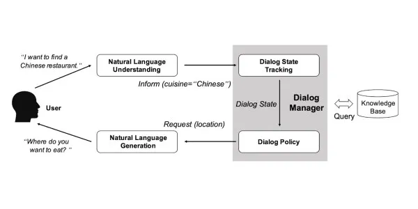
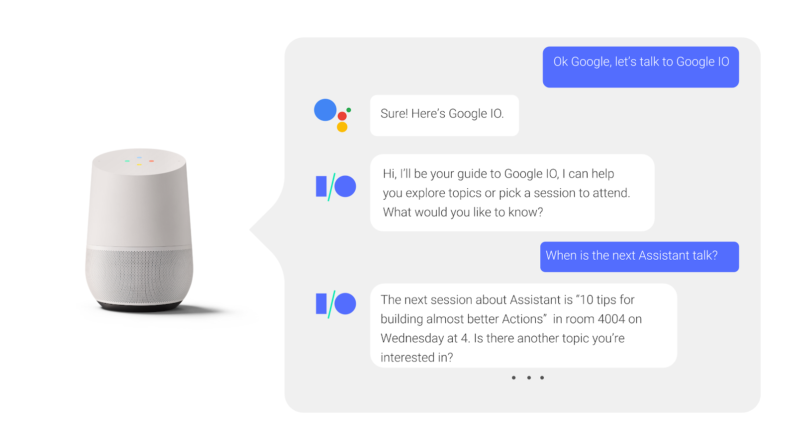

# **6 Types of Chatbot That Will Help Your Business Grow Bigger**

As there are a lot of technological systems that can boost marketing, chatbots are in first place. There are several *types of chatbots for marketing* that you can try to study in depth. However, each chatbot has some differences in its use. For example, the chatbot programming used in hospitals is different from the chatbot used in retail (online shops) or banking.

So, what makes each chatbot different? So, in this discussion of types of chatbots, we will review in detail the differences, their uses, and how to choose a chatbot that is suitable for the business you are in. Read this review until the end!

## **What Is a Chatbot?**

Before we go any further, let's talk about what a chatbot is, and where we can find chatbots? Chatbot is an online conversation platform, where it responds to the conversation just like a human. This artificial intelligence robot has been programmed to serve customers like humans.

The systems used are natural language processing (NLP) and machine learning (ML), allowing the chatbot to provide responses as expected by customers. The advantage of using this chatbot itself, depends on the speed of providing responses, no-working hours, as well as providing solutions, product or service recommendations, and even answering frequently asked questions. Most businesses that have already reached the national or international stage use chatbots to optimize sales.

## **What Are the Different Types of Chatbots for Marketing?**

There are numerous types of chatbots available for SMBs to use to enhance customer's experiences and scale. This grouping of chatbots is based on processes and how they operate, ranging from very simple to complex chatbots. Let's discuss in more depth the various types of *[chatbots for marketing](https://deskbox.co/blog/what-is-chatbot-marketing)*.

### Button-based Chatbot

Button-based chatbots are a type of chatbot that is quite unique. This chatbot is a development of a mini-website that is built on a website widget. If you have ever chosen a menu at a restaurant, or made a reservation when you wanted to book a hotel or accommodation, this is where this chatbot is used. Because it is menu-based, the conversation flow in button-based chatbots is pre-programmed. So there are conversation options that appear when customers click on certain menus.

So, with that ready-to-use basic knowledge, the users press the buttons according to their desires or needs. There are many advantages offered by this button-based chatbot, including: helping to understand customer intentions quickly and precisely, allowing customers to choose one of the many options provided, fast and efficient responses, and interactions that occur as if they were with humans, not based on automated scripts.

### **Rule-based Chatbot**

Rule-based chatbots are chatbots that appeared at the beginning of chatbot development. This chatbot uses scripts that have rules, the aim of which is to produce responses according to input or questions from users. The way this chatbot works is still very simple. When a user enters a question, the chatbot checks for keywords or phrases, then provides an appropriate answer.

For example, when entering the words "How’s the weather today?", the chatbot will check the keywords "weather" and "today". Then, according to this question, the chatbot will look for options in the form of "today's weather will be sunny and cloudy", so that there will be two-way communication, which will then meet the user's needs. The drawback of this chatbot is that it cannot solve complex questions, and does not understand written text or synonyms.

### **Keyword Recognition Chatbot**

Using Natural Language Processing (NLP), keyword-based chatbots are operated with a keyword extraction system. When the chatbot receives a query from a user, the chatbot engine will process and identify the keywords entered, then provide an appropriate response with the related keywords.

How rule-based chatbots work [source: [https://www.analyticsvidhya.com](https://www.analyticsvidhya.com/blog/2023/05/chatbot-evolution-chatgpt-vs-rule-based/#Rule-based_Chatbots)]

Users can direct the chatbot to provide certain recommendations. For example, "recommend the closest bookstore to where I stay,” then the chatbot will process "bookstore" and "nearest". Or another question like "What is the best restaurant in Mataram City", then the chatbot will process the keywords "restaurant,” "best", and " Mataram city". This type of chatbot can be found easily in e-commerce, search engines, instant messaging platforms such as Facebook Messenger, and mobile applications.

### **Hybrid Model Chatbot**

A hybrid-model chatbot is a chatbot that was developed in 2023. This chatbot is a combination of a data-based approach (NPL) and machine learning (ML). By combining the two systems above, conversations with chatbot users are easier to understand, and provide a flexible and effective impression for users. 

This chatbot is widely used in various communication channels, such as live-web chat, which allows for conversations with human agents. Hybrid chat models are also used in messaging such as Messenger, Whatsapp, Viber, and WeChat. 

Some of the advantages provided by the hybrid-model chatbot; remarkable exhibit of adaptability, efficiency, consistency, data security and compliance, cost-efficiency, and 24/7 availability. In short, this chatbot's unique ability to coherently intermix automation with customized interactions positions businesses for a competing boundary in today's digital landscape.

### **Machine Learning Chatbot**

If we talk about chatbots that are more complex and used by top-level business marketing, we will discuss machine learning chatbots. This chatbot is designed to combine natural language processing (NLP) systems and machine learning techniques. This chatbot is specifically designed to break complex codes, respond to human language, adapt to various applications, and act as a virtual assistant.

Image credit: Google 

There are several big companies that use these chatbots to help with marketing and sales activities; such as Google Assistant, The Weather Channel, IBM Watson Assistant, Replika, and much more. Through learning from data, this chatbot will be valuable for gaining engagement, efficiency, and improving customer support.

### **Voice Chatbot**

Practical, fast, and simple. Those are the three words that define the existence of voice chatbots. Some chatbots mentioned previously require typing to convey meaning, but voice bots just use a voice system (IVR) or caller to process the request. For sure, using this voice bot certainly provides an amazing experience, because users only need to speak, and then the chatbot will give them some options to choose from.

Apart from that, voice chatbots can also be integrated with various devices, such as smartwatches, smart speakers, and even cellphones. The voice bot itself is used to ask the device to play music or songs, check the weather, show directions or maps, even as a reminder. Some well-known voice chatbots are Alexa from Amazon, Siri from Apple, and Google Assistant.

## **Some Tips to Choose the Right Type of Chatbot for Your Business**

Every business needs the right chatbot to boost its marketing. The right chatbot will help companies reach their goals. There are many things that need to be considered before deciding to use one of the many types of chatbots available. A company should consider the complexity of interactions with customers, development and maintenance processes, and available resources. 

More than that, even if you use a chatbot, it's a good idea to still have a human agent, so that when the chatbot experiences problems, the automatic response from the non-chatbot still helps the company's activities.

### **Get Feedback by Engaging with Customers**

One way to develop a business through chatbots is to ask users for input and feedback. These inputs will build a company to better meet their needs, and be more advanced in the future.

### **Evaluate Business and Chatbot Integration**

Evaluating the integration between business and chatbots is the most important thing to pay attention to. You have to find out which part of your business gets the most benefit from the chatbot you use. That way, the use of chatbots will become a reliable help in the business.

### **Optimize The Chatbot by Regular Updates**

Despite having an artificial intelligence system, chatbots still need to be updated regularly. This update process takes the form of adding scripts, adapting to user needs. To carry out the update process, work with a great technician or AI specialist who can make the chatbot better.

### **Monitor Chatbot Metric**

Another way to increase chatbot effectiveness is to monitor chatbot metrics. To do this, pay attention to the conversation log between the chatbot and the customer. In every question asked, there is bound to be an area that needs updating. Don't forget that AI is a technology that continues to develop. Make sure you consult with AI experts, paying attention to the latest trends, to ensure your business continues to move forward.

## **Conclusion**

Chatbots are the main choice for companies that want to increase business sales. Each business can also choose the type of chatbot that best suits their target market. The thing you need to pay attention to when you want to use a chatbot is to put yourself in the position of the customer or user. 

If the conversation has a positive impact, then the implementation is appropriate. However, if the conversation feels ineffective, then keep updating. Try to find another strategy that can boost the improvement of your chatbot.

The next thing that must be taken into consideration is, adjusting the chatbot to user experience (UX) preferences. Every user has different tastes in using chatbots, some like to be guided by menu buttons, some prefer visual designs. Therefore, make sure to test it on users before launching a marketing system that uses chatbot assistance.

