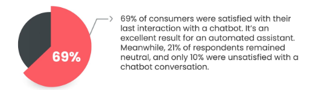
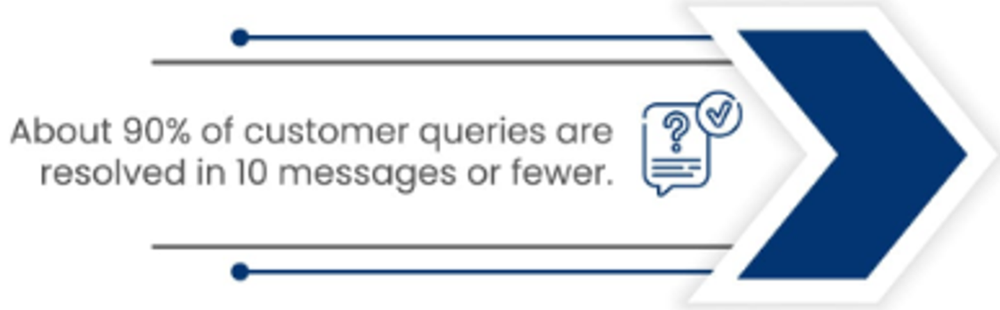
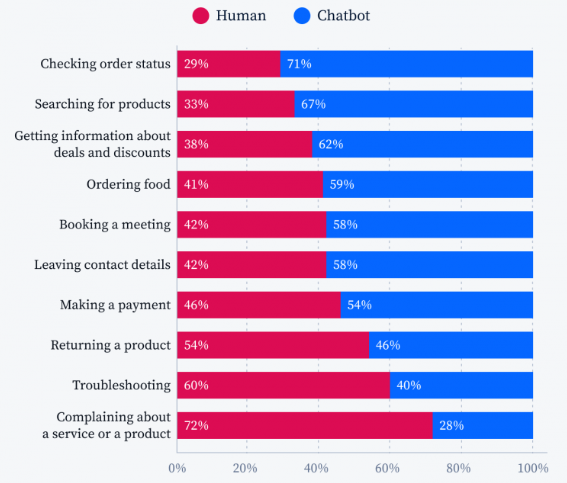
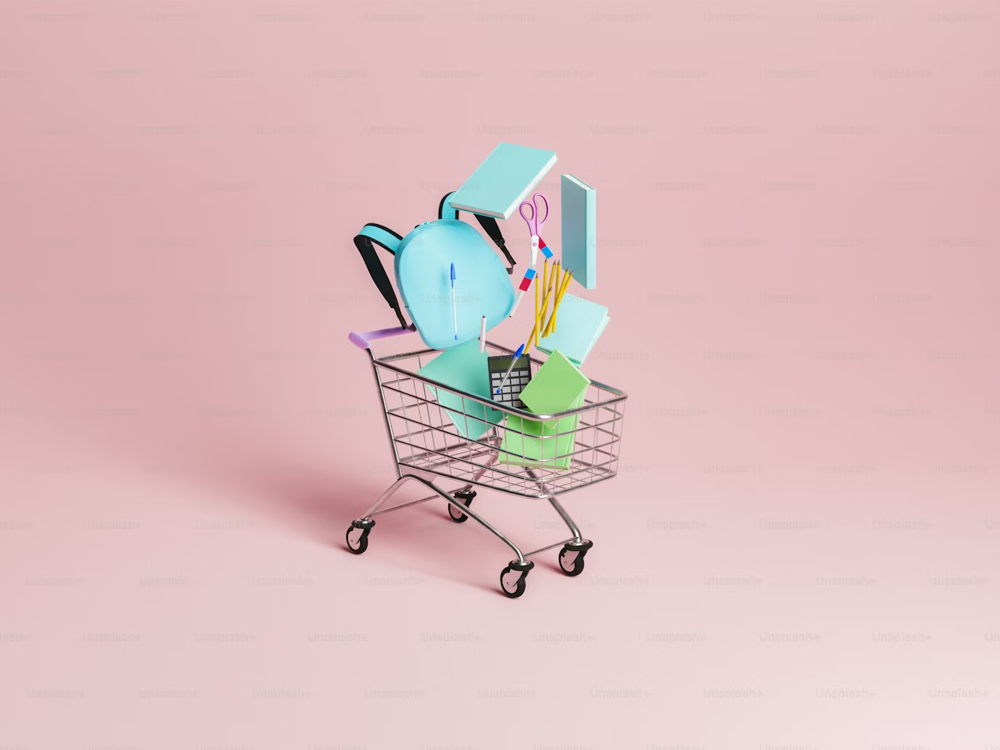
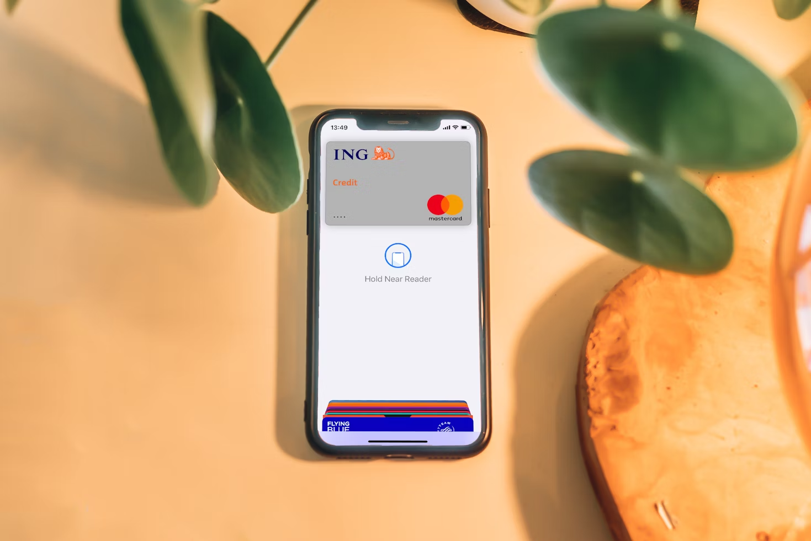

# What is a Chatbot Website? Unleashing the Power of AI-Based Customer Service

Chatbots are support agent that helps customers or website visitors to answer some questions. As an AI-based customer service, chatbot uses the automatic process. It can responds to the customer’s request with short yet to-the-point conversations immediately.

With all the benefits provided, chatbots become essential for customer service. Even though bigger businesses are slower to adopt this technology, every business knows the advantages of chatbots and is willing to use them. Some benefits obtained are 24/7 availability, enhanced customer satisfaction, cost reduction, increased sales opportunities, and more.

## **AI-Based Customer Service: Redefining the Future of Interaction**

AI-based customer service simulating human conversation in a digital chat. The AI analyzes the customer’s request by identifying keywords to provide a response. To do the process, a chatbot website has to integrate with other technologies.

### **Natural Language Processing (NLP)**

The use of Natural Language Processing (NLP) allows people to communicate with computers like humans in real-life. It includes computer processes for understand, predict, analyze, and respond to human speech or writing.

### **Machine Learning (ML)**

Machine Learning (ML) enables computer systems to learn and improve using data and algorithms. It allows the computer to make decisions, evaluate errors, and optimize the system without human intervention.

### **Conversational AI**

Conversational AI simulates human dialog. It allows humans to interact with computers naturally.

All the integrated technologies that are used in AI-based customer service give more advantages compared to traditional methods.

### 24/7 Availability

AI-based customer service is provided 24/7. Customers can get help by chatbots every time outside the regular business hours in fast reply.

### Improved Efficiency and Cost Reduction

Chatbots can handle large customer requests and reduce tasks. According to [Tidio](https://www.tidio.com/blog/chatbot-statistics/), chatbots have improved customer service and can save business costs up to 30%.

### Personalized Customer Experiences

AI algorithms and machine learning in chatbots provide personalized responses and more relevant recommendations to customers.

### Increased Lead Generation and Sales Opportunities

Chatbots have [increased sales](https://outgrow.co/blog/vital-chatbot-statistics) by 67%. It can collect customer insight, feedback, and preferences that can be used to improve customer service and boost the buying process.

## **Chatbot Business Impact: Transforming Customer Interaction**

Chatbot websites impact customer experience and business operations. Using AI technology, chatbots have a lot of benefits, such as:

### Enhanced Customer Satisfaction and Loyalty

Chatbots allow customers to save more time which correlates with the increase of customer satisfaction. It also provides personalized responses based on interactions and preferences that encourage customer loyalty and repeat orders.

Source: Outgrow

### Streamlined Customer Support Processes

Chatbot websites could respond immediately. With the automatic task, a chatbot can help streamline service by reducing repetitive work, unlike the traditional methods.

Source: Outgrow

### Reduced Wait Times and Faster Resolutions

By using the chatbots, customers do not need to wait in line and can get information 24/7 even when the agents are offline. Every customer request will resolve quickly from the chatbot’s automatization.

Source: Outgrow

### Valuable Data Collection and Customer Insights

The business operation and the satisfaction of customer services can be improved by valuable data gathered from the customer. The data could be about customer preferences and feedback to gain customers' needs and business decision-making.

### Improved Resource Allocation and Workforce Optimization

The use of chatbots can complement humans as an agent and maximize the efficiency of the workforce. The chatbots can do simple repetitive work and hand it off to human agent if needed.

Source: Tidio

## **Examples of AI for Customer Service Applications**

The applications of AI-based customer service have derived into many industries. Some industries gain specific benefits from the chatbot. Here are some cases that can be found in using chatbots:

### E-Commerce Chatbots for Product Recommendations and Order Tracking

E-commerce has a [34% acceptance](https://99firms.com/blog/chatbot-statistics/) rate for chatbots by customers. Most e-commerce implements chatbots into their website to provide product recommendations, track customer orders, send offers, and customer service.

### Banking Chatbots for Account Queries and Transaction Support

Banking chatbots can automate some parts and connect to human agents if necessary. It allows the customer to have conversations about finance, bank balances, spending, and customer services.

### Travel and Hospitality Chatbots for Booking Assistance and Itinerary Management

Travel and hospitality chatbots have a lot of benefits that they are offering. It can understand every customer's preference and guide them easily. Other benefits that are offered are efficient booking, multi-language support, personalized travel suggestions, and more.

## Conclusions

As an AI-based customer service, chatbots have a lot of benefits that fit many businesses and industries. The integrated technologies in chatbots can impact customer experience and business operations. It can enhance customer satisfaction and loyalty by faster and personalized response, and efficient customer support processes. It also allows the efficiency of the work and cost, understanding business strategies, and workforce optimization. Everyone should implement chatbots on their website to get all of those customer satisfaction and business success.