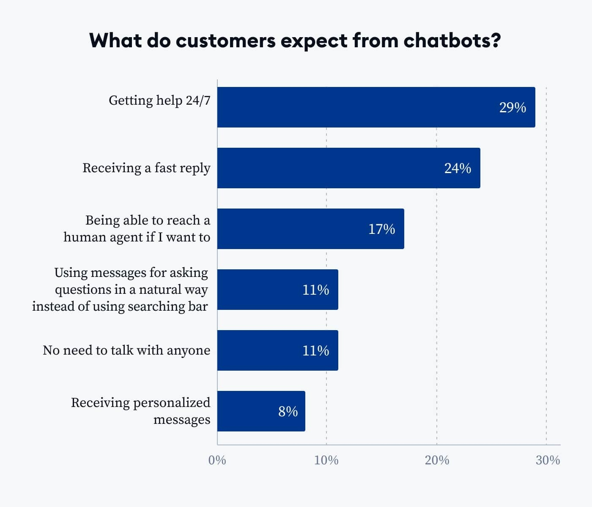
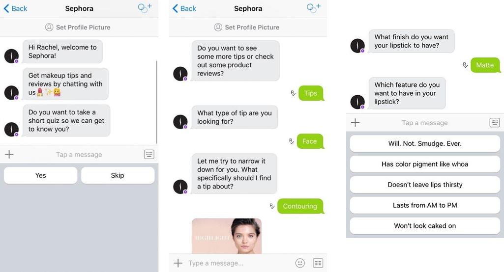

Chatbot technology can be said as a smart solution for today's businesses, to provide the best service for customers. Besides, this technology is able to provide reply messages to many customers automatically in a matter of seconds, which of course cannot be done by customer service. Apart from that, ***chatbot for marketing*** also be relied on as marketing solutions.

## **What is chatbot for marketing?**

Using marketing chatbots means promoting products and services through the use of a conversational bot. As a marketing automation tool, chatbots are used to help businesses generate better leads, offer targeted discounts, and perform other marketing automation tasks. Chatbots are also used by marketers to greet new users of their websites, convert and nurture leads, refer current clients to customer service, and more.

For customers, these are some benefits they can expect from chatbots: getting help 24/7 with a fast reply, being able to reach a human if needed, asking questions just by sending messages to bots, and receiving personalized messages. Besides, customers can look up products and their availability with this marketing chatbot. 

Customers can enter photographs or keywords by clicking on one of the options and finding what they're looking for. The bot will then link potential customers to the relevant page on the business website after determining what they searched for.

Source: 

What customers expect from chatbot [Source: [http://Tidio.com](https://www.tidio.com/blog/chatbot-statistics/)]

## **How is chatbot used in marketing?**

In business and marketing, chatbots have an important role in automating and personalizing content marketing efforts. By analyzing the questions and interactions users have with chatbots, startups (or any companies) can identify common problems and interests. Then, ***how is chatbot used in marketing?*** Read the following explanation carefully!

## **Chatbot Marketing for Lead Generation**

Chatbots guide customers through qualifying leads, the purchasing process, and obtaining client details information by using a conversational approach. Chatbots are useful for establishing rapport with clients and prospects during the picking and buying process. Chatbots are used 24/7 for communicating –between users and companies or sellers. 

In this case, they let users explore a tree of possibilities on the website and give businesses some opportunity to actively interact with potential customers, preventing them from leaving the site without making a purchase. Chatbots ensure that businesses never lose out on a lead by assisting website visitors in the event that the sales team or live chat operators are unavailable after business hours.

## **Chatbot Marketing for Appointment Booking and Reservation**

Several types of businesses have developed booking and reservation systems, especially for traditional offline businesses. The implementation of a booking and reservation system allows customers to make reservations well in advance, even if they are not in the same place or city –as the place they want to reserve. One of the most appropriate ways to make the booking and reservation process easier is using ***chatbot for marketing***.

Sephora kik chatbot [source: [squarespace-cdn.com](https://www.chatbotguide.org/sephora-bot)]

There are several examples of bots that are very well known for this booking and reservation system, the first is Sephora's Facebook Messenger. Those cosmetics companies set up a bot that lets users make their own schedule and make an appointment for an in-store takeover. Another example is the booking and appointment use in hospitality services. By using the chatbot, customers are able to book the room, determine the date of stay, and select the room type.

## **Chatbots Marketing for Surveys**

Today, customer satisfaction is one of the keys to measure the success of a company. Knowing how satisfied customers are with the products and services offered is very important to improve business quality. Currently, chatbots have become an efficient tool for conducting customer satisfaction surveys. Using chatbots has many advantages. 

If chatbots are used for customer satisfaction surveys, customer satisfaction survey activities will gain benefits, such as efficiency, less use of human resources, scalability, and many more. Also, turning a survey into a conversation creates a more interactive experience for customers. For some platforms, like WhatsApp, Facebook Messenger, or other messaging platforms, a conversational approach allows users to complete the survey on platforms with which they feel comfortable.

## **Examples Of A Chatbot Marketing?**

Have you ever thought about using chatbots in developing any kind of business? Based on the development of digital business and social media, as estimated by 2027, chatbot marketing will become one of the main customer service channels for around 25% of whole businesses worldwide. 

Before discussing further about ***what is an example of a chatbot marketing*** and several well-known business products that use chatbots, it is also a good idea to learn about their failures and successes in using chatbots. Along with sales and marketing, there's a section devoted to chatbots for e-commerce among the examples of customer service. Let’s get started!

## **H&M’s Kik Chatbot**

H&M, which is a multinational company that produces and sells fashion, has also used chatbots to increase its sales process. This brand is loved by young people and has been successful in making lots of profits. For sure, this can be separated from the sophisticated marketing system, when compared with other brands. H&M developed the messaging platform Kik to help choose outfits, colors, mix and match, and even act as a virtual stylist. The way this chatbot works is very easy. 

First, it will display two photos of clothes that customers can choose from. After answering some questions, the bot will build a style persona for the individual. Next, the models, prices, and colors that can be combined for use will be displayed. There is also a pop-up message, 'save' or, 'shop' button that can be selected by the customers. If the customer chooses 'shop', then the bot will direct the customer to the H&M outlet where the customer can get clothes of their choice. In short, H&M allows customers to purchase all the items with just a few clicks.

## **Sephora**

Setting standards for beauty stores across the globe, Sephora became one of the first cosmetic retailers to introduce their brand using Kik and Facebook Messenger. Two of the bots used by Sephora are Sephora Virtual Artist and Sephora Reservation Assistant. 

According to its name and function, Reservation Assistant is used to connect the online and in-store sales processes. Meanwhile, virtual artists work like humans, including choosing a lipstick color that matches the customer's skin color. On the other hand, the item or image can be detected by the bot. 

For example, the color. Once the users hold their phone up to an image or item, it will then display products that match. The bot can even detect the faces of celebrities wearing the user's favorite beauty products.

## **Uber’s Chatbot**

Uber is included in one of the best lists of transportation provider companies, operating in various countries, because of the ease of its transactions. One of the important aspects that Uber has is the use of ***chatbot for marketing.*** Using a chatbot is an innovative step, customers can even place orders without having to download the application first. 

So, what advantages does Uber chatbot offer? These include updates of rides, viewing receipts, having a private chat with Uber on Messenger, sending a location on Messenger, and even tracking payments and ride history for customers. Some of Uber's features for viewing, requesting, and paying for the ride just through Messenger make the entire process of taking a ride easy as well.

## **Domino’s Pizza**

Another interactive chatbot, placing orders using your voice or keyboard, Domino's Pizza. A chatbot called Dom, will provide a different pizza buying experience. If up to now the order process has been through a queuing system, customer service, or text messages, Domino's Pizza uses a more sophisticated system. Instead of calling up or ordering online, customers will be able to simply send a message to Dom, then request food with a single word or emoji. 

How to make an order via Domino's chatbot? The customers need to sign up first, then fill in the address and contact details, and save a ‘favorite basket’ that can be requested via the chatbot in the future. Is it quite simple, right?

## **HelloFresh**

As a provider of online food delivery services, the company carries out the production and distribution of meal kits. It offers a variety of meal options, including vegetarian, beef, and chicken dinners. This company also got a new digital innovation, introducing Brie as their virtual assistant to guide customers. The experience of shopping for equipment and food ingredients will of course be even more enjoyable. 

Brie will direct customers from conversation point A to B, suggest questions, and even have the option to type in questions. HelloFresh also offers discount codes when customers ask. Users will be directed directly to products with low prices but good quality. Of course, it is not that surprising that HelloFresh has become the number 1 food startup in Germany, a rapidly growing company, with branches almost all over the world.

## **Conclusion**

Today, technology is transforming virtually in every business. So, chatbots have emerged as a revolutionary way for companies to engage with their customers and streamline their operations. Using chatbots that are ready 24/7 also makes it easier for companies to reach customers anywhere and anytime. Apart from that, ***chatbots for marketing*** will be very useful for providing a pleasant shopping experience, satisfying service, and recommendations that suit customer desires. 

There are many companies that are at the peak of success by developing chatbots that make everything easier at work. It is not surprising that in the coming years, the use of chatbots will become more massive and growing. Of course, this is a win-win solution, both for the company-customers.
